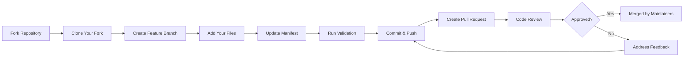

# Contributing to AL Development Collection

Thank you for your interest in contributing to the AL Development Collection! This document provides guidelines for contributing **Agent Primitives** following the **[AI Native-Instructions Architecture](https://danielmeppiel.github.io/awesome-ai-native/)** framework.

## 🏗️ Framework Overview

This collection implements the AI Native-Instructions Architecture with 3 layers:

- **Layer 1: Markdown Prompt Engineering** - Structured instructions using semantic markdown
- **Layer 2: Agent Primitives** - Configurable tools (Instructions, Agentic Workflows, Chat Modes)
- **Layer 3: Context Engineering** - Strategic context management via `applyTo` patterns

## 📋 Table of Contents

- [Code of Conduct](#code-of-conduct)
- [How to Contribute](#how-to-contribute)
- [File Naming Conventions](#file-naming-conventions)
- [Frontmatter Requirements](#frontmatter-requirements)
- [Validation](#validation)
- [Pull Request Process](#pull-request-process)

## 🤝 Code of Conduct

This project follows the [GitHub Community Guidelines](https://docs.github.com/en/site-policy/github-terms/github-community-guidelines). Please be respectful and constructive in all interactions.

## 🎯 How to Contribute

You can contribute three types of **Agent Primitives** (Layer 2):

1. **Instructions** - Auto-applied coding guidelines (`.instructions.md`)
2. **Agentic Workflows** - Task-specific execution processes (`.prompt.md`)
3. **Chat Modes** - Role-based strategic consultants (`.chatmode.md`)

### 🔄 Contribution Workflow

The standard contribution process follows the **fork and pull request** model:



**Key Points**:
- ✅ **Fork** the repository (don't request direct write access)
- ✅ **Add** your instructions, prompts, or chat modes
- ✅ **Validate** locally before submitting
- ✅ **Submit** pull request for review
- ✅ **Maintainers** will validate and merge

### What Makes a Good Contribution?

**Good Contributions** ✅:
- Solve a real AL development need
- Don't duplicate existing functionality
- Follow naming conventions and frontmatter requirements
- Include clear examples and documentation
- Pass validation without errors

**What to Avoid** ❌:
- Overly broad or vague instructions
- Hardcoded values specific to your project
- Non-AL-specific general programming advice
- Missing or incomplete frontmatter
- Contributions without validation

### Adding Instructions

Instructions are **Markdown Prompt Engineering** (Layer 1) files that customize GitHub Copilot's behavior using `applyTo` patterns (Layer 3).

📖 **See [instructions/index.md](./instructions/index.md) for complete guide to existing instructions.**

1. **Create your file** in `instructions/`
2. **Use naming convention**: `al-[feature].instructions.md`
3. **Include frontmatter** (Context Engineering):
   ```yaml
   ---
   description: 'Brief description of what this instruction provides'
   applyTo: ['**/*.al']  # Context Engineering pattern
   ---
   ```
4. **Structure your content**:
   ```markdown
   # Feature Name

   ## Rule 1: Clear Rule Title

   ### Intent
   Explain what this rule accomplishes and why it matters.

   ### Examples
   Provide good and bad examples.
   ```

### Adding Agentic Workflows

**Agentic Workflows** (formerly called "prompts") are complete execution processes for specific AL development tasks.

📖 **See [prompts/index.md](./prompts/index.md) for complete guide to existing workflows.**

1. **Create your file** in `prompts/`
2. **Use naming convention**: `al-[task].prompt.md`
3. **Include frontmatter**:
   ```markdown
   ---
   mode: 'agent'
   description: 'Brief description of what this prompt does'
   tools: ['al_build', 'al_publish', 'codebase']
   ---
   ```
4. **Structure your prompt**:
   ```markdown
   # Task Title

   Your goal is to accomplish `${input:VariableName}`.

   ## Step 1: First Action
   Clear instructions...

   ## Step 2: Second Action
   Clear instructions...
   ```

### Adding Chat Modes

**Chat Modes** are role-based strategic consultants with defined **Tool Boundaries** (MCP constraints) for specialized AL guidance.

📖 **See [chatmodes/index.md](./chatmodes/index.md) for complete guide to existing modes.**

1. **Create your file** in `chatmodes/`
2. **Use naming convention**: `al-[role].chatmode.md`
3. **Include frontmatter**:
   ```markdown
   ---
   description: 'Brief description of the chat mode role'
   tools: ['codebase', 'search', 'usages']
   ---
   ```
4. **Define the persona**:
   ```markdown
   # Role Title - Specialist Name

   You are an expert in [domain] for Business Central.

   ## Core Principles
   - Principle 1
   - Principle 2

   ## Your Capabilities
   - Capability 1
   - Capability 2

   ## Response Style
   - How you communicate
   - What you prioritize
   ```

## 📝 File Naming Conventions

### Instructions
- Format: `al-[feature].instructions.md`
- Examples:
  - ✅ `al-security.instructions.md`
  - ✅ `al-workflows.instructions.md`
  - ❌ `security.md` (missing prefix and suffix)
  - ❌ `AL-Security.instructions.md` (uppercase)

### Prompts
- Format: `al-[task].prompt.md`
- Examples:
  - ✅ `al-deploy.prompt.md`
  - ✅ `al-upgrade.prompt.md`
  - ❌ `deploy.md` (missing prefix and suffix)
  - ❌ `al-deploy.md` (missing .prompt)

### Chat Modes
- Format: `al-[role].chatmode.md`
- Examples:
  - ✅ `al-security-expert.chatmode.md`
  - ✅ `al-integration-specialist.chatmode.md`
  - ❌ `security.md` (missing prefix and suffix)
  - ❌ `al-security.md` (missing .chatmode)

## 🎨 Frontmatter Requirements

### Instructions
```yaml
---
description: 'Clear description of what this instruction provides'
globs: ["*.al", "*.json"]  # File patterns this applies to
alwaysApply: true          # or false for contextual activation
---
```

### Prompts
```yaml
---
mode: 'agent'
description: 'Clear description of what this prompt accomplishes'
tools: ['tool1', 'tool2', 'tool3']  # AL tools or VS Code tools used
---
```

### Chat Modes
```yaml
---
description: 'Clear description of the chat mode expertise and role'
tools: ['codebase', 'search', 'usages']  # Tools this mode uses
---
```

## ✅ Validation

Before submitting a pull request:

1. **Install dependencies**:
   ```bash
   npm install
   ```

2. **Run validation**:
   ```bash
   npm run validate
   ```

3. **Fix any errors or warnings**:
   - Errors must be fixed
   - Warnings should be addressed

4. **Update the collection manifest**:
   - Add your file to `collections/al-development.collection.yml`
   - Use correct `kind`: `instruction`, `prompt`, or `chat-mode`
   - For chat modes, add `usage` guidance

Example manifest entry:
```yaml
- path: instructions/al-security.instructions.md
  kind: instruction

- path: prompts/al-deploy.prompt.md
  kind: prompt

- path: chatmodes/al-security-expert.chatmode.md
  kind: chat-mode
  usage: optional
  description: |
    Specializes in AL security patterns and best practices.
    Works best with al-permissions.prompt.md.
```

## 🔄 Pull Request Process

### Step 1: Fork and Clone

1. **Fork the repository** on GitHub
   - Click the "Fork" button at the top right of the repository page
   - This creates a copy of the repository in your GitHub account

2. **Clone your fork locally**:
   ```bash
   git clone https://github.com/YOUR-USERNAME/AL_Copilot_Collection.git
   cd AL_Copilot_Collection
   ```

3. **Add the upstream remote** (to keep your fork in sync):
   ```bash
   git remote add upstream https://github.com/javiarmesto/AL_Copilot_Collection.git
   ```

### Step 2: Create Your Contribution

1. **Keep your fork updated**:
   ```bash
   git checkout main
   git pull upstream main
   git push origin main
   ```

2. **Create a feature branch**:
   ```bash
   git checkout -b feature/al-security-instructions
   ```
   
   Use descriptive branch names:
   - `feature/al-security-instructions` - New instruction file
   - `feature/al-deployment-prompt` - New prompt file
   - `feature/al-integration-chatmode` - New chat mode
   - `fix/update-documentation` - Documentation fixes

3. **Add your files** in the appropriate directory:
   - **Instructions**: Place in `instructions/` with `.instructions.md` extension
   - **Prompts**: Place in `prompts/` with `.prompt.md` extension
   - **Chat Modes**: Place in `chatmodes/` with `.chatmode.md` extension

4. **Update the collection manifest** (`collections/al-development.collection.yml`):
   ```yaml
   - path: instructions/al-security.instructions.md
     kind: instruction
   ```

5. **Run validation locally**:
   ```bash
   npm install
   npm run validate
   ```
   
   Fix any errors before proceeding. All errors must be resolved.

6. **Commit your changes** with clear, descriptive messages:
   ```bash
   git add .
   git commit -m "Add AL security instructions for authentication patterns"
   ```
   
   Good commit message examples:
   - ✅ "Add AL security instructions for OAuth2 authentication"
   - ✅ "Create deployment automation prompt with AL-Go integration"
   - ✅ "Fix: Update performance instructions with BC24 patterns"
   - ❌ "update files"
   - ❌ "changes"

### Step 3: Submit Pull Request

1. **Push to your fork**:
   ```bash
   git push origin feature/al-security-instructions
   ```

2. **Create Pull Request on GitHub**:
   - Go to your fork on GitHub
   - Click "Compare & pull request" button
   - Fill in the PR template with:
     - **What**: Clear description of what you're adding
     - **Why**: Explain the value and use case
     - **Examples**: Include usage examples if applicable
     - **Testing**: Confirm validation passes
   
3. **PR Title Format**:
   - `feat: Add AL security instructions for OAuth2`
   - `docs: Update CONTRIBUTING guide with fork workflow`
   - `fix: Correct frontmatter in performance prompt`

4. **Wait for automated validation**:
   - GitHub Actions will run validation automatically
   - Ensure all checks pass (green checkmarks)

### Step 4: Code Review Process

1. **Respond to review comments**:
   - Maintainers will review your contribution
   - Address feedback promptly and professionally
   - Make requested changes in your branch
   - Push updates to the same branch (PR updates automatically)

2. **Update your contribution**:
   ```bash
   git add .
   git commit -m "Address review feedback: Update error handling patterns"
   git push origin feature/al-security-instructions
   ```

3. **Keep your branch updated** (if main branch has new commits):
   ```bash
   git checkout main
   git pull upstream main
   git checkout feature/al-security-instructions
   git rebase main
   git push -f origin feature/al-security-instructions
   ```

### Step 5: Merge and Cleanup

Once approved and merged by maintainers:

1. **Update your local repository**:
   ```bash
   git checkout main
   git pull upstream main
   git push origin main
   ```

2. **Delete your feature branch** (optional but recommended):
   ```bash
   git branch -d feature/al-security-instructions
   git push origin --delete feature/al-security-instructions
   ```

## 🎯 Contribution Quality Checklist

Before submitting your PR, ensure:

- [ ] All files follow naming conventions (`.instructions.md`, `.prompt.md`, `.chatmode.md`)
- [ ] Frontmatter is complete and correct
- [ ] `collections/al-development.collection.yml` is updated
- [ ] Validation passes locally (`npm run validate`)
- [ ] Documentation is clear and includes examples
- [ ] No sensitive information (credentials, tokens) included
- [ ] Code examples use realistic AL patterns
- [ ] Commit messages are descriptive
- [ ] PR description explains what, why, and how

## 📖 Content Guidelines

### Writing Style
- **Clear and concise** - Developers should understand quickly
- **Specific to AL** - Focus on Business Central patterns
- **Actionable** - Provide concrete guidance
- **Example-driven** - Show good and bad examples

### Code Examples
- Use realistic AL code
- Show both ✅ good and ❌ bad patterns
- Include comments explaining why
- Follow AL naming conventions

### Testing Your Contribution
1. Copy your file(s) to a test AL project
2. Open relevant AL files
3. Verify Copilot suggestions follow your instructions
4. Test prompts or chat modes work as expected
5. Ensure no conflicts with existing files

## 🎯 What Makes a Good Contribution

### Good Instruction Files
- ✅ Address a specific AL development practice
- ✅ Provide clear rules with examples
- ✅ Include both good and bad patterns
- ✅ Don't overlap with existing instructions

### Good Prompt Files
- ✅ Solve a common AL development task
- ✅ Use available AL tools effectively
- ✅ Provide step-by-step workflow
- ✅ Include error handling guidance

### Good Chat Modes
- ✅ Fill a gap in existing modes
- ✅ Have clear, focused expertise
- ✅ Provide strategic (not tactical) guidance
- ✅ Complement existing tools

## ❌ What to Avoid

- ❌ Duplicating existing functionality
- ❌ Overly broad or vague instructions
- ❌ Hardcoded values specific to your project
- ❌ Non-AL-specific general programming advice
- ❌ Missing or incomplete frontmatter
- ❌ Incorrect file naming

## 🐛 Reporting Issues

Found a bug or problem?

1. **Check existing issues** first
2. **Create a new issue** with:
   - Clear description of the problem
   - Steps to reproduce
   - Expected vs actual behavior
   - AL version and environment details
   - Screenshots if applicable

## 💡 Suggesting Enhancements

Have an idea for improvement?

1. **Check discussions** first
2. **Create a discussion** or issue:
   - Describe the enhancement
   - Explain the use case
   - Provide examples if possible
   - Consider implementation approach

## 📞 Questions?

- **Documentation**: See [al-development.md](./al-development.md)
- **Discussions**: Use GitHub Discussions
- **Issues**: For bugs or specific problems

## 🙏 Thank You!

Your contributions help make AL development easier for everyone. We appreciate:
- Clear, well-documented contributions
- Thoughtful code reviews
- Constructive feedback
- Sharing knowledge

---

**Happy Contributing!** 🚀

Last Updated: 2025-01-15 08:19:35 UTC