Most developers start with AI by throwing simple prompts at GitHub Copilot and hoping for the best. This approach works for simple tasks but breaks down when you need reliable, repeatable results for complex development work. The three-layer framework below transforms this ad-hoc experimentation into systematic engineering practices.

## Layer 1: Markdown Prompt Engineering
**The Foundation:** Transform natural language into structured, repeatable instructions using Markdown's semantic power.

**Why This Works:** Markdown's structure (headers, lists, links) naturally guides AI reasoning, making outputs more predictable and consistent.

### Key Techniques

- **Context Loading**: `[Review existing patterns](./src/patterns/)` - Links become context injection points that pull in relevant information, either from files or websites
- **Structured Thinking**: Headers and bullets create clear reasoning pathways for the AI to follow
- **Role Activation**: "You are an expert [role]" - Triggers specialized knowledge domains and focuses responses
- **Tool Integration**: *Use MCP tool `tool-name`* - Connects to deterministic code execution from MCP servers
- **Precision Language**: Eliminate ambiguity through specific, unambiguous instructions
- **Validation Gates**: "Stop and get user approval" - Human oversight at critical decision points

### Quick Win Example

Instead of: `Find and fix the bug`, use:

```markdown
You are an expert debugger, specialized in debugging complex programming issues. 

You are particularly great at debugging this project, which architecture and quirks can be consulted in the [architecture document](./docs/architecture.md). 

Follow these steps:

1. Review the [error logs](./logs/error.log) and identify the root cause. 

2. Use the `azmcp-monitor-log-query` MCP tool to retrieve infrastructure logs from Azure.  

3. Once you find the root cause, think about 3 potential solutions with trade-offs

4. Present your root cause analysis and suggested solutions with trade-offs to the user and seek validation before proceeding with fixes - do not change any files.
```

Once you've mastered structured prompting, you'll quickly realize that manually crafting perfect prompts for every task is unsustainable. This is where the second layer comes in: turning your prompt engineering insights into reusable, configurable systems.

## Layer 2: Agent Primitives  
**The Implementation:** The configurable tools that systematically deploy your prompt engineering techniques.

### Core Primitives

- **Instructions Files**: Deploy structured guidance through modular `.instructions.md` files with targeted scope
- **Chat Modes**: Deploy role-based expertise through `.chatmode.md` files with MCP tool boundaries that prevent security breaches and cross-domain interference - like professional licenses that keep architects from building and engineers from planning
- **Agentic Workflows**: Deploy reusable prompts through `.prompt.md` files with built-in validation
- **Specification Files**: Create implementation-ready blueprints through `.spec.md` files that ensure deterministic outcomes across human and AI executors
- **Agent Memory Files**: Preserve knowledge across sessions through `.memory.md` files
- **Context Helper Files**: Optimize information retrieval through `.context.md` files

### The Transformation Effect

Agent Primitives are the core configurable elements that AI Native Developers iteratively refine to ensure reliable outcomes through systematic prompt engineering.

**Example Transformation:**
- **Technique**: "Implement secure user authentication system" (Markdown Prompt Engineering)
- **Primitives**: Developer selects `backend-dev` chat mode → Auto-triggers `security.instructions.md` via `applyTo: "auth/**"` → Loads context from `[Previous auth patterns](.memory.md#security)` and `[API Security Standards](api-security.context.md#rest)` → Generates `user-auth.spec.md` using structured templates → Executes `implement-from-spec.prompt.md` workflow with validation gates (Agent Primitives)
- **Outcome**: Developer-driven knowledge accumulation where you capture implementation failures in `.memory.md`, document successful patterns in `.instructions.md`, and refine workflows in `.prompt.md` files—creating compound intelligence that improves through your iterative refinement (Context Engineering)

This transformation might seem complex, but notice the pattern: what started as an ad-hoc request became a systematic workflow with clear handoff points, automatic context loading, and built-in validation. Each primitive file becomes a knowledge asset that improves with use, creating compound intelligence that serves your entire team.

This transformation might seem complex, but notice the pattern: what started as an ad-hoc request became a systematic workflow with clear handoff points, automatic context loading, and built-in validation. Each primitive file becomes a knowledge asset that improves with use, creating compound intelligence that serves your entire team.

> 💡 **Native VSCode Support**: While VSCode natively supports `.instructions.md`, `.prompt.md`, and `.chatmode.md` files, this framework extends the paradigm with `.spec.md`, `.memory.md`, and `.context.md` patterns that represent frontier concepts in AI Native Development.

With your prompts structured and your primitives set up, you'll encounter a new challenge: even the best prompts and primitives can fail when they're drowning in irrelevant context or competing for limited AI attention. The third layer addresses this through strategic context management.

## Layer 3: Context Engineering
**The Strategic Framework:** Systematic management of LLM context windows to maximize agent performance within memory constraints.

### Why Context Matters

LLMs have finite attention spans, limited memory (context windows) and are forgetful. Strategic context management not only helps agents focus on relevant information, but enables them to get started quicker by reducing the need to search for and ingest irrelevant or confusing information—thus preserving valuable context window space and improving reliability and effectiveness.

### The Universal Discovery Challenge

The industry developed fragmented context formats—`.instructions.md` (VSCode), `.cursorrules` (Cursor), `.clinerules` (Cline), `CLAUDE.md` (Claude Desktop)—locking teams into single tools. The **[AGENTS.md standard](https://agents.md)** emerged as the universal solution, adopted by 20,000+ open-source projects.

**Example structure:**
```
project/
├── AGENTS.md                    # Root: project-wide principles
├── frontend/
│   ├── AGENTS.md               # Frontend-specific context
│   └── Button.tsx              # Inherits: root + frontend
└── backend/
    ├── AGENTS.md               # Backend-specific context
    └── auth.ts                 # Inherits: root + backend
```

Agents walk up the directory tree and load the closest AGENTS.md file—domain-specific context without global pollution. This hierarchical approach is the foundation of scalable context engineering. 

### Key Techniques

- **Session Splitting**: Use distinct Agent sessions for different development phases (planning → implementation → testing). Fresh context = better focus
- **Modular Rule Loading**: Author `.instructions.md` files with `applyTo` patterns—the precision tool for context loading. Compile to hierarchical `AGENTS.md` for universal portability
- **Hierarchical Discovery**: Agents walk directory tree to load closest AGENTS.md—domain-specific context without global pollution. Automatic context optimization reduces context waste.
- **Memory-Driven Development**: Leverage Agent Memory through `.memory.md` files to maintain project knowledge and decisions across sessions
- **Context Optimization**: Use `.context.md` Context Helper Files to accelerate information retrieval and reduce cognitive load
- **Cognitive Focus Optimization**: Use chat modes in `.chatmode.md` files to constrain AI attention to relevant domains

### Practical Benefits

- **Session Splitting**: Fresh context window for complex tasks
- **Modular Instructions + Compilation**: Single source of truth (`.instructions.md`) is used to generate portable, optimized context (`AGENTS.md`) automatically.
- **Hierarchical Discovery**: Reduction in context pollution—agents load only relevant instructions for current file
- **Memory-Driven Development**: Preserved project knowledge and decision history across time
- **Context Optimization**: Faster startup time and reduced cognitive overhead
- **Universal Portability**: Same context works across GitHub Copilot, Cursor, Codex, Aider, and all major coding agents

**Implementation Through Primitives:** Each context engineering technique uses Agent Primitives strategically, creating compound benefits for cognitive performance.

## Agentic Workflows: The Complete System in Action

Now that you understand all three layers, you can see how they combine into **Agentic Workflows** - complete, systematic processes that orchestrate all your primitives into end-to-end solutions. These workflows represent the practical application of the entire framework working together.

**Agentic Workflows** are implemented as `.prompt.md` files that coordinate multiple primitives into unified processes, designed to work whether executed locally in your IDE or delegated to async agents.

### Key Characteristics:
- **Full Orchestration**: Combine all three layers (Markdown Prompt Engineering + Agent Primitives + Context Engineering) into unified processes
- **Complete Automation**: Handle entire development tasks from context loading through implementation to learning integration
- **Execution Flexibility**: Designed to work whether executed locally or delegated to async GitHub Coding Agents
- **Self-Improving Intelligence**: Include learning mechanisms that update primitives based on execution outcomes

**The Power of Integration:** What started as individual techniques and separate primitive files becomes a systematic process that handles complete development tasks while continuously improving through use. Each Agentic Workflow is a `.prompt.md` file that coordinates your entire AI Native Development toolkit into repeatable, reliable processes.

## The AI Native Development Framework

```mermaid
flowchart TD
    A["🔧 Markdown Prompt<br/>Engineering"] 
    
    subgraph B ["⚙️ Agent Primitives"]
        subgraph B_ROW1 [" "]
            B1["📝 Instructions"]
            B2["💬 Chat Modes"] 
            B3["⚡ Workflows"]
        end
        subgraph B_ROW2 [" "]
            B4["📋 Specifications"]
            B5["🧠 Memory"]
            B6["📚 Context"]
        end
    end
    
    C["🎯 Context Engineering"]
    D["🚀 Reliable AI Results"]
    
    A -->|"creates effective"| B
    B -->|"enables strategic"| C
    C -->|"produces"| D
    
    %% Elegant, accessible color palette with proper contrast
    classDef foundation fill:#3b82f6,stroke:#2563eb,stroke-width:2px,color:#ffffff,font-size:14px
    classDef primitives fill:#1f2937,stroke:#374151,stroke-width:1.5px,color:#ffffff,font-size:12px
    classDef optimization fill:#8b5cf6,stroke:#7c3aed,stroke-width:2px,color:#ffffff,font-size:14px
    classDef outcome fill:#065f46,stroke:#047857,stroke-width:2.5px,color:#ffffff,font-size:14px
    
    class A foundation
    class B1,B2,B3,B4,B5,B6 primitives
    class C optimization
    class D outcome
    
    %% Hide the row subgraph borders
    style B_ROW1 fill:transparent,stroke:none
    style B_ROW2 fill:transparent,stroke:none
    
    %% High contrast container styling for Agent Primitives with spacing
    style B fill:#f3f4f6,stroke:#6b7280,stroke-width:2px,color:#1f2937,font-size:13px,font-weight:bold,margin-top:10px,padding-top:15px
```

<div class="diagram-container" markdown="1">



</div>

**Markdown Prompt Engineering + Agent Primitives + Context Engineering = Reliability**

## Key Takeaways

1. **Markdown Prompt Engineering** provides the structural foundation for predictable AI interactions
2. **Agent Primitives** are your configurable tools that scale and systematize these techniques  
4. **Context Engineering** optimizes AI cognitive performance within memory constraints
3. **Agentic Workflows** in Markdown apply prompt and context engineering leveraging Agent Primitives to implement complete, reliable agentic processes
5. **The Framework** creates compound intelligence that improves through iterative refinement

**Ready for hands-on implementation?** Continue to [Getting Started](../getting-started/) to build your first Agent Primitives with hierarchical organization.

**Want to understand the tooling ecosystem?** Jump to [Tooling](../tooling/) to learn about Agent CLI Runtimes, context compilation, and agent package management.

**Ready for hands-on implementation?** Jump to [Getting Started](../getting-started/) to build your first Agent Primitives and culminate with your first Agentic Workflow.

**Want to see complete workflow execution strategies?** Jump to [Agent Delegation](../agent-delegation/) for local and async orchestration patterns.
