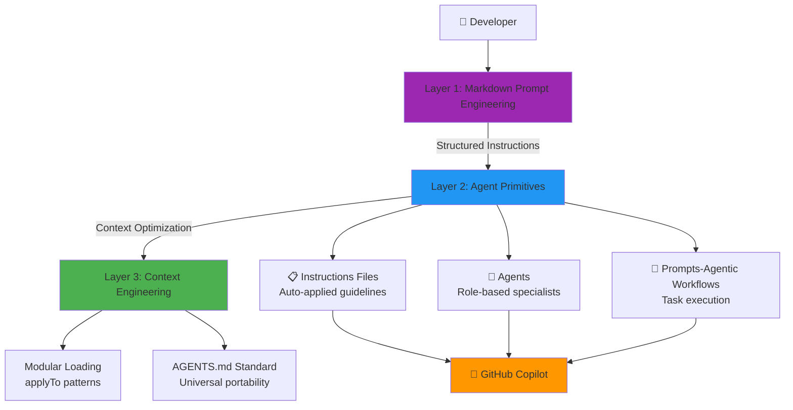

# AL Development Collection for GitHub Copilot

> **AI Native Development** toolkit for Microsoft Dynamics 365 Business Central implementing the **[AI-Native Instructions Architecture](https://danielmeppiel.github.io/awesome-ai-native/)** framework with **38 specialized Agent Primitives** across **3 systematic layers**. Features **AL Orchestra** multi-agent TDD system that transforms feature requests into code following BC best practices.

> 🎉 **v2.6.0 Production Ready** - Complete workflow validated: Architecture → TDD Implementation → PR Documentation. [See test results](./docs/workflows/complete-development-flow.md).

[](./validate-al-collection.js)
[](./CHANGELOG.md)
[](./al-development.md)
[](https://danielmeppiel.github.io/awesome-ai-native/)
[](./LICENSE)
[](https://github.com/javiarmesto/AL-Development-Collection-for-GitHub-Copilot/issues)
[](https://github.com/javiarmesto/AL-Development-Collection-for-GitHub-Copilot/stargazers)
[](https://github.com/javiarmesto/AL-Development-Collection-for-GitHub-Copilot/network/members)
[](https://github.com/javiarmesto/AL-Development-Collection-for-GitHub-Copilot/graphs/contributors)


## 🚀 Quick Start

### Prerequisites

- **Node.js** (v14.0.0 or higher) - [Download here](https://nodejs.org/en/download)
- **Visual Studio Code** with GitHub Copilot extension
- **AL Language extension** for VS Code

### Installation

**Option 1: NPM Package (Recommended)**
```bash
# Install from GitHub (no npm registry needed)
npm install github:javiarmesto/AL-Development-Collection-for-GitHub-Copilot

# Run the installer
npx al-collection install

# This will copy to .github/:
# - agents/ (7 strategic + tactical modes)
# - instructions/ (7 auto-applied guidelines)
# - prompts/ (18 agentic workflows)
# - getting-started.md (quick reference)
#
# Existing files are preserved - only new files are added
```

**Option 2: Clone Repository**

```bash
# Clone the repository
git clone https://github.com/javiarmesto/AL_Copilot_Collection.git
cd AL_Copilot_Collection

# Run the installer
node install.js install [target-directory]

# Or manually copy to your project
cp -r agents your-al-project/.github/
cp -r instructions your-al-project/.github/
cp -r prompts your-al-project/.github/
```

**Option 3: Direct Download**

1. Download the [latest release](https://github.com/javiarmesto/AL-Development-Collection-for-GitHub-Copilot/releases)
2. Extract to your project's `.github/copilot/` directory
3. Reload VS Code

### Post-Installation

1. **Reload VS Code**
   - Press `Ctrl+Shift+P` (or `Cmd+Shift+P` on Mac)
   - Run: `Developer: Reload Window`

2. **Read the Quick Start Guide**
   - Open `.github/getting-started.md`
   - This contains all essential information to get started

3. **Verify installation**
   - Open any `.al` file - instructions should auto-apply
   - Try: `Use al-orchestrator mode` - should switch context
   - Try: `@workspace use al-initialize` - should execute

### First Use

**Start here if unsure:**
```markdown
Use al-orchestrator mode
```
Then describe what you want to accomplish. The orchestrator will analyze and guide you.

**Try your first workflow:**

```bash
@workspace use al-initialize
```

**Or ask the orchestrator:**

```markdown
Switch to al-orchestrator mode and ask: "I need to build a sales approval workflow"
```

## 🏗️ AI Native-Instructions Architecture Framework

This collection implements the **[AI Native-Instructions Architecture](https://danielmeppiel.github.io/awesome-ai-native/)** framework with **3 systematic layers** that transform ad-hoc AI usage into reliable, repeatable engineering:



### 🎯 Framework Layers

| Layer | Focus | Purpose | AL Implementation |
|-------|-------|---------|-------------------|
| **Layer 1** | **Markdown Prompt Engineering** | Structured instructions using semantic markdown | Headers, lists, links for AI reasoning |
| **Layer 2** | **Agent Primitives** | Configurable tools (Instructions, Modes, Prompts) | 7 Instructions + 11 Chat Modes + 18 Workflows + 1 Guide |
| **Layer 3** | **Context Engineering** | Strategic context management via `applyTo` patterns | Modular loading, AGENTS.md compilation ready |

### 📊 Agent Primitives Breakdown

| Primitive Type | Count | Activation | Purpose |
|----------------|-------|------------|---------|  
| **Instructions** | 9 files | Auto via `applyTo` patterns | Persistent coding rules & standards |
| **Chat Modes** | 7 files | `Use [mode-name]` | Role-based strategic/tactical specialists |
| **Orchestra System** | 4 files | `Use al-conductor` | Multi-agent TDD orchestration |
| **Agentic Workflows** | 18 files | `@workspace use [name]` | Complete task execution processes |
| **Total Primitives** | **38 tools** | — | Complete AI Native toolkit with TDD |## 📦 What's Included: Agent Primitives

### � Instructions Files (7 primitives)

**Markdown Prompt Engineering** implemented as modular `.instructions.md` files with `applyTo` patterns:

**Always Active** (apply to `**/*.al`):
- **al-code-style** - Code formatting & feature-based structure
- **al-naming-conventions** - PascalCase standards & 26-char limits
- **al-performance** - SetLoadFields, early filtering, temporary tables
- **al-guidelines** - Master hub referencing all patterns

**Context-Activated** (apply based on context):
- **al-error-handling** - TryFunctions, error labels, telemetry (`applyTo: **/*.al`)
- **al-events** - Event subscribers, integration events (`applyTo: **/*.al`)
- **al-testing** - AL-Go structure, test generation (`applyTo: **/test/**/*.al`)

> 💡 **Context Engineering**: Instructions use `applyTo` frontmatter for selective loading, optimizing context window usage

### 🎯 Agentic Workflows (18 primitives)

**Systematic processes** as `.prompt.md` files with validation gates and tool access:

**General Workflows** - Invoke with `@workspace use [name]`:
- **al-initialize** - Complete environment and workspace setup (consolidated)
- **al-diagnose** - Runtime debugging and configuration troubleshooting (consolidated)
- **al-build** - Build, package, publish workflows
- **al-events** - Event subscriber/publisher implementation
- **al-performance** - Deep performance analysis with CPU profiling
- **al-performance.triage** - Quick performance diagnosis and static analysis
- **al-permissions** - Permission set generation
- **al-migrate** - BC version upgrade workflows
- **al-pages** - Page Designer integration
- **al-spec.create** - Functional-technical specifications
- **al-pr-prepare** - Pull request preparation (streamlined template)
- **al-translate** - XLF translation file management

**Context & Memory Workflows** - AI assistant continuity:
- **al-context.create** - Generate project context.md file for AI assistants
- **al-memory.create** - Generate/update memory.md for session continuity

**Copilot Workflows** - Specialized for AI-powered features:
- **al-copilot-capability** - Register new Copilot capability with enum extension and setup
- **al-copilot-promptdialog** - Create complete PromptDialog page with all areas
- **al-copilot-test** - Comprehensive testing with AI Test Toolkit
- **al-copilot-generate** - Generate Copilot code from natural language

> 💡 **Agentic Workflows**: Prompts orchestrate primitives into complete processes with human validation checkpoints.

### 💬 Chat Modes (7 primitives)

**Role-based specialists** with MCP tool boundaries (like professional licensing):

**Strategic Specialists** (design & analyze):
- **al-orchestrator** 📚 - GUIDE/EXAMPLE: Reference for creating complex agents
- **al-architect** 🏗️ - Solution architecture, cannot execute builds
- **al-debugger** 🐛 - Deep diagnosis, systematic troubleshooting
- **al-tester** ✅ - Testing strategy, TDD methodology
- **al-api** 🌐 - RESTful API design & implementation
- **al-copilot** 🤖 - AI-powered Copilot features development

**Tactical Specialist** (implement & execute):
- **al-developer** 💻 - Code implementation with full build tool access

> 💡 **Tool Boundaries**: Each mode has explicit CAN/CANNOT lists preventing cross-domain security breaches

### 🎭 AL Orchestra System (4 primitives) - NEW in v2.6

**Multi-Agent TDD Orchestration** adapted from [GitHub Copilot Orchestra](https://github.com/ShepAlderson/copilot-orchestra) with AL-specific enhancements:

**Main Agent**:
- **al-conductor** 🎯 - Orchestrates Planning → Implementation → Review → Commit cycle

**Specialized Subagents** (called automatically by conductor):
- **al-planning-subagent** 🔍 - AL-aware research and context gathering
- **al-implement-subagent** ⚙️ - TDD-focused implementation (RED → GREEN → REFACTOR)
- **al-review-subagent** ✅ - Code review against AL best practices

**Key Features**:
- 🧪 **TDD Enforcement**: Failing tests first, then minimal code, then refactor
- 🎨 **Event-Driven Validation**: Prevents base BC object modifications
- 📋 **Auto-Documentation**: Generates plan files in `.github/plans/`
- 🚦 **Quality Gates**: Automated review before each commit
- 💰 **Cost-Optimized**: Uses Haiku for implementation, Sonnet for strategic work

**Usage**:
```markdown
Use al-conductor mode

Add email validation to Customer table with these requirements:
- Use regex pattern matching
- Allow empty emails (optional in BC)
- Show user-friendly error messages
```

**Result**: Multi-phase plan → TDD implementation → Quality validation → Documentation trail

**[📖 Complete Orchestra Documentation](./agents/orchestration/README.md)**

> 💡 **When to Use**: Complex features (3+ phases), production code requiring quality gates, bug fixes with TDD proof, or learning AL through guided implementation

### 📊 Complete Development Flow Guide

**NEW**: Visual guide for choosing the right workflow based on task complexity:

**[📖 Complete Development Flow Documentation](./docs/workflows/complete-development-flow.md)**

This comprehensive guide includes:
- **Decision Tree** - Automated routing based on complexity level (Simple/Moderate/Complex/Specialized)
- **3 Development Patterns** with Mermaid diagrams:
  - Pattern 1: Simple Features (direct implementation)
  - Pattern 2: Moderate Features (TDD with multi-phase planning)
  - Pattern 3: Complex Features (architecture + specialized design)
- **Specialized Flows** for specific scenarios:
  - Flow A: API Development (REST/OData)
  - Flow B: AI/Copilot Features (prompt engineering)
  - Flow C: Performance Optimization (profiling + refactoring)
- **Real Examples** from Customer Loyalty Points test case

> 💡 **Quick Start**: Unsure which agent or workflow to use? Check the decision tree in the complete flow guide!

### 📖 Integration Guide (1 primitive)

- **copilot-instructions.md** - Master document coordinating all 38 primitives with usage guidance

## 🎯 Common Workflows

> **📖 New to the collection?** Check the **[Complete Development Flow Guide](./docs/workflows/complete-development-flow.md)** for visual decision trees and pattern selection!

### Building a New Feature (Pattern-Based)

**Simple Feature** (1-2 objects, quick changes):
```text
1. Use al-developer mode
2. Implement directly (auto-guidelines active)
3. @workspace use al-build
```

**Moderate Feature** (3-5 objects, needs tests):
```text
1. Use al-conductor mode
2. Multi-phase TDD implementation
3. Quality gates + documentation
```

**Complex Feature** (5+ objects, needs architecture):
```text
1. Use al-architect mode → Design
2. Use al-conductor mode → Implement with TDD
3. @workspace use al-pr-prepare
```

**[📊 See decision tree in Complete Flow Guide](./docs/workflows/complete-development-flow.md)**

### Debugging Issues

```text
1. @workspace use al-diagnose → Diagnose and debug
2. @workspace use al-performance → Profile (if needed)
3. Fix (auto-guidelines active)
4. Use al-tester mode → Test strategy
```

### API Development (Specialized Flow)

```text
1. Use al-architect mode → Design API contract
2. Use al-api mode → Implement REST/OData
3. @workspace use al-permissions → Security
4. Use al-tester mode → API test suite
5. @workspace use al-build → Deploy
```

**[📖 Complete API Flow with examples](./docs/workflows/complete-development-flow.md#flow-a-api-development)**

### AI/Copilot Features (Specialized Flow)

```text
1. Use al-copilot mode → Design AI capability
2. @workspace use al-copilot-capability → Register
3. @workspace use al-copilot-promptdialog → UI
4. @workspace use al-copilot-test → Validate
```

**[📖 Complete Copilot Flow with examples](./docs/workflows/complete-development-flow.md#flow-b-aicopilot-features)**

## 📚 Documentation

### Framework Documentation
- **[AI Native-Instructions Architecture Implementation](./references/AI%20Native-INSTRUCTIONS-ARCHITECTURE.md)** - Framework compliance details
- **[AI Native-Instructions Framework Guide](https://danielmeppiel.github.io/awesome-ai-native/)** - Complete framework reference
- **[AGENTS.md Standard](https://agents.md)** - Universal context format

### Collection Documentation
- **[Collection Overview](./al-development.md)** - User-facing guide
- **[Instructions Index](./instructions/index.md)** - Complete guide to all instruction files
- **[Prompts Index](./prompts/index.md)** - Complete guide to all agentic workflows
- **[Agents Index](./agents/index.md)** - Complete guide to all agents
- **[Integration Guide](./instructions/copilot-instructions.md)** - Master coordination document

## 🛠️ Requirements

- Visual Studio Code (latest version)
- AL Language extension for Business Central
- GitHub Copilot extension (active subscription)
- Business Central development environment (sandbox recommended)
- Node.js 14+ (for validation script)

## ✅ Validation

Validate the collection before contributing:

```bash
# Install dependencies
npm install

# Run validation
npm run validate
```

Expected output:
```
✅ Collection is fully compliant and ready for contribution!
```

## 📖 Usage Examples

### Example 1: New Developer
```markdown
User: "I'm new to AL. How do I start?"

Response from al-orchestrator:
"Let's get you set up. Use @workspace use al-initialize
to initialize your project. The auto-applied guidelines
will help you code correctly from day one."
```

### Example 2: Complex Task
```markdown
User: "Build AI-powered API for sales forecasting"

Response from al-orchestrator:
"This needs 4 phases:
1. al-architect - Design architecture (3-4 hours)
2. al-api + al-copilot - Build in parallel (1 day)
3. Integration - Connect layers (1-2 days)
4. al-tester - Comprehensive testing (1 day)"
```

### Example 3: Performance Issue
```markdown
User: "My report is slow"

Response from al-debugger:
"Let's diagnose it systematically:
1. @workspace use al-performance.triage (quick analysis)
2. @workspace use al-performance (deep profiling)
3. Apply optimizations
4. Re-profile to verify"
```

## 🤝 Contributing

Found an issue or have a suggestion?

1. **Report Issues**
   - Use GitHub Issues
   - Provide specific examples
   - Include error messages

2. **Suggest Improvements**
   - New prompts for common tasks
   - New modes for specialized scenarios
   - Better patterns and examples

3. **Contribution Guidelines**
   - Follow file naming conventions
   - Include proper frontmatter
   - Update manifest file
   - Run validation before submitting

See [CONTRIBUTING.md](./CONTRIBUTING.md) for detailed guidelines.

## 📋 File Structure

**AI Native-Instructions Architecture** implementation following VSCode Copilot conventions:

```
AL-Development-Collection-for-GitHub-Copilot/
├── .github/                                      # GitHub templates only
├   ├── ISSUE_TEMPLATE/                          # Issue templates (3)
│   └── PULL_REQUEST_TEMPLATE.md                 # PR template
├── instructions/                                 # 📋 Instructions (8 files)
│   ├── index.md                                 # Complete instructions guide
│   ├── copilot-instructions.md                  # Master integration guide
│   ├── al-guidelines.instructions.md            # applyTo: **/*.{al,json}
│   ├── al-code-style.instructions.md            # applyTo: **/*.al
│   ├── al-naming-conventions.instructions.md
│   ├── al-performance.instructions.md
│   ├── al-error-handling.instructions.md
│   ├── al-events.instructions.md
│   └── al-testing.instructions.md               # applyTo: **/test/**/*.al
├── prompts/                                      # 🎯 Agentic Workflows (15 files)
│   ├── index.md                                 # Complete workflows guide
│   ├── al-initialize.prompt.md                  # Environment & workspace setup
│   ├── al-diagnose.prompt.md                    # Debugging & troubleshooting
│   ├── al-copilot-capability.prompt.md          # Copilot capability registration
│   ├── al-copilot-promptdialog.prompt.md        # PromptDialog page creation
│   ├── al-copilot-test.prompt.md                # Copilot testing with AI Test Toolkit
│   └── ... (14 total workflow prompts)
├── agents/                                       # 💬 Agents (11 files)
│   ├── index.md                                  # Complete guide
│   ├── al-orchestrator.agent.md                 # Smart router (guide/example)
│   ├── al-architect.agent.md                    # Architecture specialist
│   ├── ... (6 more strategic/tactical modes)
│   └── orchestration/                           # 🎭 AL Orchestra System (4 files)
│       ├── README.md                            # Complete Orchestra documentation
│       ├── index.md                             # Quick reference
│       ├── al-conductor.agent.md                # Main orchestration agent
│       ├── al-planning-subagent.agent.md              # Research specialist
│       ├── al-implement-subagent.agent.md             # TDD implementation
│       └── al-review-subagent.agent.md                # Code review validation
├── collections/                                  # Collection manifests
│   └── al-development.collection.yml            # Main collection definition
├── references/                                   # Framework documentation
│   ├── AI Native-INSTRUCTIONS-ARCHITECTURE.md   # Framework implementation
│   ├── ai native-concepts.md                    # Framework concepts
│   └── ai native structure.md                   # Framework structure
├── archive/                                      # Historical files
├── al-development.md                            # User documentation
├── CONTRIBUTING.md                              # Contribution guidelines
├── LICENSE                                      # MIT License
├── SECURITY.md                                  # Security policy
├── validate-al-collection.js                    # Compliance validation
├── package.json                                 # Dependencies
└── README.md                                    # This file

# Ready for AGENTS.md compilation (Layer 3: Context Engineering)
# All primitives use applyTo patterns for modular context loading
```

## 🏷️ Version History

### 2.6.0 (2025-11-08) - AL Orchestra Multi-Agent TDD System
- 🎭 **AL Orchestra System** - NEW multi-agent TDD orchestration (4 agents)
  - **al-conductor**: Main orchestration agent for Planning → Implementation → Review → Commit cycle
  - **al-planning-subagent**: AL-aware research and context gathering
  - **al-implement-subagent**: TDD-focused implementation with full AL MCP tools (uses Haiku 4.5 for cost optimization)
  - **al-review-subagent**: Code review against AL best practices with CRITICAL/MAJOR/MINOR severity levels
- 🧪 **TDD Enforcement** - Strict RED (failing tests) → GREEN (minimal code) → REFACTOR cycle
- 🎨 **Event-Driven Validation** - Prevents base BC object modifications (extension patterns only)
- 📋 **Auto-Documentation** - Generates plan files in `.github/plans/` with complete audit trail
- 🚦 **Quality Gates** - Automated review before each commit with AL-specific checks
- 💰 **Cost-Optimized** - Uses Haiku for implementation, Sonnet for strategic work (30-40% cost reduction)
- 📊 **Total Primitives** - 38 tools (9 instructions + 18 workflows + 11 agents)
- 📖 **Complete Documentation** - 23k-character adaptability analysis, 15k-character Orchestra guide
- 🔄 **Backward Compatible** - All existing agents work unchanged, Orchestra is additive
- 🎯 **Framework Alignment** - Implements GitHub Copilot Orchestra pattern adapted for AL development

### 2.5.0 (2025-10-31) - Developer Mode & Context Management
- 💻 **al-developer Mode** - NEW tactical implementation specialist
  - Full MCP tool access (al_build, al_publish, al_incrementalpublish)
  - Executes code changes, builds, and tests
  - Bridges gap between strategic modes and implementation
  - Delegates architectural decisions to specialized modes
- 📄 **al-context.create Workflow** - Generate project context.md files
  - 16-section comprehensive project documentation
  - AI assistant onboarding in <2 minutes
  - Architecture, decisions, navigation guide
- 🧠 **al-memory.create Workflow** - Session continuity tracking
  - 12-section development memory log
  - Decision tracking with rationale
  - Problem/solution patterns documentation
  - TODO and learning journal
- 📊 **Total Primitives** - 32 tools (7 instructions + 18 workflows + 7 modes + 1 guide)
- 🎯 **Cognitive Focus** - Complete separation: Think (architect) → Do (developer) → Validate (tester)
- 🏗️ **Enhanced Workflows** - Better integration between strategic and tactical work

### 2.4.0 (2025-10-28) - Copilot Development Expansion
- 🤖 **AL Copilot Mode** - Complete rewrite with 3x more content (1,280 lines)
  - Quick Start guide (5-minute first Copilot)
  - Complete PromptDialog patterns (all 5 areas)
  - Modern patterns (SetManagedResourceAuthorization, AI Test Toolkit)
  - Real-world examples from Lab1_3 repository
  - Advanced prompt engineering techniques
  - Responsible AI implementation patterns
- 🎯 **New Copilot Workflows** - 3 specialized prompts added (15 total workflows)
  - al-copilot-capability: Register Copilot capability
  - al-copilot-promptdialog: Create PromptDialog pages
  - al-copilot-test: Test with AI Test Toolkit
- 📚 **al-orchestrator** - Converted to GUIDE/EXAMPLE for agent creation
- 📊 **Total Primitives** - 29 tools (7 instructions + 15 workflows + 6 modes + 1 guide)
- 🏗️ **AI Native Development** - Full compliance maintained across all new content

### 2.3.0 (2025-10-27) - Workflow Optimization
- 🔄 **Consolidated Workflows** - Reduced from 14 to 11 workflows (-21%)
- 🎯 **al-initialize** - Merged al-setup + al-workspace into single initialization workflow
- 🐛 **al-diagnose** - Merged al-debug + al-troubleshoot into unified diagnostics
- ✂️ **Streamlined Templates** - al-pr-prepare reduced from 509 to ~240 lines
- ❌ **Removed Redundancy** - Eliminated al-workflow (overlapped with specialized prompts)
- 📊 **Total Primitives** - 25 tools at v2.3 (reduced from 28 at v2.2)
- 💡 **Clearer Purpose** - Each workflow now has distinct, non-overlapping functionality
- 📉 **Context Efficiency** - Reduced total lines by ~30% while maintaining functionality

### 2.2.0 (2025-10-19) - AI Native-Instructions Architecture
- 🏗️ **Framework Implementation** - Full AI Native-Instructions Architecture compliance
- 📋 **Layer 1: Markdown Prompt Engineering** - Structured semantic markdown throughout
- 🔧 **Layer 2: Agent Primitives** - 28 configurable tools (Instructions, Modes, Prompts)
- 🎯 **Layer 3: Context Engineering** - `applyTo` patterns for modular context loading
- 📖 **AGENTS.md Ready** - Prepared for universal context compilation
- 🔒 **Tool Boundaries** - Chat modes with explicit CAN/CANNOT security lists
- ✅ **Validation Passing** - All 34 framework compliance checks passing

### 2.1.0 (2025-10-15)
- ✨ Streamlined chat modes - Archived 5 duplicate modes
- 🎯 Focused toolkit - 6 core strategic agents
- 📊 Updated to 24 tools - Clearer separation of concerns
- 📚 Enhanced documentation - Practical examples integrated

### 2.0.0 (2025-01-15)
- ✅ Full compliance with contribution guidelines
- ✅ All files renamed to proper extensions
- ✅ Collection manifest created
- ✅ Validation script added

### 1.0.0 (2025-01-15)
- 🎉 Initial release
- 📦 7 instructions, 10 prompts, 6 modes

## 📄 License

MIT License - see [LICENSE](./LICENSE) file for details.

## 👤 Author

**javiarmesto**
- GitHub: [@javiarmesto](https://github.com/javiarmesto)
- Created: 2025-01-15

## 🙏 Acknowledgments

- Microsoft Business Central team for AL language
- GitHub Copilot team for extensibility
- AL development community for patterns and best practices
- [Shep Alderson](https://github.com/ShepAlderson) for the [GitHub Copilot Orchestra pattern](https://github.com/ShepAlderson/copilot-orchestra)

## 📞 Support

- **Issues**: [GitHub Issues](https://github.com/javiarmesto/al-development-collection/issues)
- **Discussions**: [GitHub Discussions](https://github.com/javiarmesto/al-development-collection/discussions)
- **Documentation**: [al-development.md](./al-development.md)

---

**Status**: ✅ AI Native-Instructions Architecture Compliant
**Framework**: [AI Native-Instructions Architecture](https://danielmeppiel.github.io/awesome-ai-native/)
**Last Updated**: 2025-11-08
**Collection ID**: `al-development`
**Version**: 2.6.0
**Total Primitives**: 36 (7 instructions + 18 workflows + 11 agents + 1 guide)
**Context Standard**: AGENTS.md ready
**Latest**: AL Orchestra multi-agent TDD system with automated quality gates and documentation

