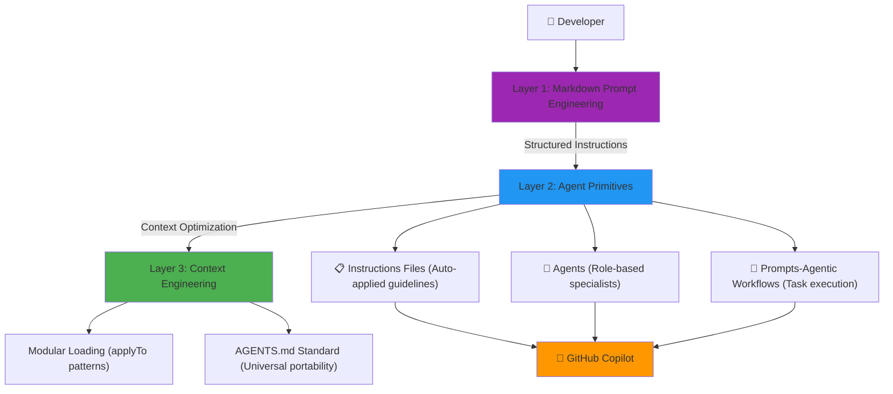

# AL Development Collection for GitHub Copilot

> **AI Native Development** toolkit for Microsoft Dynamics 365 Business Central implementing the **[AI-Native Instructions Architecture](https://danielmeppiel.github.io/awesome-ai-native/)** framework with **37 specialized Agent Primitives** across **3 systematic layers**. Features **AL Orchestra** multi-agent TDD system that transforms feature requests into code following BC best practices.

> **v2.8.0** - Workflow Simplification: Direct workflow (User → al-architect → al-conductor)

[](./validate-al-collection.js)
[](./CHANGELOG.md)
[](./al-development.md)
[](https://danielmeppiel.github.io/awesome-ai-native/)
[](./LICENSE)
[](https://github.com/javiarmesto/AL-Development-Collection-for-GitHub-Copilot/issues)
[](https://github.com/javiarmesto/AL-Development-Collection-for-GitHub-Copilot/stargazers)
[](https://github.com/javiarmesto/AL-Development-Collection-for-GitHub-Copilot/network/members)
[](https://github.com/javiarmesto/AL-Development-Collection-for-GitHub-Copilot/graphs/contributors)


## 🚀 Quick Start

> **⚡ 5-Minute Setup** → [Complete Quick Start Guide](./QUICK-START.md)

### Installation

**Option 1: NPM Package (Recommended)**

```bash
# Install via npm
npm install github:javiarmesto/AL-Development-Collection-for-GitHub-Copilot
npx al-collection install

# Or use directly with npx
npx al-development-collection install
```

**CLI Commands:**
```bash
# Install to current or specified directory
npx al-development-collection install [path]

# Update existing installation (merge mode)
npx al-development-collection update

# Validate installation
npx al-development-collection validate

# Get help
npx al-development-collection --help
```

**Features:**
- ✅ **Auto-detects AL projects** - Searches for app.json automatically
- ✅ **Interactive selection** - Choose from multiple projects if found
- ✅ **Smart merging** - Preserves existing files, only adds new ones
- ✅ **Validation** - Built-in installation verification

**Option 2: Clone & Install**

For development or customization:

```bash
git clone https://github.com/javiarmesto/AL-Development-Collection-for-GitHub-Copilot.git
cd AL-Development-Collection-for-GitHub-Copilot
node install.js install [your-al-project]
```

**Then**: Reload VS Code (`Ctrl+Shift+P` → `Developer: Reload Window`)

**Recommendation**: Use **npm CLI** for quick setup with auto-detection. Use Clone & Install for development or customization.

### First Use

**📖 Follow the complete example**: [Customer Loyalty Points System](./QUICK-START.md#-complete-example-customer-loyalty-points-system)

Or start directly:

**New project?**
```bash
@workspace use al-initialize
```

**Have a feature to build?**
```markdown
Use al-architect mode

[Describe your requirements]
```

**Need debugging?**
```markdown
Use al-debugger mode

[Describe the issue]
```


## 🏗️ AI Native-Instructions Architecture Framework

This collection implements the **[AI Native-Instructions Architecture](https://danielmeppiel.github.io/awesome-ai-native/)** framework with **3 systematic layers** that transform ad-hoc AI usage into reliable, repeatable engineering:



### 🎯 Framework Layers

| Layer | Focus | Purpose | AL Implementation |
|-------|-------|---------|-------------------|
| **Layer 1** | **Markdown Prompt Engineering** | Structured instructions using semantic markdown | Headers, lists, links for AI reasoning |
| **Layer 2** | **Agent Primitives** | Configurable tools (Instructions, Modes, Prompts) | 7 Instructions + 11 Agents + 18 Workflows + 1 Guide |
| **Layer 3** | **Context Engineering** | Strategic context management via `applyTo` patterns | Modular loading, AGENTS.md compilation ready |

### 📊 Agent Primitives Breakdown

| Primitive Type | Count | Activation | Purpose |
|----------------|-------|------------|---------|  
| **Instructions** | 9 files | Auto via `applyTo` patterns | Persistent coding rules & standards |
| **Agents** | 7 files | `Use [mode-name]` | Role-based strategic/tactical specialists |
| **Orchestra System** | 4 files | `Use al-conductor` | Multi-agent TDD orchestration |
| **Agentic Workflows** | 18 files | `@workspace use [name]` | Complete task execution processes |
| **Total Primitives** | **37 tools** | — | Complete AI Native toolkit with TDD |

## 📦 What's Included: Agent Primitives

### 📋 Instructions Files (9 primitives)

**Markdown Prompt Engineering** implemented as modular `.instructions.md` files with `applyTo` patterns:

**Always Active** (apply to `**/*.al`):
- **al-guidelines** - Master hub referencing all patterns
- **al-code-style** - Code formatting & feature-based structure
- **al-naming-conventions** - PascalCase standards & 26-char limits
- **al-performance** - SetLoadFields, early filtering, temporary tables

**Context-Activated** (apply based on context):
- **al-error-handling** - TryFunctions, error labels, telemetry (`applyTo: **/*.al`)
- **al-events** - Event subscribers, integration events (`applyTo: **/*.al`)
- **al-testing** - AL-Go structure, test generation (`applyTo: **/test/**/*.al`)

**Integration & Coordination**:
- **copilot-instructions** - Master coordination document (auto-loaded as `.github/copilot-instructions.md`)
- **index** - Complete instructions catalog and usage guide

> 💡 **Context Engineering**: Instructions use `applyTo` frontmatter for selective loading, optimizing context window usage

### 🎯 Agentic Workflows (18 primitives)

**Systematic processes** as `.prompt.md` files with validation gates and tool access:

**General Workflows** - Invoke with `@workspace use [name]`:
- **al-initialize** - Complete environment and workspace setup (consolidated)
- **al-diagnose** - Runtime debugging and configuration troubleshooting (consolidated)
- **al-build** - Build, package, publish workflows
- **al-events** - Event subscriber/publisher implementation
- **al-performance** - Deep performance analysis with CPU profiling
- **al-performance.triage** - Quick performance diagnosis and static analysis
- **al-permissions** - Permission set generation
- **al-migrate** - BC version upgrade workflows
- **al-pages** - Page Designer integration
- **al-spec.create** - Functional-technical specifications
- **al-pr-prepare** - Pull request preparation (streamlined template)
- **al-translate** - XLF translation file management

**Context & Memory Workflows** - AI assistant continuity:
- **al-context.create** - Generate project context.md file for AI assistants
- **al-memory.create** - Generate/update memory.md for session continuity

**Copilot Workflows** - Specialized for AI-powered features:
- **al-copilot-capability** - Register new Copilot capability with enum extension and setup
- **al-copilot-promptdialog** - Create complete PromptDialog page with all areas
- **al-copilot-test** - Comprehensive testing with AI Test Toolkit
- **al-copilot-generate** - Generate Copilot code from natural language

> 💡 **Agentic Workflows**: Prompts orchestrate primitives into complete processes with human validation checkpoints.

### 💬 Agents (7 primitives)

**Role-based specialists** with MCP tool boundaries (like professional licensing):

**Strategic Specialists** (design & analyze):
- **al-architect** 🏗️ - Solution architecture, cannot execute builds (START HERE)
- **al-debugger** 🐛 - Deep diagnosis, systematic troubleshooting
- **al-tester** ✅ - Testing strategy, TDD methodology
- **al-api** 🌐 - RESTful API design & implementation
- **al-copilot** 🤖 - AI-powered Copilot features development

**Tactical Specialist** (implement & execute):
- **al-developer** 💻 - Code implementation with full build tool access

> 💡 **Tool Boundaries**: Each mode has explicit CAN/CANNOT lists preventing cross-domain security breaches

### 🎭 AL Orchestra System (4 primitives) - NEW in v2.6

**Multi-Agent TDD Orchestration** adapted from [GitHub Copilot Orchestra](https://github.com/ShepAlderson/copilot-orchestra) with AL-specific enhancements:

**Main Agent**:
- **al-conductor** 🎯 - Orchestrates Planning → Implementation → Review → Commit cycle

**Specialized Subagents** (called automatically by conductor):
- **al-planning-subagent** 🔍 - AL-aware research and context gathering
- **al-implement-subagent** ⚙️ - TDD-focused implementation (RED → GREEN → REFACTOR)
- **al-review-subagent** ✅ - Code review against AL best practices

**Key Features**:
- 🧪 **TDD Enforcement**: Failing tests first, then minimal code, then refactor
- 🎨 **Event-Driven Validation**: Prevents base BC object modifications
- 📋 **Auto-Documentation**: Generates plan files in `.github/plans/`
- 🚦 **Quality Gates**: Automated review before each commit
- 💰 **Cost-Optimized**: Uses Haiku for implementation, Sonnet for strategic work

**Usage**:
```markdown
Use al-conductor mode

Add email validation to Customer table with these requirements:
- Use regex pattern matching
- Allow empty emails (optional in BC)
- Show user-friendly error messages
```

**Result**: Multi-phase plan → TDD implementation → Quality validation → Documentation trail

**[📖 Complete Orchestra Documentation](./agents/orchestration/README.md)**

> 💡 **When to Use**: Complex features (3+ phases), production code requiring quality gates, bug fixes with TDD proof, or learning AL through guided implementation

### 📋 Agent Context & Memory System (NEW in v2.7)

**Centralized documentation system** ensuring all agents share context and maintain consistency:

**Documentation Location**: `.github/plans/`

**Core Documents**:
- **`architecture.md`** - System architecture decisions and patterns
- **`spec.md`** - Functional and technical specifications
- **`test-plan.md`** - Test strategy and coverage requirements
- **`memory.md`** - Session history and decision rationale

**Agent Integration**:

**Orchestra Agents** (context-aware collaboration):
- **al-conductor**: Reads architecture/spec upfront, passes context to subagents
- **al-planning-subagent**: Documents research findings for conductor's plan creation
- **al-implement-subagent**: Aligns implementation with architecture/spec/test-plan
- **al-review-subagent**: Validates compliance against all context documents

**Specialist Agents** (context-aware design):
- **al-developer**: Reads all context docs before coding, ensures consistency
- **al-api**: Produces `<endpoint>-api-design.md` documenting contracts and integration
- **al-copilot**: Generates `<feature>-copilot-ux-design.md` covering AI prompts and UX

**Key Benefits**:
- ✅ **Consistency**: All agents reference the same architectural decisions
- 📚 **Knowledge Transfer**: New agents inherit project context automatically
- 🔄 **Session Continuity**: Memory system preserves decisions across interactions
- 🎯 **Quality Assurance**: Review validates against documented requirements
- 📖 **Auto-Documentation**: Design decisions captured for team reference

**Workflow Example**:
```markdown
1. Use al-architect mode → Creates architecture.md
2. @workspace use al-spec.create → Generates spec.md
3. Use al-conductor mode → Reads docs, implements with subagents
4. al-review-subagent → Validates against architecture.md + spec.md
5. Result: Consistent implementation aligned with design
```

**Document Templates Available**:
- API Design: `docs/templates/api-design-template.md`
- Copilot UX: `docs/templates/copilot-ux-design-template.md`
- Architecture: Generated by al-architect during planning
- Specifications: Generated by al-spec.create workflow

> 💡 **Best Practice**: Always create architecture.md and spec.md before using al-conductor for medium/high complexity features

### 📊 Complete Development Flow Guide

**NEW**: Visual guide for choosing the right workflow based on task complexity:

**[📖 Complete Development Flow Documentation](./docs/workflows/complete-development-flow.md)**

This comprehensive guide includes:
- **Decision Tree** - Automated routing based on complexity level (Simple/Moderate/Complex/Specialized)
- **3 Development Patterns** :
  - Pattern 1: Simple Features (direct implementation)
  - Pattern 2: Moderate Features (TDD with multi-phase planning)
  - Pattern 3: Complex Features (architecture + specialized design)
- **Specialized Flows** for specific scenarios:
  - Flow A: API Development (REST/OData)
  - Flow B: AI/Copilot Features (prompt engineering)
  - Flow C: Performance Optimization (profiling + refactoring)
- **Real Examples** from Customer Loyalty Points test case

> 💡 **Quick Start**: Unsure which agent or workflow to use? Check the decision tree in the complete flow guide!

### 📖 Integration Guide (1 primitive)

- **copilot-instructions.md** - Master document coordinating all 37 primitives with usage guidance

## 🎯 Common Workflows

> **📖 New to the collection?** Check the **[Complete Development Flow Guide](./docs/workflows/complete-development-flow.md)** for visual decision trees and pattern selection!

**Have a feature to implement?** The collection uses **automatic complexity classification** with validation gates:

1. **Describe your requirements** (document, specs, or plain description)
2. **System analyzes** and infers complexity: 🟢 LOW / 🟡 MEDIUM / 🔴 HIGH
3. **You confirm** the classification (🚦 VALIDATION GATE - mandatory)
4. **Auto-routes** to the appropriate agent/workflow

## 🚦 Routing Matrix by Confirmed Complexity

> ⚠️ **Experimental & Customizable Classification**: This routing system is an **experimental approach** that you can customize by editing framework files (`README.md`, `agents/index.md`, `instructions/copilot-instructions.md`) in your repository. Complexity is assessed by scope, integration depth, and architectural impact—not by counting AL objects. **Modify the criteria, thresholds, and routing paths** to match your team's expertise and project requirements.

| Complexity | Domain | Scenario Description | Agent Route | Why This Path |
|------------|--------|----------------------|-------------|---------------|
| 🟢 **LOW** | 🎯 **Standard** | Simple field addition, basic validation, single UI change | `al-developer` | Direct implementation - scope is clear, no design needed |
| 🟢 **LOW** | 🐛 **Bug Fix** | Known issue with clear reproduction steps | `al-debugger` → `al-developer` | Diagnose root cause first, then implement fix with tests |
| 🟢 **LOW** | ✅ **Test Addition** | Adding tests to existing well-structured code | `al-tester` → `al-developer` | Design test strategy, then implement test cases |
| 🟡 **MEDIUM** | 🏗️ **Feature** | Business logic with data flow, internal integrations | `al-conductor` | TDD orchestration ensures quality across 2-3 phases |
| 🟡 **MEDIUM** | 🌐 **API** | RESTful endpoints, OData pages, internal API exposure | `al-api` → `al-conductor` | Design API contract first, then implement with TDD |
| 🟡 **MEDIUM** | 🤖 **Copilot Feature** | Copilot capability, PromptDialog, basic AI integration | `al-copilot` → `al-conductor` | Design AI UX and prompts, then build with quality gates |
| 🟡 **MEDIUM** | 🐛 **Complex Bug** | Intermittent issue requiring systematic investigation | `al-debugger` → `al-conductor` | Diagnose with profiling, then fix with comprehensive tests |
| 🔴 **HIGH** | 🏛️ **Architecture** | Multi-module feature, new patterns, broad impact | `al-architect` → `al-conductor` | Design architecture first, then orchestrate TDD implementation |
| 🔴 **HIGH** | 🌐 **Integration** | External APIs, OAuth, Azure services, webhooks | `al-api` → `al-architect` → `al-conductor` | API design → System architecture → Secure TDD implementation |
| 🔴 **HIGH** | ⚡ **Performance** | System-wide optimization, architectural bottlenecks | `al-architect` → `al-conductor` | Analyze architecture impact, design optimization strategy |

**Quick examples:**
- 🟢 LOW: "Add Priority field to Sales Header" → `al-developer`
- 🟡 MEDIUM: "Customer loyalty points with calculation" → `al-conductor`
- 🔴 HIGH: "External API integration with OAuth and retry logic" → `al-api` → `al-architect` → `al-conductor`

**Start here if unsure:**
```markdown
Use al-architect mode

I need to [describe your requirement]
```

al-architect will analyze requirements, design the solution architecture, and recommend the appropriate workflow (al-developer for simple features, al-conductor for complex TDD implementation).

**[📊 See complete routing matrix and decision tree](./docs/workflows/complete-development-flow.md)**

### Debugging Issues

```text
1. @workspace use al-diagnose → Diagnose and debug
2. @workspace use al-performance → Profile (if needed)
3. Fix (auto-guidelines active)
4. Use al-tester mode → Test strategy
```

### API Development (Specialized Flow)

```text
1. Use al-architect mode → Design API contract
2. Use al-api mode → Implement REST/OData
3. @workspace use al-permissions → Security
4. Use al-tester mode → API test suite
5. @workspace use al-build → Deploy
```

**[📖 Complete API Flow with examples](./docs/workflows/complete-development-flow.md#flow-a-api-development)**

### AI/Copilot Features (Specialized Flow)

```text
1. Use al-copilot mode → Design AI capability
2. @workspace use al-copilot-capability → Register
3. @workspace use al-copilot-promptdialog → UI
4. @workspace use al-copilot-test → Validate
```

**[📖 Complete Copilot Flow with examples](./docs/workflows/complete-development-flow.md#flow-b-aicopilot-features)**

## 📚 Documentation

### Framework Documentation
- **[AI Native-Instructions Architecture Implementation](./references/AI%20Native-INSTRUCTIONS-ARCHITECTURE.md)** - Framework compliance details
- **[AI Native-Instructions Framework Guide](https://danielmeppiel.github.io/awesome-ai-native/)** - Complete framework reference
- **[AGENTS.md Standard](https://agents.md)** - Universal context format

### Collection Documentation
- **[Collection Overview](./al-development.md)** - User-facing guide
- **[Instructions Index](./instructions/index.md)** - Complete guide to all instruction files
- **[Prompts Index](./prompts/index.md)** - Complete guide to all agentic workflows
- **[Agents Index](./agents/index.md)** - Complete guide to all agents
- **[Integration Guide](./instructions/copilot-instructions.md)** - Master coordination document

## 🛠️ Requirements

- Visual Studio Code Insiders
- AL Language extension for Business Central
- GitHub Copilot extension (active subscription)
- Business Central development environment (sandbox recommended)
- Node.js 14+ (for validation script)

## ✅ Validation

Validate the collection before contributing:

```bash
# Install dependencies
npm install

# Run validation
npm run validate
```

Expected output:
```
✅ Collection is fully compliant and ready for contribution!
```

## 📖 Usage Examples

### Example 1: Simple Feature (🟢 LOW Complexity)
```markdown
User: "Add email validation to Customer table"

Classification: 🟢 LOW
- Scope: Limited (single table)
- Integration: None
- Route: al-developer mode

Result: Field + validation implemented in ~5 minutes
```

### Example 2: Feature Development (🟡 MEDIUM Complexity)
```markdown
User: "Build customer loyalty points system"

Classification: 🟡 MEDIUM
- Scope: Moderate (Customer + Sales + Loyalty)
- Integration: Internal (event subscribers)
- Route: al-architect → al-conductor (TDD Orchestra)

Workflow:
1. al-architect designs architecture (20 min)
2. al-conductor orchestrates implementation:
   - Planning subagent researches BC objects
   - Implement subagent executes 7 TDD phases
   - Review subagent validates quality gates
3. Result: 10 AL objects, 63 tests, 100% passing (90 min)
```

### Example 3: Complex Integration (🔴 HIGH Complexity)
```markdown
User: "Integrate with external payment gateway (OAuth + webhooks)"

Classification: 🔴 HIGH
- Scope: Extensive (Sales + Finance + Security + API)
- Integration: External (REST API, OAuth 2.0)
- Route: al-api → al-architect → al-conductor

Workflow:
1. al-api designs API contract (1 hour)
2. al-architect plans system architecture (2 hours)
3. al-conductor implements with TDD (1-2 days)
4. Security review + performance profiling
```

## 🤝 Contributing

Found an issue or have a suggestion?

1. **Report Issues**
   - Use GitHub Issues
   - Provide specific examples
   - Include error messages

2. **Suggest Improvements**
   - New prompts for common tasks
   - New modes for specialized scenarios
   - Better patterns and examples

3. **Contribution Guidelines**
   - Follow file naming conventions
   - Include proper frontmatter
   - Update manifest file
   - Run validation before submitting

See [CONTRIBUTING.md](./CONTRIBUTING.md) for detailed guidelines.

## 📋 File Structure

**AI Native-Instructions Architecture** with **37 Agent Primitives** across **3 layers**:

```
AL-Development-Collection-for-GitHub-Copilot/
├── .github/                                      # GitHub integration
│   ├── ISSUE_TEMPLATE/                          # Issue templates
│   ├── PULL_REQUEST_TEMPLATE.md                 # PR template
│   └── copilot-instructions.md                  # Master coordination (symlink)
├── instructions/                                 # 📋 Layer 1: Instructions (9 files)
│   ├── index.md                                 # Complete guide
│   ├── copilot-instructions.md                  # Master integration guide
│   ├── al-guidelines.instructions.md            # Master hub (applyTo: **/*.{al,json})
│   ├── al-code-style.instructions.md            # Code style (applyTo: **/*.al)
│   ├── al-naming-conventions.instructions.md    # Naming rules
│   ├── al-performance.instructions.md           # Performance patterns
│   ├── al-error-handling.instructions.md        # Error handling
│   ├── al-events.instructions.md                # Event-driven patterns
│   └── al-testing.instructions.md               # Testing (applyTo: **/test/**/*.al)
├── prompts/                                      # 🎯 Layer 2: Agentic Workflows (18 files)
│   ├── index.md                                 # Complete workflows guide
│   ├── al-initialize.prompt.md                  # Environment & workspace setup
│   ├── al-diagnose.prompt.md                    # Debug & troubleshoot
│   ├── al-build.prompt.md                       # Build & deployment
│   ├── al-events.prompt.md                      # Event implementation
│   ├── al-performance.prompt.md                 # Deep profiling
│   ├── al-performance.triage.prompt.md          # Quick analysis
│   ├── al-permissions.prompt.md                 # Permission generation
│   ├── al-migrate.prompt.md                     # Version migration
│   ├── al-pages.prompt.md                       # Page Designer
│   ├── al-spec.create.prompt.md                 # Specifications
│   ├── al-pr-prepare.prompt.md                  # Pull request prep
│   ├── al-translate.prompt.md                   # XLF translation
│   ├── al-context.create.prompt.md              # Context file generation
│   ├── al-memory.create.prompt.md               # Memory file generation
│   ├── al-copilot-capability.prompt.md          # Copilot capability registration
│   ├── al-copilot-promptdialog.prompt.md        # PromptDialog creation
│   ├── al-copilot-test.prompt.md                # AI Test Toolkit integration
│   └── al-copilot-generate.prompt.md            # Natural language to code
├── agents/                                       # 💬 Layer 2: Agents (6 + 4 files)
│   ├── index.md                                 # Complete agent guide
│   ├── al-architect.agent.md                    # 🏗️ Solution architecture (START HERE)
│   ├── al-developer.agent.md                    # 💻 Tactical implementation
│   ├── al-debugger.agent.md                     # 🐛 Deep debugging
│   ├── al-tester.agent.md                       # ✅ Testing strategy
│   ├── al-api.agent.md                          # 🌐 API development
│   ├── al-copilot.agent.md                      # 🤖 AI features
│   └── orchestration/                           # 🎭 Orchestra System (4 files)
│       ├── README.md                            # Complete Orchestra docs (23k chars)
│       ├── index.md                             # Quick reference
│       ├── al-conductor.agent.md                # Main orchestration agent
│       ├── al-planning-subagent.agent.md        # AL-aware research
│       ├── al-implement-subagent.agent.md       # TDD implementation (Haiku 4.5)
│       └── al-review-subagent.agent.md          # Quality validation
├── docs/                                         # Documentation mirrors
│   ├── agents/                                  # Agent documentation
│   ├── instructions/                            # Instructions documentation
│   ├── prompts/                                 # Prompts documentation
│   └── workflows/
│       └── complete-development-flow.md         # Visual workflow guide
├── collections/                                  # Collection manifests
│   └── al-development.collection.yml            # Main collection (37 primitives)
├── references/                                   # Framework documentation
│   ├── AI Native-INSTRUCTIONS-ARCHITECTURE.md   # Framework compliance
│   ├── ai native-concepts.md                    # Core concepts
│   └── ai native structure.md                   # Structure guide
├── archive/                                      # Historical files
│   ├── README.md                                # Archive documentation
│   ├── MIGRATION-FROM-ORCHESTRATOR.md           # Migration guide (v2.8.0)
│   └── al-orchestrator.agent.md                 # Archived: Smart router (deprecated v2.8.0)
├── al-development.md                            # Framework overview
├── CONTRIBUTING.md                              # Contribution guidelines
├── CHANGELOG.md                                 # Version history
├── LICENSE                                      # MIT License
├── SECURITY.md                                  # Security policy
├── validate-al-collection.js                    # Compliance validation
├── package.json                                 # Dependencies
├── QUICK-START.md                               # Quick start guide with complete example
├── REPRODUCIBLE-EXAMPLE.md                      # Step-by-step reproducible example
└── README.md                                    # This file

# Total: 37 Agent Primitives (9 instructions + 18 workflows + 6 agents + 4 orchestra)
# AGENTS.md compilation ready (Layer 3: Context Engineering)
# All primitives use applyTo patterns for modular context loading
```

## 🏷️ Version History

### 2.8.0 (2025-11-14) - Workflow Simplification
- 🎯 **Simplified Workflow** - Reduced from 3-4 steps to 2 steps
  - Removed al-orchestrator routing layer (archived)
  - Direct workflow: User → al-architect (design) → al-conductor (implement)
  - 40% reduction in decision fatigue
- 📚 **Example-Based Learning** - Single validated reproducible example
  - QUICK-START.md with complete Customer Loyalty Points walkthrough
  - REPRODUCIBLE-EXAMPLE.md with step-by-step instructions
  - Replaced multiple incomplete examples with one comprehensive case
- 📖 **Migration Guide** - MIGRATION-FROM-ORCHESTRATOR.md for existing users
  - Before/after workflow comparison tables
  - Decision tree without orchestrator
  - FAQ for common migration questions
- 📊 **Total Primitives** - 37 tools (9 + 18 + 6 + 4) - orchestrator archived
- 🎓 **Better Onboarding** - 5-minute setup → working example in <2 hours
- ✅ **Validation** - Customer Loyalty Points test case (24/24 validations passed)

### 2.7.0 (2025-11-10) - Agent Context & Memory System
- 📋 **Agent Context System** - Centralized documentation in `.github/plans/`
  - Core documents: architecture.md, spec.md, test-plan.md, memory.md
  - All orchestra agents read and reference shared context
  - Specialist agents (developer, API, Copilot) produce design documents
- 🔄 **Session Continuity** - Memory system preserves decisions across interactions
- 📚 **Knowledge Transfer** - Context automatically shared between agents
- 🎯 **Quality Consistency** - Review validates against documented requirements
- 📖 **Auto-Documentation** - Design decisions captured in structured templates
- 🏗️ **Enhanced Collaboration** - Conductor delegates with full context awareness
- ✅ **Phase 2 Complete** - All orchestration subagents and specialists context-aware
- 📊 **Total Primitives** - 38 tools unchanged (9 + 18 + 7 + 4)
- 🎓 **Production Ready** - Context system validated across orchestra workflow

### 2.6.0 (2025-11-09) - Routing Matrix Optimization & Complexity Classification
- 🎯 **Routing Matrix Optimization** - Streamlined from 14 to 10 essential paths
  - Removed edge cases (AI System, Migration) for clarity
  - Enhanced with 5-column format: Domain | Scenario | Route | Rationale
  - Added domain icons for visual identification (🎯🐛✅🏗️🌐🤖⚡)
- 📊 **Complexity Classification System** - Scope-based assessment framework
  - 5-question framework (Scope, Integration, Logic, Phases, Impact)
  - Removed all object count references (conceptual purity)
  - 🚦 **Validation Gate Protocol** - Mandatory user confirmation before routing
  - Experimental & customizable by teams (documented adaptation process)
- 🧪 **Test Validation** - Complete framework testing with Customer Loyalty Points
  - 24/24 validations passed (100% success rate)
  - 7-phase TDD workflow validated
  - Test execution documented in `.local/test-execution-results-2025-11-09.md`
- 📚 **Workshop Materials Updated** - Complete workshop v2.0 ready
  - Added complexity assessment module (30 min)
  - Added customization workshop module (30 min)
  - 6 practice classification exercises with solutions
  - Updated to 7 parts, 4h 45min total duration
- 📊 **Total Primitives** - 38 tools unchanged (9 + 18 + 7 + 4)
- 🎓 **Framework Maturity** - Production-ready with test validation

### 2.6.0-beta (2025-11-08) - AL Orchestra Multi-Agent TDD System
- 🎭 **AL Orchestra System** - NEW multi-agent TDD orchestration (4 agents)
  - **al-conductor**: Main orchestration agent for Planning → Implementation → Review → Commit cycle
  - **al-planning-subagent**: AL-aware research and context gathering
  - **al-implement-subagent**: TDD-focused implementation with full AL MCP tools (uses Haiku 4.5 for cost optimization)
  - **al-review-subagent**: Code review against AL best practices with CRITICAL/MAJOR/MINOR severity levels
- 🧪 **TDD Enforcement** - Strict RED (failing tests) → GREEN (minimal code) → REFACTOR cycle
- 🎨 **Event-Driven Validation** - Prevents base BC object modifications (extension patterns only)
- 📋 **Auto-Documentation** - Generates plan files in `.github/plans/` with complete audit trail
- 🚦 **Quality Gates** - Automated review before each commit with AL-specific checks
- 💰 **Cost-Optimized** - Uses Haiku for implementation, Sonnet for strategic work (30-40% cost reduction)
- 📊 **Total Primitives** - 38 tools (9 instructions + 18 workflows + 11 agents)
- 📖 **Complete Documentation** - 23k-character adaptability analysis, 15k-character Orchestra guide
- 🔄 **Backward Compatible** - All existing agents work unchanged, Orchestra is additive
- 🎯 **Framework Alignment** - Implements GitHub Copilot Orchestra pattern adapted for AL development

### 2.5.0 (2025-10-31) - Developer Mode & Context Management
- 💻 **al-developer Mode** - NEW tactical implementation specialist
  - Full MCP tool access (al_build, al_publish, al_incrementalpublish)
  - Executes code changes, builds, and tests
  - Bridges gap between strategic modes and implementation
  - Delegates architectural decisions to specialized modes
- 📄 **al-context.create Workflow** - Generate project context.md files
  - 16-section comprehensive project documentation
  - AI assistant onboarding in <2 minutes
  - Architecture, decisions, navigation guide
- 🧠 **al-memory.create Workflow** - Session continuity tracking
  - 12-section development memory log
  - Decision tracking with rationale
  - Problem/solution patterns documentation
  - TODO and learning journal
- 📊 **Total Primitives** - 32 tools (7 instructions + 18 workflows + 7 modes + 1 guide)
- 🎯 **Cognitive Focus** - Complete separation: Think (architect) → Do (developer) → Validate (tester)
- 🏗️ **Enhanced Workflows** - Better integration between strategic and tactical work

### 2.4.0 (2025-10-28) - Copilot Development Expansion
- 🤖 **AL Copilot Mode** - Complete rewrite with 3x more content (1,280 lines)
  - Quick Start guide (5-minute first Copilot)
  - Complete PromptDialog patterns (all 5 areas)
  - Modern patterns (SetManagedResourceAuthorization, AI Test Toolkit)
  - Real-world examples from Lab1_3 repository
  - Advanced prompt engineering techniques
  - Responsible AI implementation patterns
- 🎯 **New Copilot Workflows** - 3 specialized prompts added (15 total workflows)
  - al-copilot-capability: Register Copilot capability
  - al-copilot-promptdialog: Create PromptDialog pages
  - al-copilot-test: Test with AI Test Toolkit
- 📚 **al-orchestrator** - Converted to GUIDE/EXAMPLE for agent creation
- 📊 **Total Primitives** - 29 tools (7 instructions + 15 workflows + 6 modes + 1 guide)
- 🏗️ **AI Native Development** - Full compliance maintained across all new content

### 2.3.0 (2025-10-27) - Workflow Optimization
- 🔄 **Consolidated Workflows** - Reduced from 14 to 11 workflows (-21%)
- 🎯 **al-initialize** - Merged al-setup + al-workspace into single initialization workflow
- 🐛 **al-diagnose** - Merged al-debug + al-troubleshoot into unified diagnostics
- ✂️ **Streamlined Templates** - al-pr-prepare reduced from 509 to ~240 lines
- ❌ **Removed Redundancy** - Eliminated al-workflow (overlapped with specialized prompts)
- 📊 **Total Primitives** - 25 tools at v2.3 (reduced from 28 at v2.2)
- 💡 **Clearer Purpose** - Each workflow now has distinct, non-overlapping functionality
- 📉 **Context Efficiency** - Reduced total lines by ~30% while maintaining functionality

### 2.2.0 (2025-10-19) - AI Native-Instructions Architecture
- 🏗️ **Framework Implementation** - Full AI Native-Instructions Architecture compliance
- 📋 **Layer 1: Markdown Prompt Engineering** - Structured semantic markdown throughout
- 🔧 **Layer 2: Agent Primitives** - 28 configurable tools (Instructions, Modes, Prompts)
- 🎯 **Layer 3: Context Engineering** - `applyTo` patterns for modular context loading
- 📖 **AGENTS.md Ready** - Prepared for universal context compilation
- 🔒 **Tool Boundaries** - Agents with explicit CAN/CANNOT security lists
- ✅ **Validation Passing** - All 34 framework compliance checks passing

### 2.1.0 (2025-10-15)
- ✨ Streamlined agents - Archived 5 duplicate modes
- 🎯 Focused toolkit - 6 core strategic agents
- 📊 Updated to 24 tools - Clearer separation of concerns
- 📚 Enhanced documentation - Practical examples integrated

### 2.0.0 (2025-01-15)
- ✅ Full compliance with contribution guidelines
- ✅ All files renamed to proper extensions
- ✅ Collection manifest created
- ✅ Validation script added

### 1.0.0 (2025-01-15)
- 🎉 Initial release
- 📦 7 instructions, 10 prompts, 6 modes

## 📄 License

MIT License - see [LICENSE](./LICENSE) file for details.

## 👤 Author

**javiarmesto**
- GitHub: [@javiarmesto](https://github.com/javiarmesto)
- Created: 2025-01-15

## 🙏 Acknowledgments

- Microsoft Business Central team for AL language
- GitHub Copilot team for extensibility
- AL development community for patterns and best practices
- [Shep Alderson](https://github.com/ShepAlderson) for the [GitHub Copilot Orchestra pattern](https://github.com/ShepAlderson/copilot-orchestra)

## 📞 Support

- **Issues**: [GitHub Issues](https://github.com/javiarmesto/al-development-collection/issues)
- **Discussions**: [GitHub Discussions](https://github.com/javiarmesto/al-development-collection/discussions)
- **Documentation**: [al-development.md](./al-development.md)

---

**Status**: ✅ AI Native-Instructions Architecture Compliant
**Framework**: [AI Native-Instructions Architecture](https://danielmeppiel.github.io/awesome-ai-native/)
**Last Updated**: 2025-11-14
**Collection ID**: `al-development`
**Version**: 2.8.0
**Total Primitives**: 37 (9 instructions + 18 workflows + 6 agents + 4 orchestra)
**Installation**: npm CLI (recommended) | Clone & Install
**Context Standard**: AGENTS.md ready
**Latest**: Workflow Simplification - Direct User → al-architect → al-conductor path

