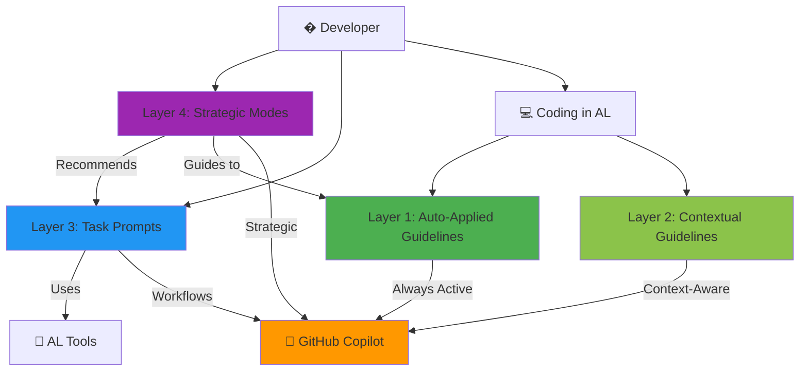

# AL Development Collection for GitHub Copilot

> Comprehensive toolkit for Microsoft Dynamics 365 Business Central AL development with **28 specialized tools** across **4 intelligent layers**.

[](./validate-al-collection.js)
[](./al-development.collection.yml)
[](./al-development.md)
[](./LICENSE)

## 🚀 Quick Start

### Installation

1. **Clone or download this collection**
   ```bash
   git clone https://github.com/javiarmesto/al-development-collection.git
   cd al-development-collection
   ```

2. **Install the collection in your AL workspace**
   ```bash
   # Copy files to your AL project
   cp -r .github your-al-project/
   cp -r collections your-al-project/
   ```

3. **Reload VS Code**
   - Press `Ctrl+Shift+P` (or `Cmd+Shift+P` on Mac)
   - Run: `Developer: Reload Window`

4. **Verify installation**
   ```bash
   npm install
   npm run validate
   ```

### First Use

Open any `.al` file and start coding. The auto-applied instructions will guide Copilot automatically.

**Try your first prompt:**
```
@workspace use al-workspace
```

**Or ask the orchestrator:**
```
Switch to al-orchestrator mode and ask: "I need to build a sales approval workflow"
```

## 🏗️ The 4-Layer System Architecture

This collection implements a unique **4-layer architecture** that combines automation, context, tasks, and strategy:



### 📊 Layer Breakdown

| Layer | Type | Count | Activation | Purpose |
|-------|------|-------|------------|---------|
| **Layer 1** | Auto-Applied | 4 files | Always on `*.al` | Code style, naming, performance |
| **Layer 2** | Contextual | 3 files | Context-triggered | Error handling, events, testing |
| **Layer 3** | Task Prompts | 14 files | `@workspace use [name]` | Specific workflows |
| **Layer 4** | Strategic Modes | 6 files | `Use [mode-name]` | Expert consultation |
| **Guide** | Documentation | 1 file | Reference | Master integration guide |
| **Total** | — | **28 tools** | — | Complete toolkit |

## 📦 What's Included

### 🔧 Layer 1 & 2: Instructions (7 files)

**Always Active** (Layer 1):
- **al-code-style** - Formatting and structure
- **al-naming-conventions** - Naming standards  
- **al-performance** - Optimization patterns
- **al-guidelines** - Core development principles

**Context-Activated** (Layer 2):
- **al-error-handling** - Error patterns & TryFunctions
- **al-events** - Event-driven development
- **al-testing** - Testing guidelines & AL-Go structure

### 📝 Layer 3: Task-Specific Prompts (14 files)

Invoke with `@workspace use [name]`:
- **al-setup** - Environment setup & configuration for AI-assisted development
- **al-workspace** - Project setup & initialization
- **al-build** - Build & deployment workflows
- **al-events** - Event implementation
- **al-debug** - Debugging sessions & snapshots
- **al-performance** - Performance analysis & profiling
- **al-permissions** - Permission set generation
- **al-troubleshoot** - Common problem solving
- **al-migrate** - Version migration support
- **al-pages** - Page designer & UI customization
- **al-workflow** - End-to-end feature guidance
- **al-spec.create** - Create functional-technical specifications
- **al-performance.triage** - Identify and prioritize performance bottlenecks
- **al-pr.prepare** - Prepare pull request drafts with documentation

### 💬 Layer 4: Role-Based Chat Modes (6 files)

Specialized expert consultants:
- **al-orchestrator** 🎯 - Smart router (START HERE)
- **al-architect** 🏗️ - Solution architecture & design
- **al-debugger** 🐛 - Deep issue diagnosis
- **al-tester** ✅ - Testing strategy & TDD
- **al-api** 🌐 - RESTful API development
- **al-copilot** 🤖 - AI-powered features

## 🎯 Common Workflows

### Building a New Feature
```
1. al-orchestrator → Analyze requirements
2. al-architect → Design solution
3. @workspace use al-workspace → Setup
4. Code (auto-guidelines active)
5. @workspace use al-events → Add events
6. al-tester → Test strategy
7. @workspace use al-permissions → Security
8. @workspace use al-build → Deploy
```

### Debugging Issues
```
1. al-debugger → Diagnose
2. @workspace use al-debug → Debug tools
3. @workspace use al-performance → Profile
4. Fix (auto-guidelines active)
5. al-tester → Regression tests
```

### API Development
```
1. al-architect → Design API
2. al-api → Implement
3. @workspace use al-permissions → Security
4. al-tester → API tests
5. @workspace use al-build → Deploy
```

## 📚 Documentation

- **[Collection Overview](./al-development.md)** - User-facing documentation
- **[Prompts Parameter Reference](./PROMPTS.md)** - Comprehensive prompt parameter documentation
- **[Referencia de Parámetros de Prompts](./PROMPTS-ES.md)** - Documentación de parámetros (Español)
- **[Complete Reference](./COLLECTION-SUMMARY.md)** - Internal documentation  
- **[Integration Guide](./.github/copilot-instructions.md)** - Master Copilot setup guide

## 🛠️ Requirements

- Visual Studio Code (latest version)
- AL Language extension for Business Central
- GitHub Copilot extension (active subscription)
- Business Central development environment (sandbox recommended)
- Node.js 14+ (for validation script)

## ✅ Validation

Validate the collection before contributing:

```bash
# Install dependencies
npm install

# Run validation
npm run validate
```

Expected output:
```
✅ Collection is fully compliant and ready for contribution!
```

## 📖 Usage Examples

### Example 1: New Developer
```markdown
User: "I'm new to AL. How do I start?"

Response from al-orchestrator:
"Let's get you set up. Use @workspace use al-workspace
to initialize your project. The auto-applied guidelines
will help you code correctly from day one."
```

### Example 2: Complex Task
```markdown
User: "Build AI-powered API for sales forecasting"

Response from al-orchestrator:
"This needs 4 phases:
1. al-architect - Design architecture (3-4 hours)
2. al-api + al-copilot - Build in parallel (1 day)
3. Integration - Connect layers (1-2 days)
4. al-tester - Comprehensive testing (1 day)"
```

### Example 3: Performance Issue
```markdown
User: "My report is slow"

Response from al-debugger:
"Let's profile it systematically:
1. @workspace use al-performance
2. Identify bottleneck
3. Apply optimizations
4. Re-profile to verify"
```

## 🤝 Contributing

Found an issue or have a suggestion?

1. **Report Issues**
   - Use GitHub Issues
   - Provide specific examples
   - Include error messages

2. **Suggest Improvements**
   - New prompts for common tasks
   - New modes for specialized scenarios
   - Better patterns and examples

3. **Contribution Guidelines**
   - Follow file naming conventions
   - Include proper frontmatter
   - Update manifest file
   - Run validation before submitting

See [CONTRIBUTING.md](./CONTRIBUTING.md) for detailed guidelines.

## 📋 File Structure

```
AL_Copilot_Collection/
├── .github/
│   ├── copilot-instructions.md    # 🎯 Master integration guide
│   ├── instructions/              # Layer 1 & 2: Auto-applied (7 files)
│   ├── prompts/                   # Layer 3: Task workflows (10 files)
│   └── chatmodes/                 # Layer 4: Strategic modes (6 files)
├── archive/                       # Legacy files (not active)
├── collections/
│   └── al-development.collection.yml  # Collection manifest
├── al-development.md              # User documentation
├── COLLECTION-SUMMARY.md          # Internal reference
├── validate-al-collection.js      # Validation script
├── package.json                   # Dependencies
└── README.md                      # This file
```

## 🏷️ Version History

### 2.1.0 (2025-10-15)
- ✨ **Streamlined chat modes** - Archived 5 duplicate modes
- 🎯 **Focused toolkit** - 6 core strategic chatmodes
- 📊 **Updated to 24 tools** - Clearer separation of concerns
- 📚 **Enhanced documentation** - Practical examples integrated
- 🏗️ **4-layer architecture diagram** - Mermaid visualization

### 2.0.0 (2025-01-15)
- ✅ Full compliance with contribution guidelines
- ✅ All files renamed to proper extensions (.prompt.md, .chatmode.md)
- ✅ Collection manifest created
- ✅ Validation script added
- ✅ Complete documentation

### 1.0.0 (2025-01-15)
- 🎉 Initial release
- 📦 7 instructions, 10 prompts, 6 modes
- 🏗️ Multi-layer architecture concept

## 📄 License

MIT License - see [LICENSE](./LICENSE) file for details.

## 👤 Author

**javiarmesto**
- GitHub: [@javiarmesto](https://github.com/javiarmesto)
- Created: 2025-01-15

## 🙏 Acknowledgments

- Microsoft Business Central team for AL language
- GitHub Copilot team for extensibility
- AL development community for patterns and best practices

## 📞 Support

- **Issues**: [GitHub Issues](https://github.com/javiarmesto/al-development-collection/issues)
- **Discussions**: [GitHub Discussions](https://github.com/javiarmesto/al-development-collection/discussions)
- **Documentation**: [al-development.md](./al-development.md)

---

**Status**: ✅ Ready for contribution  
**Last Updated**: 2025-10-19  
**Collection ID**: `al-development`  
**Version**: 2.1.0  
**Total Tools**: 28 (7 instructions + 14 prompts + 6 chatmodes + 1 guide)