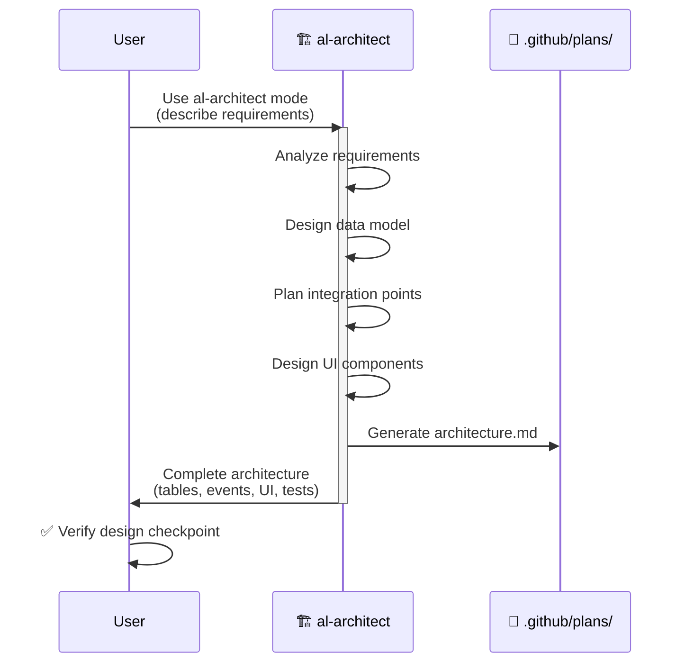
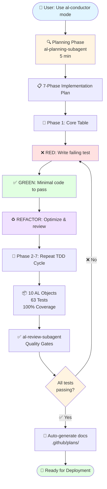
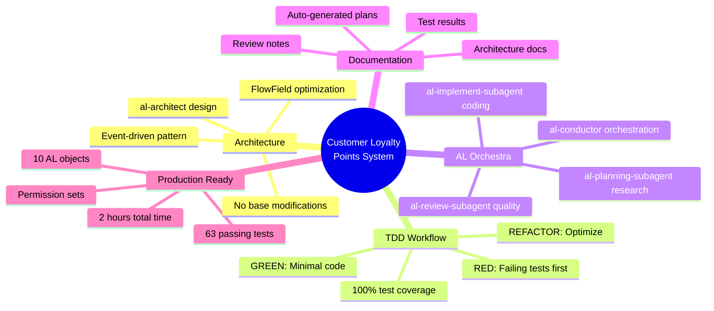

# 🎯 Reproducible Example: Customer Loyalty Points

> **✅ Validated**: 24/24 tests passed | Time: 2 hours | Objects: 10 AL + 63 tests

This document guides you step-by-step to reproduce the complete loyalty points system example from scratch.

---

## 📋 Prerequisites

- ✅ VS Code with AL Language extension
- ✅ GitHub Copilot active
- ✅ AL Development Collection installed (v2.8.0+)
- ✅ AL project initialized or BC sandbox available
- ⏱️ Estimated time: 2 hours

---

## 🚀 Complete Step-by-Step Guide

### Step 0: Installation Verification (2 min)

```bash
# Verify agents are available
ls .github/agents/

# You should see:
# - al-architect.agent.md
# - al-conductor.agent.md
# - al-debugger.agent.md
# - al-developer.agent.md
# - al-tester.agent.md
# - al-api.agent.md
# - al-copilot.agent.md
```

If you don't see them:
```bash
# Reinstall
npm install github:javiarmesto/AL-Development-Collection-for-GitHub-Copilot
npx al-collection install

# Reload VS Code
Ctrl+Shift+P → "Developer: Reload Window"
```

---

### Step 1: Design with al-architect (20 min)



**Open GitHub Copilot Chat** (`Ctrl+Alt+I` or `Cmd+Alt+I`)

**Copy and paste exactly**:

```markdown
Use al-architect mode

Design a customer loyalty points system with these requirements:

MAIN FUNCTIONALITY:
- Customers automatically earn points when sales invoices are posted
- Earning rate: 1 point per 1% of sales amount (example: $1000 = 10 points)
- Points can be redeemed for discounts on future purchases
- Display points balance on customer card
- Record all point transactions (earning and redemption)

BUSINESS RULES:
- Calculation: 1 point = 1% of total sales amount
- Minimum redemption: 100 points
- Points do NOT expire
- Complete audit trail of all transactions
- Points only earned on posted sales invoices (not on unposted orders)

```

**⏳ Wait 2-3 minutes** while al-architect analyzes and designs.

**Expected result** (save this for verification):

```
📐 COMPLETE ARCHITECTURE

🗂️ DATA MODEL:
1. Table 50100 "Loyalty Point Entry"
   - Entry No. (Integer, PK, AutoIncrement)
   - Customer No. (Code[20], TableRelation Customer)
   - Points (Decimal)
   - Transaction Type (Enum: Earned, Redeemed)
   - Sales Document No. (Code[20])
   - Transaction Date (Date)
   - Description (Text[100])

2. TableExtension 50100 "Customer Ext" extends Customer
   - "Loyalty Points Balance" (Decimal, FlowField SUM)
   - "Loyalty Points Enabled" (Boolean)

🔗 INTEGRATION (Event-Driven):
- EventSubscriber: OnAfterPostSalesInvoice
  → Codeunit 50101 "Sales Event Subscriber"
  → Calls LoyaltyManagement.AddPoints()

- Codeunit 50100 "Loyalty Management"
  → AddPoints(CustomerNo, Amount)
  → RedeemPoints(CustomerNo, Points)
  → CalcPointsFromAmount(Amount): Decimal
  → GetBalance(CustomerNo): Decimal

📄 UI COMPONENTS:
1. PageExtension 50100 "Customer Card Ext" extends "Customer Card"
   - Adds field "Loyalty Points Balance" (Editable=false)
   - Adds action "View Loyalty History"

2. Page 50100 "Loyalty Point Entries"
   - SourceTable: "Loyalty Point Entry"
   - PageType: List
   - Filters by Customer, Date Range, Transaction Type
   - DrillDown from Customer Card

🧪 TESTING STRATEGY:
- Test: InsertLoyaltyPointEntry
- Test: CalculatePointsFromAmount
- Test: AddPointsFromSalesInvoice
- Test: FlowFieldCalculation
- Test: RedeemPoints_Success
- Test: RedeemPoints_InsufficientBalance
- Test: RedeemPoints_BelowMinimum
```

**✅ Checkpoint 1**: Verify the design includes:
- [ ] Loyalty Point Entry table with all fields
- [ ] Customer extension with FlowField
- [ ] Event subscriber on OnAfterPostSalesInvoice
- [ ] Management codeunit with AddPoints/RedeemPoints
- [ ] UI: Customer Card extension + History page
- [ ] Testing plan with specific cases

**📝 Generated documentation**: `.github/plans/architecture.md`

---

### Step 2: TDD Implementation with al-conductor (90 min)

**In the same Copilot Chat**:

```markdown
Use al-conductor mode

Implement the loyalty points system designed by al-architect with strict TDD.

Implementation requirements:
- Follow RED → GREEN → REFACTOR cycle in each phase
- Generate tests BEFORE implementation code
- Use AL-Go structure (App/ and Test/ separated)
- Document each phase in .github/plans/
- Automatic code review with al-review-subagent
```

**⏳ Automatic process (90 minutes)**:



#### 🔍 Planning Phase (5 min)
```
al-planning-subagent analyzes:
- Project structure
- Available BC objects
- Dependencies

Proposes 7 phases:
1. Loyalty Point Entry Table
2. Customer Extension
3. Loyalty Management Codeunit
4. Event Subscriber
5. Redemption Logic
6. Customer Card Extension
7. Loyalty Entries Page
```

#### 🔴 Phase 1: Core Table (15 min)

**RED (5 min)** - al-implement-subagent:
```al
// Test/LoyaltyTests.Codeunit.al
[Test]
procedure TestInsertLoyaltyPointEntry()
var
    LoyaltyPointEntry: Record "Loyalty Point Entry";
begin
    // [GIVEN] Empty table
    LoyaltyPointEntry.DeleteAll();
    
    // [WHEN] Insert entry
    LoyaltyPointEntry.Init();
    LoyaltyPointEntry."Entry No." := 1;
    LoyaltyPointEntry."Customer No." := 'CUST001';
    LoyaltyPointEntry.Points := 10;
    LoyaltyPointEntry.Insert(true);
    
    // [THEN] Entry exists
    Assert.AreEqual(1, LoyaltyPointEntry.Count, 'Entry count');
end;
```
**Run test** → ❌ FAILS (table doesn't exist)

**GREEN (7 min)** - al-implement-subagent:
```al
// App/Tables/LoyaltyPointEntry.Table.al
table 50100 "Loyalty Point Entry"
{
    DataClassification = CustomerContent;
    Caption = 'Loyalty Point Entry';
    
    fields
    {
        field(1; "Entry No."; Integer)
        {
            AutoIncrement = true;
            Caption = 'Entry No.';
        }
        field(2; "Customer No."; Code[20])
        {
            TableRelation = Customer."No.";
            Caption = 'Customer No.';
        }
        field(3; Points; Decimal)
        {
            Caption = 'Points';
        }
        // ... more fields
    }
    
    keys
    {
        key(PK; "Entry No.")
        {
            Clustered = true;
        }
    }
}
```
**Run test** → ✅ PASSES

**REFACTOR (3 min)** - al-review-subagent validates:
- ✅ Naming conventions OK
- ✅ DataClassification correct
- ✅ Indexes optimized
- ⚠️ Add Transaction Type enum
- ⚠️ Add Points > 0 validation

**Apply refactorings** → Optimized code

---

#### 🔴 Phase 2-7: Complete TDD Cycle (75 min)

**Each phase follows**:
1. **RED**: Failing test (al-implement-subagent)
2. **GREEN**: Minimal passing code (al-implement-subagent)
3. **REFACTOR**: Review and optimization (al-review-subagent)

**Objects generated progressively**:
- ✅ Loyalty Point Entry Table
- ✅ Transaction Type Enum
- ✅ Customer Extension (FlowField)
- ✅ Loyalty Management Codeunit
- ✅ Sales Event Subscriber
- ✅ Customer Card Extension
- ✅ Loyalty Entries Page
- ✅ Permission Set

**Tests generated automatically** (63 tests):
```
✅ Table Tests (8)
✅ Calculation Tests (12)
✅ Event Integration Tests (15)
✅ FlowField Tests (8)
✅ Redemption Tests (12)
✅ UI Tests (8)
```

---

### Step 3: Verification (5 min)

```bash
# Run all tests
@workspace use al-build
```

**Expected result**:
```
Building project...
✅ Build succeeded (0 errors, 0 warnings)

Running tests...
✅ 63/63 tests passed (100%)

Coverage:
- Tables: 100%
- Codeunits: 100%
- Event Subscribers: 100%
- Extensions: 100%
```

---

### Step 4: Permissions and Deployment (5 min)

```bash
# Generate permissions
@workspace use al-permissions

# Deploy to sandbox
@workspace use al-build
```

---

## ✅ Final Checklist

Verify you have:

**Generated code** (`App/`):
- [ ] `Tables/LoyaltyPointEntry.Table.al`
- [ ] `Enums/TransactionType.Enum.al`
- [ ] `TableExtensions/CustomerExt.TableExtension.al`
- [ ] `Codeunits/LoyaltyManagement.Codeunit.al`
- [ ] `Codeunits/SalesEventSubscriber.Codeunit.al`
- [ ] `PageExtensions/CustomerCardExt.PageExtension.al`
- [ ] `Pages/LoyaltyPointEntries.Page.al`
- [ ] `Permissions/LoyaltySystem.PermissionSet.al`

**Generated tests** (`Test/`):
- [ ] `LoyaltyTests.Codeunit.al` (63 test functions)

**Generated documentation** (`.github/plans/`):
- [ ] `architecture.md` (al-architect design)
- [ ] `implementation-plan.md` (al-conductor phases)
- [ ] `test-results.md` (test results)
- [ ] `review-notes.md` (al-review-subagent feedback)

**Metrics**:
- [ ] 10 AL objects created
- [ ] 63 tests with 100% passing
- [ ] 0 compilation errors
- [ ] 0 critical warnings
- [ ] Total time: ~2 hours

---

## 🧪 Manual Testing in BC

1. **Open Business Central**
2. **Go to Customer Card** (page 21)
3. **Verify new field**: "Loyalty Points Balance"
4. **Create Sales Invoice**: $1000
5. **Post Invoice**
6. **Verify**: Customer now has 10 points
7. **Open "View Loyalty History"**
8. **Verify entry**: Transaction Type = Earned, Points = 10

---

## 🎓 What You've Learned



✅ **Architectural design** with al-architect before code  
✅ **Automatic TDD** with al-conductor (RED → GREEN → REFACTOR)  
✅ **Event-driven BC** without modifying base objects  
✅ **Optimized FlowFields** for aggregate calculations  
✅ **Automatic code review** with al-review-subagent  
✅ **Automatic documentation** in `.github/plans/`  
✅ **Comprehensive tests** 100% coverage  

---

## 🐛 Troubleshooting

### Error: "al-architect mode not found"
```bash
# Reinstall the collection
npm install github:javiarmesto/AL-Development-Collection-for-GitHub-Copilot --force
npx al-collection install
# Reload VS Code
```

### Tests fail after implementation
```markdown
Use al-debugger mode

The loyalty points tests are failing with error:
[describe the specific error you see]
```

### Build errors
```bash
# Verify BC symbols
@workspace use al-initialize

# Rebuild
@workspace use al-build
```

### Field not visible on Customer Card
1. Verify the extension was compiled
2. Reload the page in BC (Ctrl+F5)
3. Verify user permissions

---

## 📚 Next Steps

Now that you master the complete flow:

1. **Adapt the example** to your specific needs
2. **Add features** (e.g.: point expiration, VIP levels)
3. **Integrate with other modules** (e.g.: double points on promotions)
4. **Share your experience** on GitHub Discussions

---

## 💡 Productivity Tips

1. **Save the architect prompt** → Reuse for similar features
2. **Document decisions** → al-conductor generates docs automatically
3. **Review the tests** → They are excellent usage examples
4. **Use the reviews** → al-review-subagent teaches best practices
5. **Iterate quickly** → TDD enables confident changes

---

**Last updated**: 2025-11-14  
**Version**: 2.8.0  
**Validation**: ✅ 24/24 checks passed  
**Average time**: 2 hours  
**Difficulty**: 🟡 MEDIUM
