# Agents - Layer 2: Agent Primitives

**Role-based strategic consultants** implemented as `.agent.md` files with **MCP Tool Boundaries** for specialized AL development guidance in Business Central.

## 📋 What Are Agents?

Agents are:
- **Specialized consultant personas** with domain expertise
- **Strategic advisors** (not executors - they recommend workflows)
- **Context-aware specialists** that auto-load relevant Instructions
- **Boundary-constrained agents** with clear CAN/CANNOT rules (MCP model)

## 🎯 How to Use Agents

Activate modes explicitly for strategic consultation:
```markdown
Use [mode-name]

Examples:
Use al-orchestrator
Use al-architect
Use al-debugger
```

Or in multi-turn conversations:
```markdown
---
mode: al-orchestrator
title: Complex feature planning
---

I need to build a sales forecasting system...
```

## 📊 Complexity-Based Agent Selection

**All agents use automatic complexity inference with mandatory validation gate** - the system analyzes your requirements and suggests the appropriate complexity level, then you confirm before proceeding.

### Complexity Classification Matrix

| Complejidad | Objetos AL | Fases | TDD | Agente Recomendado | Tiempo Estimado |
|-------------|-----------|-------|-----|-------------------|------------------|
| 🟢 **LOW** | 1-2 objetos | 1 fase | Opcional | **al-developer** | 15-30 min |
| 🟡 **MEDIUM** | 3-5 objetos | 2-3 fases | Recomendado | **al-conductor** | 1-3 horas |
| 🔴 **HIGH** | 6+ objetos | 4+ fases | Obligatorio | **al-architect** → **al-conductor** | 3+ horas |

### 📦 Available Agents (7 files)

#### 🎯 Strategic Router (Start Here)

| Mode | Role | Complejidad | When to Use |
|------|------|-------------|-------------|
| **al-orchestrator** | Strategic Router & Workflow Coordinator | Todas | **Start here** when unsure - analyzes complexity and routes appropriately |

#### 🏗️ Implementation Agents (Complexity-Driven)

| Mode | Role | Complejidad Target | Best For |
|------|------|-------------------|----------|
| **al-architect** | Solution Architecture & Design | 🔴 HIGH | Design phase for complex features, architectural decisions, pattern evaluation |
| **al-conductor** | TDD Orchestra Coordinator | 🟡 MEDIUM / 🔴 HIGH | Multi-phase implementation with enforced TDD and quality gates |
| **al-developer** | Tactical Implementation Specialist | 🟢 LOW / 🟡 MEDIUM | Direct implementation when design is clear and scope is limited |

#### 🔧 Specialized Consultants (Complexity-Agnostic)

| Mode | Role | Works With | Best For |
|------|------|-----------|----------|
| **al-debugger** | Systematic Debugging Specialist | Any complexity | Root cause analysis, performance bottlenecks, execution flow |
| **al-tester** | Testing Strategy & TDD Expert | Any complexity | Test design, TDD strategy, coverage planning |
| **al-api** | RESTful API Design Specialist | 🟡 MEDIUM / 🔴 HIGH | API contracts, endpoint design, external integrations |
| **al-copilot** | AI-Powered Features Expert | 🟡 MEDIUM / 🔴 HIGH | Copilot experiences, prompt engineering, Azure OpenAI integration |

## 🏗️ Tool Boundaries (MCP Model)

Each mode follows **professional licensing** constraints:

### CAN (Strategic/Advisory)
- ✅ Design solutions and patterns
- ✅ Analyze code and architecture
- ✅ Recommend approaches
- ✅ Plan implementations
- ✅ Review and critique
- ✅ Explain concepts

### CANNOT (Execution - Delegates to Workflows)
- ❌ Execute builds directly
- ❌ Run debuggers
- ❌ Deploy code
- ❌ Run tests
- ❌ Modify files without explicit request

**Why?** This prevents:
- Context window pollution from execution logs
- Cross-domain operations (architect shouldn't debug)
- Loss of strategic focus

## 🎯 Complexity-Based Decision Flow with Validation Gate

**MANDATORY PROCESS**: All agents analyze requirements → infer complexity → present classification → user confirms → route to appropriate workflow

```mermaid
graph TD
    Start[📄 Task/Requirements] --> Analyze[🔍 Automatic Complexity Analysis]
    
    Analyze --> Infer[💭 System infers complexity based on:<br/>- Scope and scale<br/>- Integration depth<br/>- Business logic complexity<br/>- Implementation phases]
    
    Infer --> Present[📊 Present Classification]
    Present --> Gate{🚦 VALIDATION GATE<br/>User confirms complexity?}
    
    Gate -->|❌ Adjust| UserInput[👤 User provides correct complexity]
    UserInput --> Present
    
    Gate -->|✅ Confirmed: LOW| Low[🟢 LOW Complexity]
    Gate -->|✅ Confirmed: MEDIUM| Med[🟡 MEDIUM Complexity]
    Gate -->|✅ Confirmed: HIGH| High[🔴 HIGH Complexity]
    
    Low --> LowRoute{Specialized help?}
    LowRoute -->|No| DevDirect[💻 al-developer<br/>Direct implementation]
    LowRoute -->|Debug| Debug[🐛 al-debugger]
    LowRoute -->|Tests| Test1[🧪 al-tester]
    
    Med --> MedRoute{Need design first?}
    MedRoute -->|Yes| Arch1[👨‍💼 al-architect<br/>Then al-conductor]
    MedRoute -->|No, spec ready| Conductor1[🎼 al-conductor<br/>TDD Orchestra]
    MedRoute -->|Debug| Debug
    MedRoute -->|Tests| Test2[🧪 al-tester]
    
    High --> HighRoute{Specialized domain?}
    HighRoute -->|Standard| Arch2[👨‍💼 al-architect<br/>Design phase]
    HighRoute -->|APIs| API[🌐 al-api<br/>Then al-architect]
    HighRoute -->|AI Features| Copilot[🤖 al-copilot<br/>Then al-architect]
    
    Arch1 --> Conductor2[🎼 al-conductor<br/>Implementation]
    Arch2 --> Conductor3[🎼 al-conductor<br/>Implementation]
    API --> Arch3[👨‍💼 al-architect]
    Copilot --> Arch4[👨‍💼 al-architect]
    Arch3 --> Conductor4[🎼 al-conductor]
    Arch4 --> Conductor5[🎼 al-conductor]
    
    style Gate fill:#FF6B6B,stroke:#C92A2A,color:#fff
    style Low fill:#51CF66,stroke:#2F9E44,color:#fff
    style Med fill:#FFD43B,stroke:#F59F00,color:#000
    style High fill:#FF6B6B,stroke:#C92A2A,color:#fff
```



### 🔍 Automatic Complexity Inference Criteria

The system analyzes these factors to suggest complexity:

#### 🟢 LOW (Low) - Indicators:
- ✅ Limited scope - single feature/change
- ✅ No external integrations
- ✅ Clear, straightforward implementation path
- ✅ Minimal business logic
- ✅ Single implementation phase
- **Example**: "Add Priority field to Sales Header"

#### 🟡 MEDIUM (Medium) - Indicators:
- ✅ Moderate scope - multiple interrelated components
- ✅ 2-3 implementation phases
- ✅ Internal integration points (events, interfaces)
- ✅ Moderate business logic with some complexity
- ✅ Comprehensive testing required
- **Example**: "Customer loyalty points with automatic calculation"

#### 🔴 HIGH (High) - Indicators:
- ✅ Extensive scope - complex system with many interconnected parts
- ✅ 4+ implementation phases required
- ✅ External integrations (REST APIs, OAuth, web services)
- ✅ Complex business rules and workflows
- ✅ Multi-company/multi-user/multi-tenant scenarios
- ✅ Performance optimization critical
- **Example**: "Multi-company approval workflow with email notifications and delegation"

### 🚦 Validation Gate Protocol

When you provide requirements, agents will:

1. **Analyze Requirements**
   ```markdown
   📊 Complexity Analysis:
   - Detected: 4 AL objects (Customer.TableExt, CustomerCard.PageExt, 
                CustomerMgmt.Codeunit, CustomerValidator.Codeunit)
   - Integration: Internal event subscribers only
   - Business logic: Email validation + address formatting
   - Phases: 2 (validation + UI)
   
   💭 Inferred Complexity: 🟡 MEDIUM
   ```

2. **Present Justification**
   ```markdown
   Reasoning:
   - 4 objects falls in MEDIUM range (3-5)
   - Limited scope, no external dependencies
   - Moderate logic, manageable in 2 phases
   - Good candidate for al-conductor with TDD
   ```

3. **Request Confirmation (GATE)**
   ```markdown
   🚦 VALIDATION GATE:
   Do you confirm complexity level: 🟡 MEDIUM?
   
   Options:
   ✅ Yes, proceed with MEDIUM complexity → al-conductor
   ❌ No, this is LOW (explain why)
   ❌ No, this is HIGH (explain why)
   ```

4. **Route Based on Confirmed Complexity**
   ```markdown
   ✅ Confirmed: 🟡 MEDIUM complexity
   → Routing to al-conductor for TDD orchestration
   → Will create 2-phase plan with quality gates
   ```

## 📖 Detailed Mode Descriptions

### 🎯 al-orchestrator (★ Recommended Entry Point)

**Role**: Strategic router and workflow coordinator

**Use when**:
- Starting a complex, multi-phase project
- Unsure which tools/modes to use
- Need to coordinate multiple specialists
- Planning feature implementation

**Example**:
```markdown
Use al-orchestrator

I need to build a sales approval workflow with email notifications.
I'm not sure where to start.
```

**Orchestrator will**:
1. Analyze requirements
2. Load relevant Instructions
3. Recommend appropriate Workflows
4. Route to specialized Agents
5. Create multi-phase plan

---

### 🏗️ al-architect

**Role**: Solution architecture and design specialist

**Use when**:
- Planning new feature architecture
- Designing data models
- Evaluating integration strategies
- Making architectural decisions
- Reviewing existing designs

**Auto-loads Instructions**:
- `al-guidelines.instructions.md`
- `al-code-style.instructions.md`
- `al-performance.instructions.md`

**Example**:
```markdown
Use al-architect

Design a multi-company approval workflow system.
Should work across companies, support delegation, send emails.
```

---

### � al-developer (★ New)

**Role**: Tactical implementation specialist with full MCP tool access

**Use when**:
- Implementing features from specifications
- Creating AL objects (tables, pages, codeunits)
- Extending base BC objects
- Implementing event subscribers
- Refactoring existing code
- Fixing bugs
- Building and publishing extensions

**Full AL MCP Tool Access**:
- `al_build`, `al_buildall`, `al_package`, `al_publish`
- `al_incrementalpublish` (fast iteration)
- `al_downloadsymbols`, `al_downloadsource`
- `al_generatepermissionset`, `al_generatemanifest`
- Debugging and performance tools

**Auto-loads Instructions**:
- `al-code-style.instructions.md`
- `al-naming-conventions.instructions.md`
- `al-performance.instructions.md`
- `al-error-handling.instructions.md`
- `al-events.instructions.md`

**Example**:
```markdown
Use al-developer

#file: src/Sales/Customer.TableExt.al

Implement email validation on Customer table extension:
- Add event subscriber for OnBeforeValidateEvent on Email field
- Validate format using regex
- Show error if invalid
- Build and test
```

**Delegates to**:
- `al-architect` (strategic decisions)
- `al-tester` (test strategy)
- `al-debugger` (complex diagnosis)

---

### �🐛 al-debugger

**Role**: Systematic debugging specialist

**Use when**:
- Diagnosing bugs
- Root cause analysis
- Understanding code execution flow
- Performance bottleneck identification
- Investigating intermittent issues

**Recommends Workflows**:
- `al-debug.prompt.md`
- `al-performance.prompt.md`
- `al-troubleshoot.prompt.md`

**Example**:
```markdown
Use al-debugger

#file: src/Sales/SalesEventHandler.Codeunit.al

My OnBeforePostSalesDoc event subscriber isn't being called.
```

---

### 🧪 al-tester

**Role**: Testing strategy and TDD specialist

**Use when**:
- Designing test strategies
- Implementing TDD
- Planning test coverage
- Creating comprehensive test suites
- Setting up test automation

**Auto-loads Instructions**:
- `al-testing.instructions.md`

**Example**:
```markdown
Use al-tester

#file: src/Sales/SalesPost.Codeunit.al

What test scenarios should I cover for sales posting logic?
```

---

### 🌐 al-api

**Role**: RESTful API design specialist

**Use when**:
- Designing API endpoints
- Implementing API pages (v2.0)
1. **New Feature Development**
   ```
   al-orchestrator → al-architect (design) → al-developer (implement) → al-tester (validate)
   ```

2. **Bug Fix**
   ```
   al-debugger (diagnose) → al-developer (fix) → al-tester (verify)
   ```

3. **Performance Optimization**
   ```
   al-debugger (profile) → al-architect (redesign) → al-developer (implement)
   ```

4. **Testing Implementation**
   ```
   al-tester (strategy) → al-developer (create tests) → al-debugger (fix failures)
   ```

5. **API Development**
   ```
   al-architect (design) → al-api (contract) → al-developer (implement)
   ``` al-copilot

**Role**: AI-powered features specialist

**Use when**:
- Designing Copilot user experiences
- Implementing Azure OpenAI integration
- Prompt engineering for business scenarios
- Creating AI-powered suggestions
- Implementing responsible AI practices

**Coordinates with**:
- `al-architect` (for AI integration architecture)
- `al-error-handling.instructions.md` (for AI service failures)

**Example**:
```markdown
Use al-copilot

Add AI sales forecasting feature to customer card.
Should analyze historical data and suggest order quantities.
```

---

## 🔄 Mode Combinations & Workflows

### Common Patterns

1. **New Feature Development**
   ```
   al-orchestrator → al-architect → Execute workflows → al-debugger (if needed)
   ```

2. **Performance Optimization**
   ```
   al-debugger (diagnosis) → Execute al-performance.triage → al-architect (redesign)
   ```

3. **Testing Implementation**
   ```
   al-tester (strategy) → Execute test creation → al-debugger (fix failures)
   ```

4. **API Development**
   ```
   al-architect (overall design) → al-api (endpoint design) → Execute al-build
   ```

### Mode Handoffs

Modes can recommend switching:
```markdown
Orchestrator: "Based on your requirements, switch to al-architect to design the solution."
Architect: "Design complete. Execute @workspace /al-build to implement."
Debugger: "Root cause identified. Switch to al-architect to redesign this component."
```

## 💡 Best Practices

### ✅ DO

- **Start with al-orchestrator** for complex tasks
- **Stay in strategic mode** - let modes recommend workflows
- **Provide context** (#file:, business requirements)
- **Ask about alternatives** and trade-offs
- **Request explanations** of recommendations

### ❌ DON'T

- Ask modes to execute builds/tests directly (they'll recommend workflows)
- Switch modes mid-conversation without reason
- Expect implementation without using recommended workflows
- Forget to include relevant code context

### Creating Custom Agents

1. **Create file** in this directory: `al-[role].agent.md`
2. **Add frontmatter**:
   ```yaml
   ---
   description: 'Brief role description'
   tools: ['codebase', 'search', 'usages']
   ---
   ```
3. **Define the persona**:
   - Role & specialization
   - Markdown Prompt Engineering principles
   - Tool Boundaries (CAN/CANNOT)
   - Context Engineering strategy
   - Interaction protocol
4. **Update collection manifest** in `collections/al-development.collection.yml`
5. **Test** with sample scenarios

## 🔗 Related Resources

- **Collection Manifest**: `collections/al-development.collection.yml`
- **Framework Reference**: `references/A-INSTRUCTIONS-ARCHITECTURE.md`
- **User Guide**: `al-development.md`
- **Contributing**: `CONTRIBUTING.md`

## 📊 Validation

Run `npm run validate` to verify:
- All agent files exist
- Frontmatter is properly formatted
- File naming conventions are followed
- Descriptions are clear and complete

---

**Framework Compliance**: These agents implement **A-Instructions Architecture** - Layer 2 (Agent Primitives) with clear Tool Boundaries (MCP model), auto-loading Instructions (Layer 1), and strategic Context Engineering (Layer 3).

**Usage Philosophy**: Agents are **strategic consultants**, not **code executors**. They analyze, design, and recommend. For execution, they delegate to **Agentic Workflows**.
