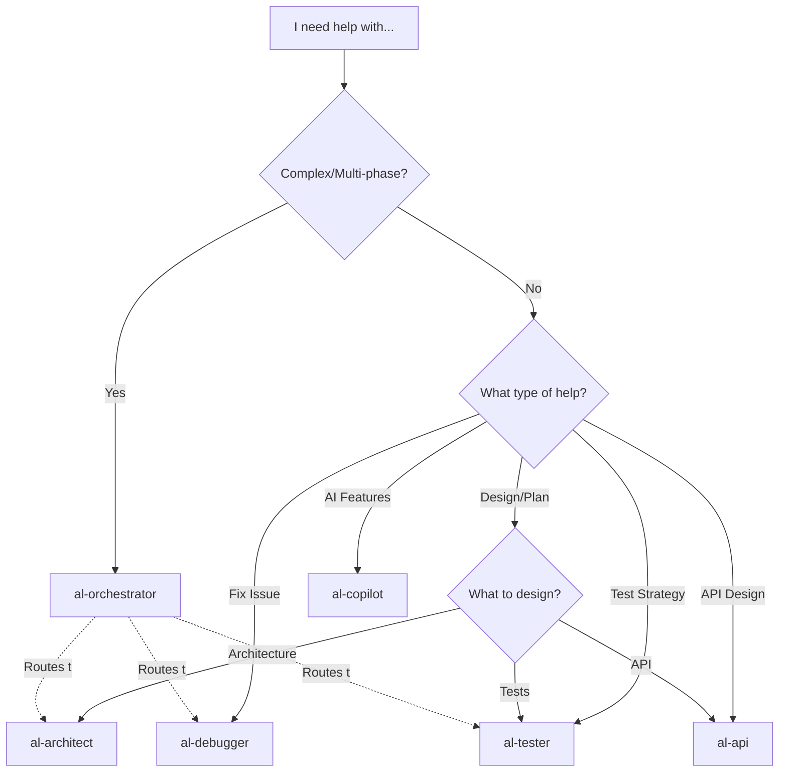

# Chat Modes - Layer 2: Agent Primitives

**Role-based strategic consultants** implemented as `.agent.md` files with **MCP Tool Boundaries** for specialized AL development guidance in Business Central.

## 📋 What Are Chat Modes?

Chat Modes are:
- **Specialized consultant personas** with domain expertise
- **Strategic advisors** (not executors - they recommend workflows)
- **Context-aware specialists** that auto-load relevant Instructions
- **Boundary-constrained agents** with clear CAN/CANNOT rules (MCP model)

## 🎯 How to Use Chat Modes

Activate modes explicitly for strategic consultation:
```markdown
Use [mode-name]

Examples:
Use al-orchestrator
Use al-architect
Use al-debugger
```

Or in multi-turn conversations:
```markdown
---
mode: al-orchestrator
title: Complex feature planning
---

I need to build a sales forecasting system...
```

## 📦 Available Chat Modes (7 files)

### 🎯 Entry Point (Use This First)

| Mode | Role | When to Use |
|------|------|-------------|
| **al-orchestrator** | Strategic Router & Workflow Coordinator | **Start here** for complex tasks, multi-phase projects, when unsure which tools to use |

### 🏗️ Strategic Specialists

| Mode | Role | Best For |
|------|------|----------|
| **al-architect** | Solution Architecture & Design | Planning features, designing data models, architectural decisions |
| **al-developer** | Tactical Implementation Specialist | **Executing** code changes, building features, implementing from specs |
| **al-debugger** | Systematic Debugging Specialist | Diagnosing bugs, root cause analysis, understanding execution flow |
| **al-tester** | Testing Strategy & TDD Expert | Test design, TDD implementation, coverage planning |
| **al-api** | RESTful API Design Specialist | API contracts, endpoint design, external integrations |
| **al-copilot** | AI-Powered Features Expert | Copilot experiences, prompt engineering, Azure OpenAI integration |

## 🏗️ Tool Boundaries (MCP Model)

Each mode follows **professional licensing** constraints:

### CAN (Strategic/Advisory)
- ✅ Design solutions and patterns
- ✅ Analyze code and architecture
- ✅ Recommend approaches
- ✅ Plan implementations
- ✅ Review and critique
- ✅ Explain concepts

### CANNOT (Execution - Delegates to Workflows)
- ❌ Execute builds directly
- ❌ Run debuggers
- ❌ Deploy code
- ❌ Run tests
- ❌ Modify files without explicit request

**Why?** This prevents:
- Context window pollution from execution logs
- Cross-domain operations (architect shouldn't debug)
- Loss of strategic focus

## 💡 Decision Tree: Which Mode to Use?



## 📖 Detailed Mode Descriptions

### 🎯 al-orchestrator (★ Recommended Entry Point)

**Role**: Strategic router and workflow coordinator

**Use when**:
- Starting a complex, multi-phase project
- Unsure which tools/modes to use
- Need to coordinate multiple specialists
- Planning feature implementation

**Example**:
```markdown
Use al-orchestrator

I need to build a sales approval workflow with email notifications.
I'm not sure where to start.
```

**Orchestrator will**:
1. Analyze requirements
2. Load relevant Instructions
3. Recommend appropriate Workflows
4. Route to specialized Chat Modes
5. Create multi-phase plan

---

### 🏗️ al-architect

**Role**: Solution architecture and design specialist

**Use when**:
- Planning new feature architecture
- Designing data models
- Evaluating integration strategies
- Making architectural decisions
- Reviewing existing designs

**Auto-loads Instructions**:
- `al-guidelines.instructions.md`
- `al-code-style.instructions.md`
- `al-performance.instructions.md`

**Example**:
```markdown
Use al-architect

Design a multi-company approval workflow system.
Should work across companies, support delegation, send emails.
```

---

### � al-developer (★ New)

**Role**: Tactical implementation specialist with full MCP tool access

**Use when**:
- Implementing features from specifications
- Creating AL objects (tables, pages, codeunits)
- Extending base BC objects
- Implementing event subscribers
- Refactoring existing code
- Fixing bugs
- Building and publishing extensions

**Full AL MCP Tool Access**:
- `al_build`, `al_buildall`, `al_package`, `al_publish`
- `al_incrementalpublish` (fast iteration)
- `al_downloadsymbols`, `al_downloadsource`
- `al_generatepermissionset`, `al_generatemanifest`
- Debugging and performance tools

**Auto-loads Instructions**:
- `al-code-style.instructions.md`
- `al-naming-conventions.instructions.md`
- `al-performance.instructions.md`
- `al-error-handling.instructions.md`
- `al-events.instructions.md`

**Example**:
```markdown
Use al-developer

#file: src/Sales/Customer.TableExt.al

Implement email validation on Customer table extension:
- Add event subscriber for OnBeforeValidateEvent on Email field
- Validate format using regex
- Show error if invalid
- Build and test
```

**Delegates to**:
- `al-architect` (strategic decisions)
- `al-tester` (test strategy)
- `al-debugger` (complex diagnosis)

---

### �🐛 al-debugger

**Role**: Systematic debugging specialist

**Use when**:
- Diagnosing bugs
- Root cause analysis
- Understanding code execution flow
- Performance bottleneck identification
- Investigating intermittent issues

**Recommends Workflows**:
- `al-debug.prompt.md`
- `al-performance.prompt.md`
- `al-troubleshoot.prompt.md`

**Example**:
```markdown
Use al-debugger

#file: src/Sales/SalesEventHandler.Codeunit.al

My OnBeforePostSalesDoc event subscriber isn't being called.
```

---

### 🧪 al-tester

**Role**: Testing strategy and TDD specialist

**Use when**:
- Designing test strategies
- Implementing TDD
- Planning test coverage
- Creating comprehensive test suites
- Setting up test automation

**Auto-loads Instructions**:
- `al-testing.instructions.md`

**Example**:
```markdown
Use al-tester

#file: src/Sales/SalesPost.Codeunit.al

What test scenarios should I cover for sales posting logic?
```

---

### 🌐 al-api

**Role**: RESTful API design specialist

**Use when**:
- Designing API endpoints
- Implementing API pages (v2.0)
1. **New Feature Development**
   ```
   al-orchestrator → al-architect (design) → al-developer (implement) → al-tester (validate)
   ```

2. **Bug Fix**
   ```
   al-debugger (diagnose) → al-developer (fix) → al-tester (verify)
   ```

3. **Performance Optimization**
   ```
   al-debugger (profile) → al-architect (redesign) → al-developer (implement)
   ```

4. **Testing Implementation**
   ```
   al-tester (strategy) → al-developer (create tests) → al-debugger (fix failures)
   ```

5. **API Development**
   ```
   al-architect (design) → al-api (contract) → al-developer (implement)
   ``` al-copilot

**Role**: AI-powered features specialist

**Use when**:
- Designing Copilot user experiences
- Implementing Azure OpenAI integration
- Prompt engineering for business scenarios
- Creating AI-powered suggestions
- Implementing responsible AI practices

**Coordinates with**:
- `al-architect` (for AI integration architecture)
- `al-error-handling.instructions.md` (for AI service failures)

**Example**:
```markdown
Use al-copilot

Add AI sales forecasting feature to customer card.
Should analyze historical data and suggest order quantities.
```

---

## 🔄 Mode Combinations & Workflows

### Common Patterns

1. **New Feature Development**
   ```
   al-orchestrator → al-architect → Execute workflows → al-debugger (if needed)
   ```

2. **Performance Optimization**
   ```
   al-debugger (diagnosis) → Execute al-performance.triage → al-architect (redesign)
   ```

3. **Testing Implementation**
   ```
   al-tester (strategy) → Execute test creation → al-debugger (fix failures)
   ```

4. **API Development**
   ```
   al-architect (overall design) → al-api (endpoint design) → Execute al-build
   ```

### Mode Handoffs

Modes can recommend switching:
```markdown
Orchestrator: "Based on your requirements, switch to al-architect to design the solution."
Architect: "Design complete. Execute @workspace /al-build to implement."
Debugger: "Root cause identified. Switch to al-architect to redesign this component."
```

## 💡 Best Practices

### ✅ DO

- **Start with al-orchestrator** for complex tasks
- **Stay in strategic mode** - let modes recommend workflows
- **Provide context** (#file:, business requirements)
- **Ask about alternatives** and trade-offs
- **Request explanations** of recommendations

### ❌ DON'T

- Ask modes to execute builds/tests directly (they'll recommend workflows)
- Switch modes mid-conversation without reason
- Expect implementation without using recommended workflows
- Forget to include relevant code context

### Creating Custom Chat Modes

1. **Create file** in this directory: `al-[role].agent.md`
2. **Add frontmatter**:
   ```yaml
   ---
   description: 'Brief role description'
   tools: ['codebase', 'search', 'usages']
   ---
   ```
3. **Define the persona**:
   - Role & specialization
   - Markdown Prompt Engineering principles
   - Tool Boundaries (CAN/CANNOT)
   - Context Engineering strategy
   - Interaction protocol
4. **Update collection manifest** in `collections/al-development.collection.yml`
5. **Test** with sample scenarios

## 🔗 Related Resources

- **Collection Manifest**: `collections/al-development.collection.yml`
- **Framework Reference**: `references/A-INSTRUCTIONS-ARCHITECTURE.md`
- **User Guide**: `al-development.md`
- **Contributing**: `CONTRIBUTING.md`

## 📊 Validation

Run `npm run validate` to verify:
- All chat mode files exist
- Frontmatter is properly formatted
- File naming conventions are followed
- Descriptions are clear and complete

---

**Framework Compliance**: These chat modes implement **A-Instructions Architecture** - Layer 2 (Agent Primitives) with clear Tool Boundaries (MCP model), auto-loading Instructions (Layer 1), and strategic Context Engineering (Layer 3).

**Usage Philosophy**: Chat modes are **strategic consultants**, not **code executors**. They analyze, design, and recommend. For execution, they delegate to **Agentic Workflows**.
