# Agents - Layer 2: Agent Primitives

**Role-based strategic consultants** implemented as `.agent.md` files with **MCP Tool Boundaries** for specialized AL development guidance in Business Central.

## 📋 What Are Agents?

Agents are:
- **Specialized consultant personas** with domain expertise
- **Strategic advisors** (not executors - they recommend workflows)
- **Context-aware specialists** that auto-load relevant Instructions
- **Boundary-constrained agents** with clear CAN/CANNOT rules (MCP model)

## 🎯 How to Use Agents

Activate modes explicitly for strategic consultation:
```markdown
Use [mode-name]

Examples:
Use al-architect
Use al-conductor
Use al-debugger
```

Or in multi-turn conversations:
```markdown
---
mode: al-architect
title: Complex feature planning
---

I need to build a sales forecasting system...
```

## 📊 Complexity-Based Agent Selection

> ⚠️ **Experimental & Customizable Framework**: The complexity classification system is an **experimental heuristic** that provides initial guidance. **You can modify these criteria** by editing the framework files in your repository (`agents/index.md`, `instructions/copilot-instructions.md`) to match your team's expertise, organizational standards, and project requirements. Adapt thresholds, add custom criteria, or redefine complexity levels based on your context.

**All agents use automatic complexity inference with mandatory validation gate** - the system analyzes your requirements and suggests the appropriate complexity level, then you confirm before proceeding.

### Complexity Classification Matrix

| Complexity | Scope | Phases | TDD | Recommended Agent | Estimated Time |
|-------------|-------|-------|-----|-------------------|----------------|
| 🟢 **LOW** | Limited scope - isolated change | 1 phase | Optional | **al-developer** | 15-30 min |
| 🟡 **MEDIUM** | Moderate scope - internal integrations | 2-3 phases | Recommended | **al-conductor** | 1-3 hours |
| 🔴 **HIGH** | Extensive scope - complex architecture | 4+ phases | Mandatory | **al-architect** → **al-conductor** | 3+ hours |

**Note**: Scope refers to the breadth and depth of functionality, not the count of AL objects. Focus on integration complexity, business logic depth, and architectural impact.

**Customization Tip**: You can adjust these complexity definitions by editing this file in your repository. For example, if your team typically works with smaller changes, you might redefine MEDIUM as "1-2 phases" instead of "2-3 phases". The framework adapts to your workflow.

### 📦 Available Agents (10 total)

### 🏗️ Implementation Agents (Complexity-Driven)

| Mode | Role | Complejidad Target | Best For |
|------|------|-------------------|----------|
| **al-architect** | Solution Architecture & Design | 🔴 HIGH | **Start here** - Design phase for new features, architectural decisions, pattern evaluation |
| **al-conductor** | TDD Orchestra Coordinator | 🟡 MEDIUM / 🔴 HIGH | Multi-phase implementation with enforced TDD and quality gates |
| **al-developer** | Tactical Implementation Specialist | 🟢 LOW / 🟡 MEDIUM | Direct implementation when design is clear and scope is limited |

### 🎭 Orchestra Subagents (Invoked by al-conductor)

| Mode | Role | Model | Purpose |
|------|------|-------|---------|
| **al-planning-subagent** | AL-aware Research Specialist | Sonnet 4.5 | Analyzes codebase, gathers context for planning |
| **al-implement-subagent** | TDD Implementation Executor | Haiku 4.5 | Executes RED→GREEN→REFACTOR cycle |
| **al-review-subagent** | Quality Assurance Validator | Sonnet 4.5 | Reviews code against AL best practices |

> 💡 **Note**: Subagents are automatically invoked by `al-conductor` via `runSubagent` tool. You don't invoke them directly.

### 🔧 Specialized Consultants (Complexity-Agnostic)

| Mode | Role | Works With | Best For |
|------|------|-----------|----------|
| **al-debugger** | Systematic Debugging Specialist | Any complexity | Root cause analysis, performance bottlenecks, execution flow |
| **al-tester** | Testing Strategy & TDD Expert | Any complexity | Test design, TDD strategy, coverage planning |
| **al-api** | RESTful API Design Specialist | 🟡 MEDIUM / 🔴 HIGH | API contracts, endpoint design, external integrations |
| **al-copilot** | AI-Powered Features Expert | 🟡 MEDIUM / 🔴 HIGH | Copilot experiences, prompt engineering, Azure OpenAI integration |

## 🏗️ Tool Boundaries (MCP Model)

Each mode follows **professional licensing** constraints:

### CAN (Strategic/Advisory)
- ✅ Design solutions and patterns
- ✅ Analyze code and architecture
- ✅ Recommend approaches
- ✅ Plan implementations
- ✅ Review and critique
- ✅ Explain concepts

### CANNOT (Execution - Delegates to Workflows)
- ❌ Execute builds directly
- ❌ Run debuggers
- ❌ Deploy code
- ❌ Run tests
- ❌ Modify files without explicit request

**Why?** This prevents:
- Context window pollution from execution logs
- Cross-domain operations (architect shouldn't debug)
- Loss of strategic focus

## 🎯 Complexity-Based Decision Flow with Validation Gate

**MANDATORY PROCESS**: All agents analyze requirements → infer complexity → present classification → user confirms → route to appropriate workflow

```mermaid
graph TD
    Start[📄 Task/Requirements] --> Analyze[🔍 Automatic Complexity Analysis]
    
    Analyze --> Infer[💭 System infers complexity based on:<br/>- Scope and scale<br/>- Integration depth<br/>- Business logic complexity<br/>- Implementation phases]
    
    Infer --> Present[📊 Present Classification]
    Present --> Gate{🚦 VALIDATION GATE<br/>User confirms complexity?}
    
    Gate -->|❌ Adjust| UserInput[👤 User provides correct complexity]
    UserInput --> Present
    
    Gate -->|✅ Confirmed: LOW| Low[🟢 LOW Complexity]
    Gate -->|✅ Confirmed: MEDIUM| Med[🟡 MEDIUM Complexity]
    Gate -->|✅ Confirmed: HIGH| High[🔴 HIGH Complexity]
    
    Low --> LowRoute{Specialized help?}
    LowRoute -->|No| DevDirect[💻 al-developer<br/>Direct implementation]
    LowRoute -->|Debug| Debug[🐛 al-debugger]
    LowRoute -->|Tests| Test1[🧪 al-tester]
    
    Med --> MedRoute{Need design first?}
    MedRoute -->|Yes| Arch1[👨‍💼 al-architect<br/>Then al-conductor]
    MedRoute -->|No, spec ready| Conductor1[🎼 al-conductor<br/>TDD Orchestra]
    MedRoute -->|Debug| Debug
    MedRoute -->|Tests| Test2[🧪 al-tester]
    
    High --> HighRoute{Specialized domain?}
    HighRoute -->|Standard| Arch2[👨‍💼 al-architect<br/>Design phase]
    HighRoute -->|APIs| API[🌐 al-api<br/>Then al-architect]
    HighRoute -->|AI Features| Copilot[🤖 al-copilot<br/>Then al-architect]
    
    Arch1 --> Conductor2[🎼 al-conductor<br/>Implementation]
    Arch2 --> Conductor3[🎼 al-conductor<br/>Implementation]
    API --> Arch3[👨‍💼 al-architect]
    Copilot --> Arch4[👨‍💼 al-architect]
    Arch3 --> Conductor4[🎼 al-conductor]
    Arch4 --> Conductor5[🎼 al-conductor]
    
    style Gate fill:#FF6B6B,stroke:#C92A2A,color:#fff
    style Low fill:#51CF66,stroke:#2F9E44,color:#fff
    style Med fill:#FFD43B,stroke:#F59F00,color:#000
    style High fill:#FF6B6B,stroke:#C92A2A,color:#fff
```



## 📖 Detailed Mode Descriptions

### �️ al-architect (★ Recommended Entry Point)

**Role**: Solution architecture and design specialist

**Use when**:
- **Starting a new feature** (design first)
- Planning new feature architecture
- Designing data models
- Evaluating integration strategies
- Making architectural decisions
- Reviewing existing designs

**Auto-loads Instructions**:
- `al-guidelines.instructions.md`
- `al-code-style.instructions.md`
- `al-performance.instructions.md`

**Example**:
```markdown
Use al-architect

Design a multi-company approval workflow system.
Should work across companies, support delegation, send emails.
```

---

### 💻 al-developer

**Role**: Tactical implementation specialist with full MCP tool access

**Use when**:
- Implementing features from specifications
- Creating AL objects (tables, pages, codeunits)
- Extending base BC objects
- Implementing event subscribers
- Refactoring existing code
- Fixing bugs
- Building and publishing extensions

**Full AL MCP Tool Access**:
- `al_build`, `al_buildall`, `al_package`, `al_publish`
- `al_incrementalpublish` (fast iteration)
- `al_downloadsymbols`, `al_downloadsource`
- `al_generatepermissionset`, `al_generatemanifest`
- Debugging and performance tools

**Auto-loads Instructions**:
- `al-code-style.instructions.md`
- `al-naming-conventions.instructions.md`
- `al-performance.instructions.md`
- `al-error-handling.instructions.md`
- `al-events.instructions.md`

**Example**:
```markdown
Use al-developer

#file: src/Sales/Customer.TableExt.al

Implement email validation on Customer table extension:
- Add event subscriber for OnBeforeValidateEvent on Email field
- Validate format using regex
- Show error if invalid
- Build and test
```

**Delegates to**:
- `al-architect` (strategic decisions)
- `al-tester` (test strategy)
- `al-debugger` (complex diagnosis)

---

### 🐛 al-debugger

**Role**: Systematic debugging specialist

**Use when**:
- Diagnosing bugs
- Root cause analysis
- Understanding code execution flow
- Performance bottleneck identification
- Investigating intermittent issues

**Recommends Workflows**:
- `al-diagnose.prompt.md`
- `al-performance.prompt.md`
- `al-performance.triage.prompt.md`

**Example**:
```markdown
Use al-debugger

#file: src/Sales/SalesEventHandler.Codeunit.al

My OnBeforePostSalesDoc event subscriber isn't being called.
```

---

### 🧪 al-tester

**Role**: Testing strategy and TDD specialist

**Use when**:
- Designing test strategies
- Implementing TDD
- Planning test coverage
- Creating comprehensive test suites
- Setting up test automation

**Auto-loads Instructions**:
- `al-testing.instructions.md`

**Example**:
```markdown
Use al-tester

#file: src/Sales/SalesPost.Codeunit.al

What test scenarios should I cover for sales posting logic?
```

---

### 🌐 al-api

**Role**: RESTful API design specialist

**Use when**:
- Designing API endpoints
- Implementing API pages (v2.0)
- Creating OData endpoints
- Planning API versioning
- External system integrations

**Coordinates with**:
- `al-architect` (for API architecture decisions)
- `al-error-handling.instructions.md` (for API error responses)

**Example**:
```markdown
Use al-api

Design a REST API for customer data with CRUD operations.
Should support filtering and pagination.
```

---

### 🤖 al-copilot

**Role**: AI-powered features specialist

**Use when**:
- Designing Copilot user experiences
- Implementing Azure OpenAI integration
- Prompt engineering for business scenarios
- Creating AI-powered suggestions
- Implementing responsible AI practices

**Coordinates with**:
- `al-architect` (for AI integration architecture)
- `al-error-handling.instructions.md` (for AI service failures)

**Example**:
```markdown
Use al-copilot

Add AI sales forecasting feature to customer card.
Should analyze historical data and suggest order quantities.
```

---

## 🔄 Mode Combinations & Workflows

### Common Patterns

1. **New Feature Development**
   ```
   al-architect (design) → al-conductor (TDD) → al-debugger (if needed)
   ```

2. **Performance Optimization**
   ```
   al-debugger (diagnosis) → Execute al-performance.triage → al-architect (redesign)
   ```

3. **Testing Implementation**
   ```
   al-tester (strategy) → Execute test creation → al-debugger (fix failures)
   ```

4. **API Development**
   ```
   al-architect (overall design) → al-api (endpoint design) → Execute al-build
   ```

### Mode Handoffs

Modes can recommend switching:
```markdown
Architect: "Design complete. Switch to al-conductor for TDD implementation."
Conductor: "Implementation complete. Execute @workspace /al-build to deploy."
Debugger: "Root cause identified. Switch to al-architect to redesign this component."
```

## 💡 Best Practices

### ✅ DO

- **Start with al-architect** for new features (design first)
- **Use al-conductor** for medium/high complexity TDD orchestration
- **Stay in strategic mode** - let modes recommend workflows
- **Provide context** (#file:, business requirements)
- **Ask about alternatives** and trade-offs
- **Request explanations** of recommendations

### ❌ DON'T

- Ask modes to execute builds/tests directly (they'll recommend workflows)
- Switch modes mid-conversation without reason
- Expect implementation without using recommended workflows
- Forget to include relevant code context

### Creating Custom Agents

1. **Create file** in this directory: `al-[role].agent.md`
2. **Add frontmatter**:
   ```yaml
   ---
   description: 'Brief role description'
   tools: ['codebase', 'search', 'usages']
   ---
   ```
3. **Define the persona**:
   - Role & specialization
   - Markdown Prompt Engineering principles
   - Tool Boundaries (CAN/CANNOT)
   - Context Engineering strategy
   - Interaction protocol
4. **Update collection manifest** in `collections/al-development.collection.yml`
5. **Test** with sample scenarios

## 🔗 Related Resources

- **Collection Manifest**: `collections/al-development.collection.yml`
- **Framework Reference**: `references/AI Native-INSTRUCTIONS-ARCHITECTURE.md`
- **User Guide**: `al-development.md`
- **Contributing**: `CONTRIBUTING.md`

## 📊 Validation

Run `npm run validate` to verify:
- All agent files exist
- Frontmatter is properly formatted
- File naming conventions are followed
- Descriptions are clear and complete

---

**Framework Compliance**: These agents implement **AI Native-Instructions Architecture** - Layer 2 (Agent Primitives) with clear Tool Boundaries (MCP model), auto-loading Instructions (Layer 1), and strategic Context Engineering (Layer 3).

**Version**: 2.8.0
**Total Agents**: 10 (6 strategic + 4 orchestra subagents)
**Last Updated**: 2025-11-25

**Usage Philosophy**: Agents are **strategic consultants**, not **code executors**. They analyze, design, and recommend. For execution, they delegate to **Agentic Workflows**.
