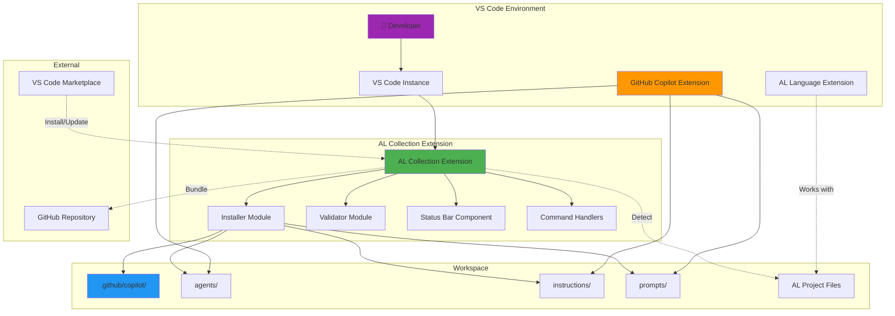
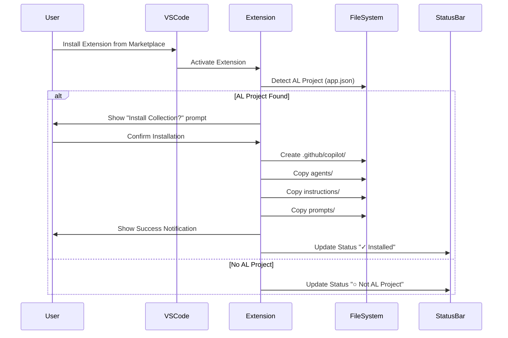
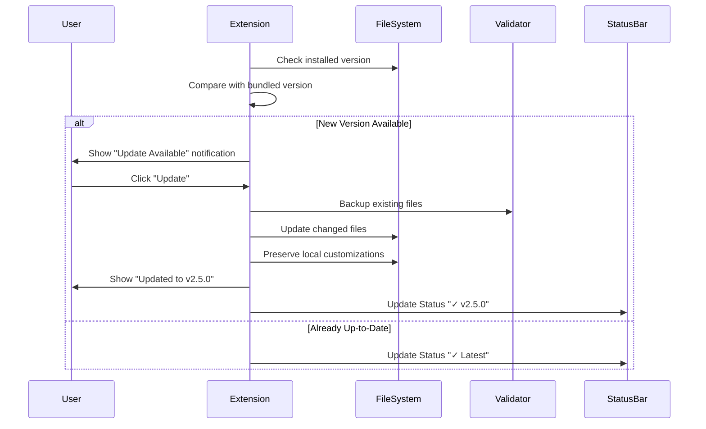
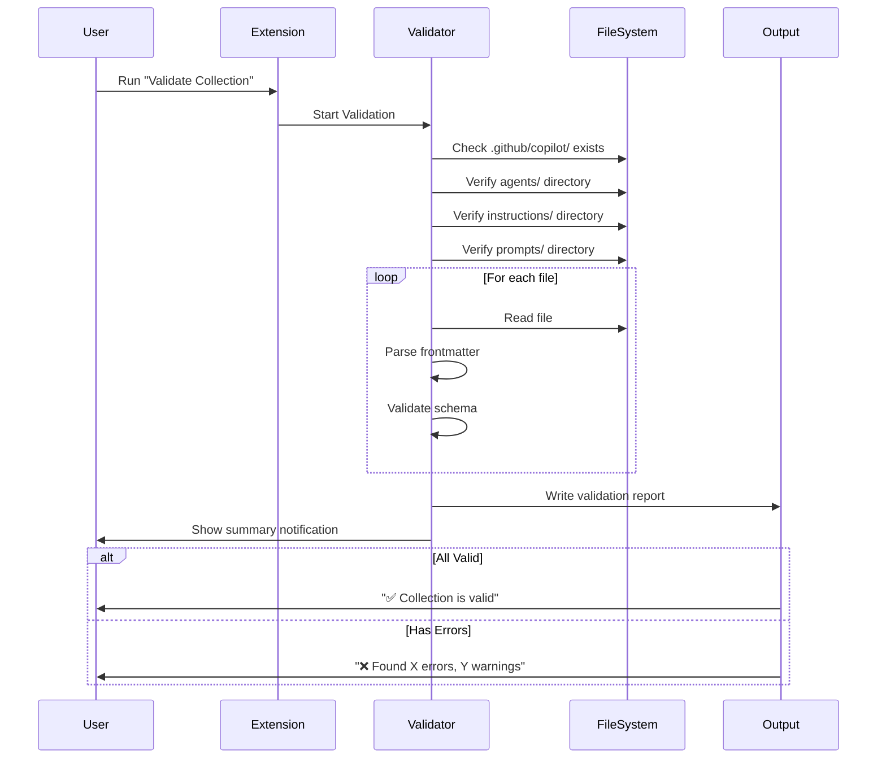
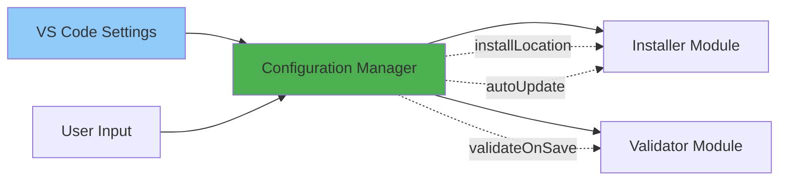
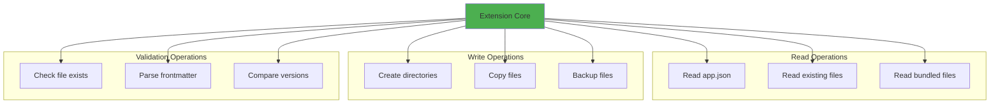
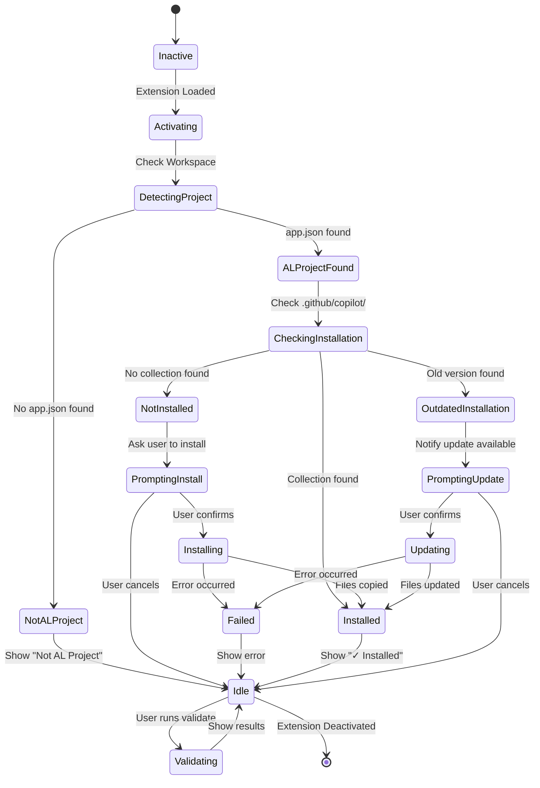
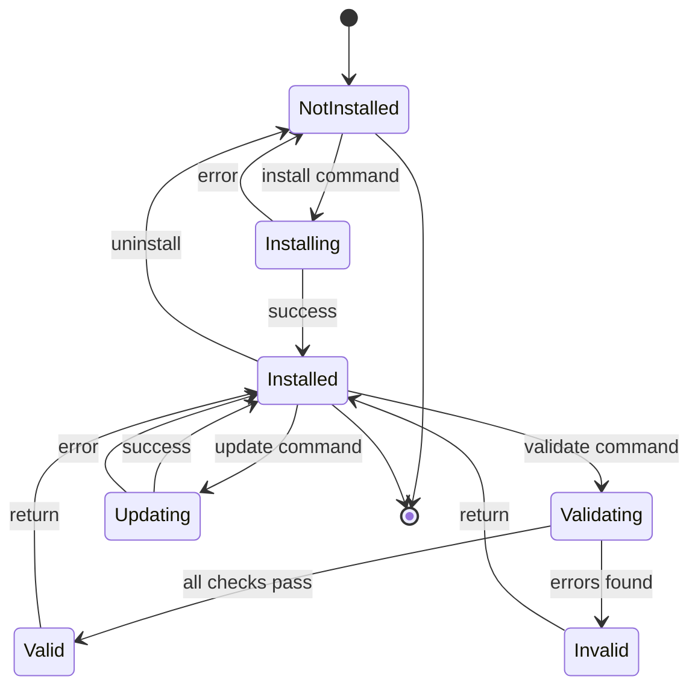
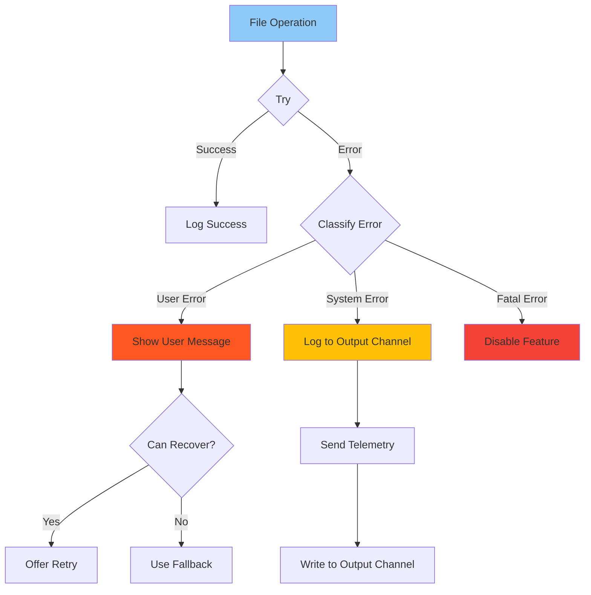
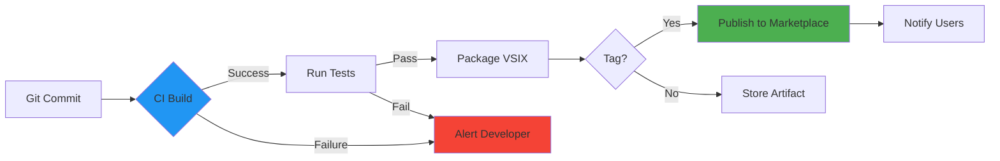

# VS Code Extension Architecture

This document provides a visual overview of the proposed VS Code extension architecture for AL Development Collection.

---

## System Architecture Overview



---

## Component Interaction Flow

### Installation Flow



### Update Flow



### Validation Flow



---

## File Structure of Extension

```
al-development-collection-extension/
│
├── src/
│   ├── extension.ts                 # Main entry point
│   │   ├── activate()              # Extension activation
│   │   └── deactivate()            # Extension cleanup
│   │
│   ├── installer.ts                # Installation logic
│   │   ├── installCollection()     # Install files
│   │   ├── updateCollection()      # Update files
│   │   └── detectALProject()       # Detect AL projects
│   │
│   ├── validator.ts                # Validation logic
│   │   ├── validateCollection()    # Run validation
│   │   ├── checkFrontmatter()      # Validate YAML frontmatter
│   │   └── generateReport()        # Create validation report
│   │
│   ├── statusBar.ts                # Status bar integration
│   │   ├── createStatusBarItem()   # Create status indicator
│   │   └── updateStatus()          # Update status text
│   │
│   ├── commands/
│   │   ├── install.ts              # Install command handler
│   │   ├── update.ts               # Update command handler
│   │   ├── validate.ts             # Validate command handler
│   │   └── showDocs.ts             # Show docs command
│   │
│   ├── utils/
│   │   ├── fileSystem.ts           # File operations
│   │   ├── logger.ts               # Logging utilities
│   │   └── config.ts               # Configuration management
│   │
│   └── types/
│       ├── collection.ts           # TypeScript types
│       └── frontmatter.ts          # Frontmatter schema
│
├── resources/
│   ├── agents/                     # Bundled agents (copied from repo)
│   ├── instructions/               # Bundled instructions
│   ├── prompts/                    # Bundled prompts
│   └── icon.png                    # Extension icon
│
├── test/
│   ├── suite/
│   │   ├── extension.test.ts
│   │   ├── installer.test.ts
│   │   └── validator.test.ts
│   └── fixtures/
│       └── sample-project/
│
├── .vscode/
│   ├── launch.json                 # Debug configuration
│   └── tasks.json                  # Build tasks
│
├── .vscodeignore                   # Files to exclude from package
├── package.json                    # Extension manifest
├── tsconfig.json                   # TypeScript config
├── README.md                       # Extension README
├── CHANGELOG.md                    # Extension changelog
└── LICENSE                         # MIT License
```

---

## Data Flow Diagrams

### Configuration Data Flow



### File System Operations



---

## State Management

### Extension States



### Collection Installation States



---

## Integration Points

### VS Code API Usage

```typescript
// Example of key VS Code APIs used

// 1. Commands API
vscode.commands.registerCommand('al-collection.install', async () => {
  // Install logic
});

// 2. Status Bar API
const statusBarItem = vscode.window.createStatusBarItem(
  vscode.StatusBarAlignment.Right,
  100
);
statusBarItem.text = "$(check) AL Collection";
statusBarItem.show();

// 3. Notifications API
vscode.window.showInformationMessage('Collection installed successfully!');
vscode.window.showErrorMessage('Installation failed: ' + error.message);

// 4. File System API
const workspaceFolders = vscode.workspace.workspaceFolders;
const fs = vscode.workspace.fs;
await fs.writeFile(targetUri, content);

// 5. Configuration API
const config = vscode.workspace.getConfiguration('al-collection');
const autoUpdate = config.get<boolean>('autoUpdate');

// 6. Output Channel API
const outputChannel = vscode.window.createOutputChannel('AL Collection');
outputChannel.appendLine('Validation started...');
outputChannel.show();
```

### GitHub Copilot Integration

```
┌─────────────────────────────────────────┐
│       GitHub Copilot Extension          │
│  (Reads .github/copilot/ automatically) │
└────────────┬────────────────────────────┘
             │
             │ Reads
             ▼
┌─────────────────────────────────────────┐
│     .github/copilot/ Directory          │
│                                         │
│  ├── agents/          ◄────────────────┼── Installed by
│  │   ├── al-architect.agent.md        │   AL Collection
│  │   └── ...                           │   Extension
│  │                                     │
│  ├── instructions/                     │
│  │   ├── al-code-style.instructions.md│
│  │   └── ...                           │
│  │                                     │
│  └── prompts/                          │
│      ├── al-initialize.prompt.md      │
│      └── ...                           │
└─────────────────────────────────────────┘
```

**Key Point**: The AL Collection Extension doesn't modify GitHub Copilot. It just manages the files that Copilot reads.

---

## Performance Considerations

### Optimization Strategies

1. **Lazy Loading**
   - Only activate when AL project detected
   - Load modules on-demand
   - Bundle only essential resources

2. **Caching**
   ```typescript
   class CollectionCache {
     private installedVersion: string | null = null;
     private lastChecked: Date | null = null;
     
     isStale(): boolean {
       if (!this.lastChecked) return true;
       const hoursSinceCheck = (Date.now() - this.lastChecked.getTime()) / 3600000;
       return hoursSinceCheck > 24; // Check once per day
     }
   }
   ```

3. **Async Operations**
   - All file operations are async
   - Show progress notifications for long operations
   - Cancel tokens for user-initiated cancellation

4. **Minimal Footprint**
   - Extension size: < 5MB
   - Memory usage: < 50MB
   - Startup time: < 100ms

---

## Error Handling Strategy



---

## Security Considerations

### File System Security

1. **Path Validation**
   ```typescript
   function isValidInstallPath(path: string): boolean {
     // Prevent path traversal
     if (path.includes('..')) return false;
     
     // Must be inside workspace
     const workspaceRoot = vscode.workspace.workspaceFolders?.[0]?.uri.fsPath;
     if (!path.startsWith(workspaceRoot)) return false;
     
     return true;
   }
   ```

2. **File Permissions**
   - Only write to workspace directories
   - Never modify system files
   - Respect `.gitignore` patterns

3. **Content Validation**
   - Validate YAML frontmatter schema
   - Sanitize user input
   - Check file sizes before operations

---

## Testing Strategy

### Test Pyramid

```
        /\
       /  \
      / E2E \          ← 10% (Integration tests)
     /______\
    /        \
   /  INTEG   \        ← 20% (Component tests)
  /____________\
 /              \
/      UNIT      \     ← 70% (Unit tests)
/________________\
```

### Test Coverage Goals

| Component | Target Coverage |
|-----------|----------------|
| Installer | 85% |
| Validator | 90% |
| Commands | 80% |
| Utils | 95% |
| **Overall** | **85%** |

---

## Deployment Pipeline



---

## Monitoring & Telemetry (Opt-in)

### Metrics to Track

1. **Installation Metrics**
   - Install success/failure rate
   - Installation time
   - Update success/failure rate

2. **Usage Metrics**
   - Command usage frequency
   - Validation runs
   - Error occurrences

3. **Performance Metrics**
   - Extension activation time
   - File operation duration
   - Memory usage

**Privacy**: All telemetry is opt-in and anonymized.

---

## Summary

This architecture provides:

- ✅ **Clear separation of concerns** (installer, validator, commands)
- ✅ **Scalable structure** (easy to add new features)
- ✅ **Robust error handling** (graceful degradation)
- ✅ **Performance optimization** (lazy loading, caching)
- ✅ **Security by design** (path validation, permissions)
- ✅ **Comprehensive testing** (unit, integration, E2E)
- ✅ **Automated deployment** (CI/CD pipeline)

For implementation details, see the full feasibility analysis in `docs/vscode-extension-feasibility.md`.
