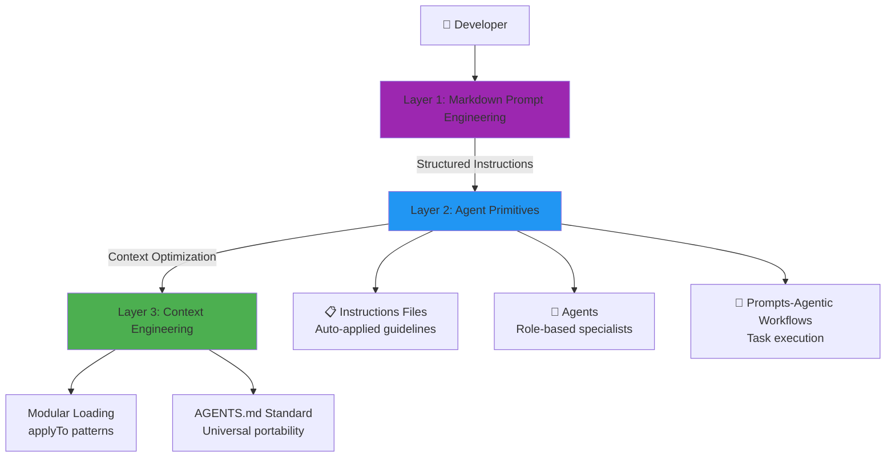

# Framework Overview

The **AI Native-Instructions Architecture** is a systematic framework for building AI-powered development tools using three fundamental layers.

## Three-Layer Architecture

## Layer 1: Markdown Prompt Engineering

Human-readable structured instructions in Markdown format with YAML frontmatter.

**Key Features:**

- Universal format (works across all AI assistants)
- Version controlled
- Easy to maintain and update
- Self-documenting

## Layer 2: Agent Primitives

Three types of reusable components:

### 📋 Instructions (7 primitives)

Auto-applied persistent rules via `applyTo` patterns.

### 🎯 Agentic Workflows (14 primitives)

Complete task execution processes as `.prompt.md` files.

### 💬 Chat Modes (6 primitives)

Role-based specialists with defined tool boundaries.

## Layer 3: Context Engineering

Optimization strategies:

- **Modular Loading**: Only load relevant context
- **Pattern Matching**: `applyTo` patterns for automatic application
- **AGENTS.md Standard**: Universal portability across platforms

## Benefits

!!! success "Key Advantages"
    - ✅ **Portable**: Works with any AI assistant
    - ✅ **Maintainable**: Plain text, version controlled
    - ✅ **Modular**: Load only what you need
    - ✅ **Scalable**: Easy to extend
    - ✅ **Standard**: Follows AI Native conventions

## Statistics

| Metric | Value |
|:-------|:------|
| **Total Primitives** | 28 |
| **Instructions** | 7 |
| **Agentic Workflows** | 14 |
| **Chat Modes** | 6 |
| **Framework Version** | 2.2.0 |

## Learn More

- [Architecture Details](architecture.md)
- [Getting Started](../getting-started.md)
- [Contributing Guide](../CONTRIBUTING.md)
