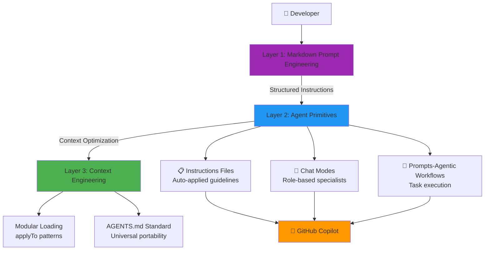

# AL Development Collection for GitHub Copilot

> **AI Native Development** toolkit for Microsoft Dynamics 365 Business Central implementing the **[AI Native-Instructions Architecture](https://danielmeppiel.github.io/awesome-ai-native/)** framework with **28 specialized Agent Primitives** across **3 systematic layers**.

[](./validate-al-collection.js)
[](./CHANGELOG.md)
[](./al-development.md)
[](https://danielmeppiel.github.io/awesome-ai-native/)
[](./LICENSE)
[](https://github.com/javiarmesto/AL_Copilot_Collection/issues)
[](https://github.com/javiarmesto/AL_Copilot_Collection/stargazers)
[](https://github.com/javiarmesto/AL_Copilot_Collection/network/members)
[](https://github.com/javiarmesto/AL_Copilot_Collection/graphs/contributors)

## 🚀 Quick Start

### Installation

1. **Clone or download this collection**
   ```bash
   git clone https://github.com/javiarmesto/al-development-collection.git
   cd al-development-collection
   ```

2. **Install the collection in your AL workspace**
   ```bash
   # Copy files to your AL project
   cp -r instructions your-al-project/
   cp -r prompts your-al-project/
   cp -r chatmodes your-al-project/
   cp -r collections your-al-project/
   cp -r .github your-al-project/  # Templates only
   ```

3. **Reload VS Code**
   - Press `Ctrl+Shift+P` (or `Cmd+Shift+P` on Mac)
   - Run: `Developer: Reload Window`

4. **Verify installation**
   ```bash
   npm install
   npm run validate
   ```

### First Use

Open any `.al` file and start coding. The auto-applied instructions will guide Copilot automatically.

**Try your first prompt:**

```bash
@workspace use al-workspace
```

**Or ask the orchestrator:**

```markdown
Switch to al-orchestrator mode and ask: "I need to build a sales approval workflow"
```

## 🏗️ AI Native-Instructions Architecture Framework

This collection implements the **[AI Native-Instructions Architecture](https://danielmeppiel.github.io/awesome-ai-native/)** framework with **3 systematic layers** that transform ad-hoc AI usage into reliable, repeatable engineering:



### 🎯 Framework Layers

| Layer | Focus | Purpose | AL Implementation |
|-------|-------|---------|-------------------|
| **Layer 1** | **Markdown Prompt Engineering** | Structured instructions using semantic markdown | Headers, lists, links for AI reasoning |
| **Layer 2** | **Agent Primitives** | Configurable tools (Instructions, Modes, Prompts) | 7 Instructions + 6 Chat Modes + 14 Prompts + 1 Guide |
| **Layer 3** | **Context Engineering** | Strategic context management via `applyTo` patterns | Modular loading, AGENTS.md compilation ready |

### 📊 Agent Primitives Breakdown

| Primitive Type | Count | Activation | Purpose |
|----------------|-------|------------|---------|
| **Instructions** | 7 files | Auto via `applyTo` patterns | Persistent coding rules & standards |
| **Chat Modes** | 6 files | `Use [mode-name]` | Role-based strategic consulting |
| **Agentic Workflows** | 14 files | `@workspace use [name]` | Complete task execution processes |
| **Integration Guide** | 1 file | Reference | Master coordination document |
| **Total Primitives** | **28 tools** | — | Complete AI Native toolkit |

## 📦 What's Included: Agent Primitives

### � Instructions Files (7 primitives)

**Markdown Prompt Engineering** implemented as modular `.instructions.md` files with `applyTo` patterns:

**Always Active** (apply to `**/*.al`):
- **al-code-style** - Code formatting & feature-based structure
- **al-naming-conventions** - PascalCase standards & 26-char limits
- **al-performance** - SetLoadFields, early filtering, temporary tables
- **al-guidelines** - Master hub referencing all patterns

**Context-Activated** (apply based on context):
- **al-error-handling** - TryFunctions, error labels, telemetry (`applyTo: **/*.al`)
- **al-events** - Event subscribers, integration events (`applyTo: **/*.al`)
- **al-testing** - AL-Go structure, test generation (`applyTo: **/test/**/*.al`)

> 💡 **Context Engineering**: Instructions use `applyTo` frontmatter for selective loading, optimizing context window usage

### 🎯 Agentic Workflows (14 primitives)

**Systematic processes** as `.prompt.md` files with validation gates and tool access:

Invoke with `@workspace use [name]`:
- **al-setup** - Environment setup & AI-assisted configuration
- **al-workspace** - Project initialization with symbol download
- **al-build** - Build, package, publish workflows
- **al-events** - Event subscriber/publisher implementation
- **al-debug** - Debugging sessions with snapshot support
- **al-performance** - CPU profiling & bottleneck analysis
- **al-permissions** - Permission set generation
- **al-troubleshoot** - Systematic problem resolution
- **al-migrate** - BC version upgrade workflows
- **al-pages** - Page Designer integration
- **al-workflow** - Complete feature lifecycle
- **al-spec.create** - Functional-technical specifications
- **al-performance.triage** - Performance bottleneck prioritization
- **al-pr.prepare** - Pull request preparation with docs

> 💡 **Agentic Workflows**: Prompts orchestrate primitives into complete processes with human validation checkpoints

### 💬 Chat Modes (6 primitives)

**Role-based specialists** with MCP tool boundaries (like professional licensing):

- **al-orchestrator** 🎯 - Smart router, workflow coordinator (START HERE)
- **al-architect** 🏗️ - Solution architecture, cannot execute builds
- **al-debugger** 🐛 - Deep diagnosis, systematic troubleshooting
- **al-tester** ✅ - Testing strategy, TDD methodology
- **al-api** 🌐 - RESTful API design & implementation
- **al-copilot** 🤖 - AI-powered Copilot features

> 💡 **Tool Boundaries**: Each mode has explicit CAN/CANNOT lists preventing cross-domain security breaches

### 📖 Integration Guide (1 primitive)

- **copilot-instructions.md** - Master document coordinating all 27 primitives with usage guidance

## 🎯 Common Workflows

### Building a New Feature

```text
1. al-orchestrator → Analyze requirements
2. al-architect → Design solution
3. @workspace use al-workspace → Setup
4. Code (auto-guidelines active)
5. @workspace use al-events → Add events
6. al-tester → Test strategy
7. @workspace use al-permissions → Security
8. @workspace use al-build → Deploy
```

### Debugging Issues

```text
1. al-debugger → Diagnose
2. @workspace use al-debug → Debug tools
3. @workspace use al-performance → Profile
4. Fix (auto-guidelines active)
5. al-tester → Regression tests
```

### API Development

```text
1. al-architect → Design API
2. al-api → Implement
3. @workspace use al-permissions → Security
4. al-tester → API tests
5. @workspace use al-build → Deploy
```

## 📚 Documentation

### Framework Documentation
- **[AI Native-Instructions Architecture Implementation](./references/AI%20Native-INSTRUCTIONS-ARCHITECTURE.md)** - Framework compliance details
- **[AI Native-Instructions Framework Guide](https://danielmeppiel.github.io/awesome-ai-native/)** - Complete framework reference
- **[AGENTS.md Standard](https://agents.md)** - Universal context format

### Collection Documentation
- **[Collection Overview](./al-development.md)** - User-facing guide
- **[Instructions Index](./instructions/index.md)** - Complete guide to all instruction files
- **[Prompts Index](./prompts/index.md)** - Complete guide to all agentic workflows
- **[Chat Modes Index](./chatmodes/index.md)** - Complete guide to all chat modes
- **[Integration Guide](./instructions/copilot-instructions.md)** - Master coordination document

## 🛠️ Requirements

- Visual Studio Code (latest version)
- AL Language extension for Business Central
- GitHub Copilot extension (active subscription)
- Business Central development environment (sandbox recommended)
- Node.js 14+ (for validation script)

## ✅ Validation

Validate the collection before contributing:

```bash
# Install dependencies
npm install

# Run validation
npm run validate
```

Expected output:
```
✅ Collection is fully compliant and ready for contribution!
```

## 📖 Usage Examples

### Example 1: New Developer
```markdown
User: "I'm new to AL. How do I start?"

Response from al-orchestrator:
"Let's get you set up. Use @workspace use al-workspace
to initialize your project. The auto-applied guidelines
will help you code correctly from day one."
```

### Example 2: Complex Task
```markdown
User: "Build AI-powered API for sales forecasting"

Response from al-orchestrator:
"This needs 4 phases:
1. al-architect - Design architecture (3-4 hours)
2. al-api + al-copilot - Build in parallel (1 day)
3. Integration - Connect layers (1-2 days)
4. al-tester - Comprehensive testing (1 day)"
```

### Example 3: Performance Issue
```markdown
User: "My report is slow"

Response from al-debugger:
"Let's profile it systematically:
1. @workspace use al-performance
2. Identify bottleneck
3. Apply optimizations
4. Re-profile to verify"
```

## 🤝 Contributing

Found an issue or have a suggestion?

1. **Report Issues**
   - Use GitHub Issues
   - Provide specific examples
   - Include error messages

2. **Suggest Improvements**
   - New prompts for common tasks
   - New modes for specialized scenarios
   - Better patterns and examples

3. **Contribution Guidelines**
   - Follow file naming conventions
   - Include proper frontmatter
   - Update manifest file
   - Run validation before submitting

See [CONTRIBUTING.md](./CONTRIBUTING.md) for detailed guidelines.

## 📋 File Structure

**AI Native-Instructions Architecture** implementation following VSCode Copilot conventions:

```
AL_Copilot_Collection/
├── .github/                                      # GitHub templates only
│   ├── ISSUE_TEMPLATE/                          # Issue templates (3)
│   └── PULL_REQUEST_TEMPLATE.md                 # PR template
├── instructions/                                 # 📋 Instructions (8 files)
│   ├── index.md                                 # Complete instructions guide
│   ├── copilot-instructions.md                  # Master integration guide
│   ├── al-guidelines.instructions.md            # applyTo: **/*.{al,json}
│   ├── al-code-style.instructions.md            # applyTo: **/*.al
│   ├── al-naming-conventions.instructions.md
│   ├── al-performance.instructions.md
│   ├── al-error-handling.instructions.md
│   ├── al-events.instructions.md
│   └── al-testing.instructions.md               # applyTo: **/test/**/*.al
├── prompts/                                      # 🎯 Agentic Workflows (15 files)
│   ├── index.md                                 # Complete workflows guide
│   ├── al-workspace.prompt.md
│   ├── al-build.prompt.md
│   └── ... (14 total workflow prompts)
├── chatmodes/                                    # 💬 Chat Modes (7 files)
│   ├── index.md                                 # Complete modes guide
│   ├── al-orchestrator.chatmode.md              # Smart router
│   ├── al-architect.chatmode.md                 # Architecture specialist
│   └── ... (6 total strategic modes)
├── collections/                                  # Collection manifests
│   └── al-development.collection.yml            # Main collection definition
├── references/                                   # Framework documentation
│   ├── AI Native-INSTRUCTIONS-ARCHITECTURE.md   # Framework implementation
│   ├── ai native-concepts.md                    # Framework concepts
│   └── ai native structure.md                   # Framework structure
├── archive/                                      # Historical files
├── al-development.md                            # User documentation
├── CONTRIBUTING.md                              # Contribution guidelines
├── LICENSE                                      # MIT License
├── SECURITY.md                                  # Security policy
├── validate-al-collection.js                    # Compliance validation
├── package.json                                 # Dependencies
└── README.md                                    # This file

# Ready for AGENTS.md compilation (Layer 3: Context Engineering)
# All primitives use applyTo patterns for modular context loading
```

## 🏷️ Version History

### 2.2.0 (2025-10-19) - AI Native-Instructions Architecture
- 🏗️ **Framework Implementation** - Full AI Native-Instructions Architecture compliance
- 📋 **Layer 1: Markdown Prompt Engineering** - Structured semantic markdown throughout
- 🔧 **Layer 2: Agent Primitives** - 28 configurable tools (Instructions, Modes, Prompts)
- 🎯 **Layer 3: Context Engineering** - `applyTo` patterns for modular context loading
- 📖 **AGENTS.md Ready** - Prepared for universal context compilation
- 🔒 **Tool Boundaries** - Chat modes with explicit CAN/CANNOT security lists
- ✅ **Validation Passing** - All 34 framework compliance checks passing

### 2.1.0 (2025-10-15)
- ✨ Streamlined chat modes - Archived 5 duplicate modes
- 🎯 Focused toolkit - 6 core strategic chatmodes
- 📊 Updated to 24 tools - Clearer separation of concerns
- 📚 Enhanced documentation - Practical examples integrated

### 2.0.0 (2025-01-15)
- ✅ Full compliance with contribution guidelines
- ✅ All files renamed to proper extensions
- ✅ Collection manifest created
- ✅ Validation script added

### 1.0.0 (2025-01-15)
- 🎉 Initial release
- 📦 7 instructions, 10 prompts, 6 modes

## 📄 License

MIT License - see [LICENSE](./LICENSE) file for details.

## 👤 Author

**javiarmesto**
- GitHub: [@javiarmesto](https://github.com/javiarmesto)
- Created: 2025-01-15

## 🙏 Acknowledgments

- Microsoft Business Central team for AL language
- GitHub Copilot team for extensibility
- AL development community for patterns and best practices

## 📞 Support

- **Issues**: [GitHub Issues](https://github.com/javiarmesto/al-development-collection/issues)
- **Discussions**: [GitHub Discussions](https://github.com/javiarmesto/al-development-collection/discussions)
- **Documentation**: [al-development.md](./al-development.md)

---

**Status**: ✅ AI Native-Instructions Architecture Compliant  
**Framework**: [AI Native-Instructions Architecture](https://danielmeppiel.github.io/awesome-ai-native/)  
**Last Updated**: 2025-10-19  
**Collection ID**: `al-development`  
**Version**: 2.2.0  
**Total Primitives**: 28 (7 instructions + 14 workflows + 6 modes + 1 guide)  
**Context Standard**: AGENTS.md ready
