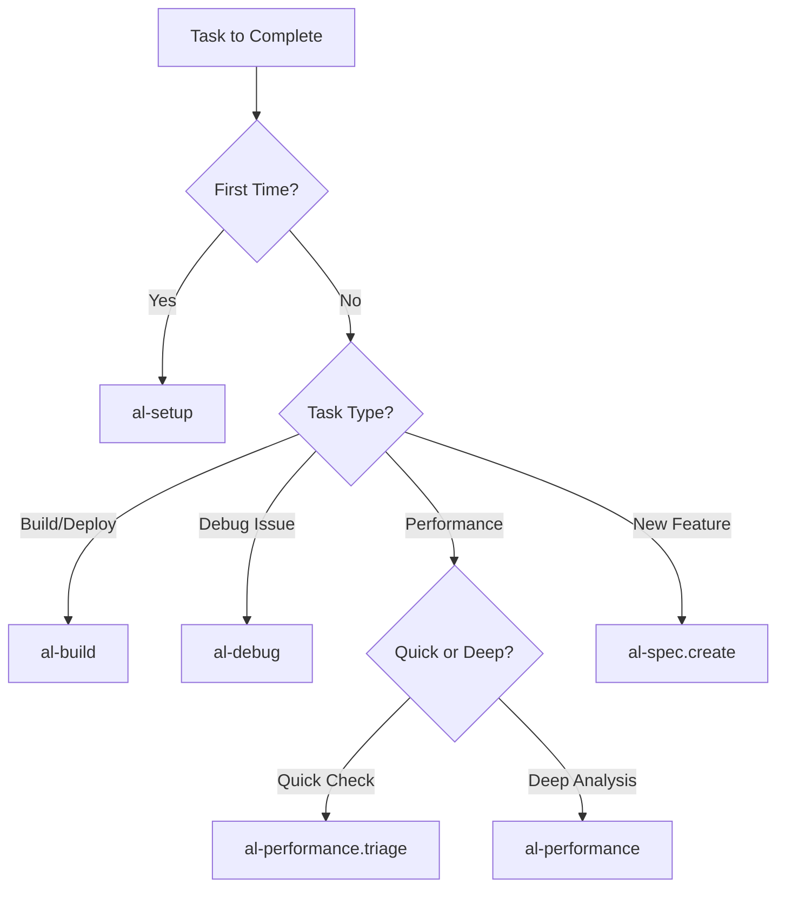

# Agentic Workflows - Layer 2: Agent Primitives

**Complete execution processes** implemented as `.prompt.md` files providing **systematic workflows** for specific AL development tasks in Business Central.

## 📋 What Are Agentic Workflows?

Agentic Workflows (formerly called "prompts") are:
- **Task-specific execution processes** with step-by-step guidance
- **Complete workflows** from planning through validation
- **Tool-integrated** processes that can execute AL commands
- **Reusable templates** for common development scenarios

## 🎯 How to Use Agentic Workflows

Activate workflows explicitly when needed:
```markdown
@workspace use [workflow-name]

Example:
@workspace /al-build
@workspace /al-debug
@workspace /al-performance
```

## 📦 Available Workflows (14 files)

### Environment & Setup

| File | Purpose | When to Use |
|------|---------|-------------|
| **al-setup.prompt.md** | Environment setup & configuration | First-time project setup, onboarding |
| **al-workspace.prompt.md** | Workspace organization & structure | Organizing multi-extension workspaces |

### Development Lifecycle

| File | Purpose | When to Use |
|------|---------|-------------|
| **al-build.prompt.md** | Build, package, and deploy extensions | Building for release, deployment |
| **al-debug.prompt.md** | Attach debugger and diagnose issues | Debugging runtime issues |
| **al-spec.create.prompt.md** | Create functional specifications | Planning new features |
| **al-pages.prompt.md** | Design and implement page objects | Creating UI components |
| **al-workflow.prompt.md** | Implement business workflows | Building approval/processing flows |

### Events & Integration

| File | Purpose | When to Use |
|------|---------|-------------|
| **al-events.prompt.md** | Implement event publishers/subscribers | Extending BC without modifying base |
| **al-migrate.prompt.md** | Data migration strategies | Moving data between systems/versions |

### Quality & Performance

| File | Purpose | When to Use |
|------|---------|-------------|
| **al-performance.prompt.md** | Analyze and optimize performance | Slow queries, bottlenecks |
| **al-performance.triage.prompt.md** | Quick performance diagnosis | Rapid performance assessment |
| **al-troubleshoot.prompt.md** | Systematic issue resolution | General problem-solving |

### Security & Deployment

| File | Purpose | When to Use |
|------|---------|-------------|
| **al-permissions.prompt.md** | Generate permission sets | Setting up security |
| **al-pr.prepare.prompt.md** | Prepare pull request documentation | Before code review/merge |

## 🏗️ Workflow Structure

Each workflow follows this pattern:

### 1. Objective
Clear statement of what the workflow accomplishes

### 2. Prerequisites
- Required context (files, settings)
- Required tools
- Required knowledge

### 3. Step-by-Step Process
Detailed instructions with:
- Context gathering
- Analysis phase
- Implementation steps
- Validation gates

### 4. Validation Criteria
How to verify success

### 5. Common Issues & Solutions
Troubleshooting guide

## 💡 Best Practices

### Choosing the Right Workflow



### Workflow Combinations

Common workflow sequences:

1. **New Feature Development**
   ```
   al-spec.create → al-pages → al-build → al-debug
   ```

2. **Performance Issue**
   ```
   al-performance.triage → al-performance → al-build
   ```

3. **Security Setup**
   ```
   al-permissions → al-build → al-troubleshoot
   ```

4. **Integration Work**
   ```
   al-events → al-migrate → al-build → al-debug
   ```

### Integration with Other Primitives

Workflows complement:
- **Instructions** - Automatically loaded context during workflow execution
- **Chat Modes** - Strategic consultation before/after workflow execution
  - Use `al-orchestrator` to choose right workflow
  - Use `al-architect` to design before implementing workflow
  - Use `al-debugger` when workflow execution reveals issues

### Creating Custom Workflows

1. **Create file** in this directory: `al-[task].prompt.md`
2. **Add frontmatter**:
   ```yaml
   ---
   mode: 'agent'
   description: 'Brief task description'
   tools: ['codebase', 'workspace_search', 'al_build']
   model: 'claude-3.5-sonnet'
   ---
   ```
3. **Structure workflow** following the pattern above
4. **Update collection manifest** in `collections/al-development.collection.yml`
5. **Test execution** with sample tasks

## 🔗 Related Resources

- **Collection Manifest**: `collections/al-development.collection.yml`
- **Framework Reference**: `references/A-INSTRUCTIONS-ARCHITECTURE.md`
- **User Guide**: `al-development.md`
- **Contributing**: `CONTRIBUTING.md`

## 📊 Validation

Run `npm run validate` to verify:
- All workflow files exist
- Frontmatter is properly formatted
- File naming conventions are followed
- Required fields are present

## 🎯 Quick Reference

| Need to... | Use Workflow |
|-----------|--------------|
| Set up new project | `al-setup` |
| Build & deploy | `al-build` |
| Fix a bug | `al-debug` → `al-troubleshoot` |
| Improve performance | `al-performance.triage` → `al-performance` |
| Create new feature | `al-spec.create` → `al-pages` → `al-workflow` |
| Add events | `al-events` |
| Set up security | `al-permissions` |
| Prepare for review | `al-pr.prepare` |

---

**Framework Compliance**: These workflows implement **A-Instructions Architecture** - Layer 2 (Agent Primitives) providing systematic execution processes that coordinate Instructions and Chat Modes for complete task fulfillment.
