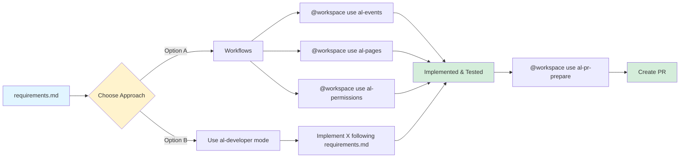

# Complete AL Development Flow

> **Comprehensive guide to using AL Development Collection agents and workflows for Business Central development**

## Overview

The AL Development Collection provides multiple pathways from requirements to production code. This document shows how all agents, workflows, and the Orchestra system work together.

---

## 🎯 Decision Tree with Complexity Validation Gate

**NEW**: All workflows now include automatic complexity classification with mandatory user confirmation.

```mermaid
graph TD
    A[📄 Start: Requirements/Task] --> B{Have requirements<br/>document?}
    B -->|NO| CreateDoc[Create Documentation]
    CreateDoc --> Doc1["@workspace use al-context.create"]
    CreateDoc --> Doc2["@workspace use al-spec.create"]
    
    B -->|YES| Analyze[🔍 Automatic Complexity Analysis]
    Doc1 --> Analyze
    Doc2 --> Analyze
    
    Analyze --> Infer["📊 System infers complexity:<br/>- Scope and scale<br/>- Integration complexity<br/>- Business logic depth<br/>- Implementation effort"]
    
    Infer --> Present["📋 Present Classification<br/>with justification"]
    
    Present --> Gate{"🚦 VALIDATION GATE<br/>Confirm complexity?"}
    
    Gate -->|"❌ Incorrect"| UserCorrect["👤 User provides<br/>correct complexity"]
    UserCorrect --> Present
    
    Gate -->|"✅ LOW"| Low["🟢 LOW Complexity<br/>Direct implementation"]
    Gate -->|"✅ MEDIUM"| Med["🟡 MEDIUM Complexity<br/>TDD with Orchestra"]
    Gate -->|"✅ HIGH"| High["🔴 HIGH Complexity<br/>Architecture first"]
    
    Low --> LowOpt{Implementation<br/>approach?}
    LowOpt -->|Workflows| LowWork["@workspace use<br/>al-events, al-pages, etc."]
    LowOpt -->|Direct code| LowDev["Use al-developer mode<br/>Direct implementation"]
    
    Med --> MedSpec{Specialized<br/>domain?}
    MedSpec -->|No| MedCond["Use al-conductor mode<br/>TDD Orchestra"]
    MedSpec -->|Yes| MedSpecAgent["al-api / al-copilot<br/>Then al-conductor"]
    
    High --> HighArch["Use al-architect mode<br/>Design solution"]
    HighArch --> HighSpec{Specialized<br/>design?}
    HighSpec -->|APIs| HighAPI["al-api mode<br/>Design contracts"]
    HighSpec -->|AI/Copilot| HighCopilot["al-copilot mode<br/>Design experience"]
    HighSpec -->|Standard| HighStd["Complete architecture"]
    
    HighAPI --> HighCond1["Use al-conductor mode"]
    HighCopilot --> HighCond2["Use al-conductor mode"]
    HighStd --> HighCond3["Use al-conductor mode"]
    
    style Gate fill:#FF6B6B,stroke:#C92A2A,stroke-width:4px,color:#fff
    style Low fill:#51CF66,stroke:#2F9E44,color:#fff
    style Med fill:#FFD43B,stroke:#F59F00,color:#000
    style High fill:#FF8787,stroke:#C92A2A,color:#fff
    style Analyze fill:#E3FAFC,stroke:#0CA678
    style Present fill:#FFF4E6,stroke:#FD7E14
```



### 🚦 Validation Gate Protocol

**MANDATORY STEP**: Before any implementation begins, the system:

1. **📊 Analyzes Requirements**
   - Counts AL objects mentioned/needed
   - Identifies integration points
   - Evaluates business logic complexity
   - Estimates implementation phases

2. **📋 Presents Classification**
   ```
   🔍 Complexity Analysis Results:
   
   Detected Elements:
   - AL Objects: 4 (Customer.TableExt, CustomerCard.PageExt, 
                    CustomerValidator.Codeunit, CustomerEvents.Codeunit)
   - Integrations: Internal event subscribers only
   - Business Logic: Email validation, address formatting
   - Estimated Phases: 2 phases
   - External Dependencies: None
   
   📊 Inferred Complexity: 🟡 MEDIUM
   
   Reasoning:
   - Scope indicates MEDIUM complexity (multiple interrelated components)
   - Limited scope, internal dependencies only
   - Moderate business logic, manageable complexity
   - Can be structured in 2-3 TDD phases
   
   Recommended: al-conductor mode with TDD orchestration
   ```

3. **🚦 Waits for Confirmation (GATE)**
   ```
   🚦 VALIDATION GATE - Please confirm:
   
   Proposed Complexity: 🟡 MEDIUM
   
   Options:
   ✅ [1] Confirm MEDIUM - Proceed with al-conductor
   ❌ [2] Actually LOW - This is simpler than analyzed
   ❌ [3] Actually HIGH - This is more complex than analyzed
   📝 [4] Explain your reasoning
   ```

4. **➡️ Routes Based on Confirmation**
   - **If confirmed**: Proceeds with recommended workflow
   - **If corrected**: Re-analyzes with user input and presents new recommendation
   - **If explained**: Incorporates reasoning into complexity assessment

### 📊 Complexity Classification Criteria

#### 🟢 LOW (Low Complexity)

**Characteristics:**
- Limited scope - isolated change or single feature
- Single implementation phase
- No external integrations
- Clear, straightforward implementation
- Minimal or no business logic
- Quick turnaround (hours, not days)

**Examples:**
- ✅ Add single field to existing table
- ✅ Modify page layout (add/remove fields)
- ✅ Simple validation rule (one condition)
- ✅ Caption/label changes
- ✅ Add single report column

**Recommended Path:**
→ `al-developer` mode (direct implementation)
→ OR workflows (`@workspace use al-events`, `@workspace use al-pages`, etc.)
→ OR if debugging needed: `al-debugger` → `al-developer`

---

#### 🟡 MEDIUM (Medium Complexity)

**Characteristics:**
- Moderate scope - multiple related components
- 2-3 implementation phases
- Internal integrations (event subscribers, interfaces)
- Moderate business logic with interdependencies
- Requires comprehensive testing strategy
- Some architectural decisions needed

**Examples:**
- ✅ Customer loyalty points calculation system
- ✅ Sales order validation with multiple rules
- ✅ Automated email notifications (internal)
- ✅ Custom report with data transformation
- ✅ Approval workflow (basic, single-level)

**Recommended Path (by specialization):**
→ Standard feature: `al-conductor` mode (TDD Orchestra)
→ API integration: `al-api` mode → `al-conductor` mode
→ AI/Copilot feature: `al-copilot` mode → `al-conductor` mode
→ Testing focus: `al-tester` mode → `al-conductor` mode

---

#### 🔴 HIGH (High Complexity)

**Characteristics:**
- Extensive scope - complex system architecture
- 4+ implementation phases
- External integrations (REST APIs, OAuth, web services)
- Complex business rules and multi-step workflows
- Multi-company, multi-user, or multi-tenant scenarios
- Performance optimization critical
- Significant architectural and design decisions

**Examples:**
- ✅ Multi-company approval workflow with delegation and email
- ✅ External API integration (REST/OAuth/retry logic)
- ✅ AI-powered forecasting system
- ✅ Real-time inventory synchronization
- ✅ Complex pricing engine with multiple factors
- ✅ Document management system with Azure Blob Storage

**Recommended Path (by specialization):**
→ Standard complex: `al-architect` → `al-conductor`
→ Complex APIs: `al-api` → `al-architect` → `al-conductor`
→ Complex AI system: `al-copilot` → `al-architect` → `al-conductor`
→ Performance-critical: `al-architect` (with perf analysis) → `al-conductor`
→ Legacy refactoring: `al-debugger` (understand) → `al-architect` (redesign) → `al-conductor`

---

## 📋 Flow Patterns

### Pattern 1: Simple Feature (Direct Implementation)

**Use when**: 1-2 objects, clear requirements, no architecture needed



**Agents/Workflows used**:
- Optional: `@workspace use al-spec.create` (document first)
- **Workflows**: `al-events`, `al-pages`, `al-permissions`, etc.
- **OR Agent**: `al-developer` mode
- Final: `@workspace use al-pr-prepare`

**Time**: 15-30 minutes

---

### Pattern 2: Moderate Feature (Specification + Orchestra)

**Use when**: 3-5 objects, need TDD, moderate complexity

```mermaid
graph TD
    A[requirements.md] --> B["@workspace use al-spec.create"]
    B --> B1["Creates spec.md: Object IDs, Integration points, Dependencies, Acceptance criteria"]
    B1 --> C[Feature.spec.md]
    C -->|"User reviews & approves"| D[Use al-conductor mode]
    
    D --> E[PLANNING PHASE]
    E --> E1[al-planning-subagent]
    E1 --> E2["Reads spec.md, Analyzes AL codebase, Returns findings"]
    
    E2 --> F["Multi-phase plan (3-5 phases, TDD per phase)"]
    F -->|User approves| G[IMPLEMENTATION CYCLE]
    
    G --> H[Phase Loop]
    H --> H1["1. al-implement-subagent (RED → GREEN → REFACTOR)"]
    H1 --> H2["2. al-review-subagent (Validate AL patterns, Check test coverage)"]
    H2 --> H3{Review Result}
    H3 -->|APPROVED| H4[3. User commits]
    H3 -->|"NEEDS REVISION"| H1
    
    H4 --> I{More phases?}
    I -->|YES| H
    I -->|NO| J["Plan Complete: All objects created, Tests 100% passing, Quality gates passed"]
    
    J --> K["@workspace use al-pr-prepare"]
    K --> L[Create PR]
    
    style A fill:#e1f5ff
    style D fill:#fff3cd
    style E fill:#ffe6cc
    style G fill:#d4edda
    style J fill:#d4edda
    style L fill:#d4edda
```



**Agents/Workflows used**:
1. `@workspace use al-spec.create` - Document requirements
2. `Use al-conductor mode` - Orchestrate implementation
   - Delegates to `al-planning-subagent` (research)
   - Delegates to `al-implement-subagent` (TDD)
   - Delegates to `al-review-subagent` (QA)
3. `@workspace use al-pr-prepare` - Finalize

**Time**: 1-2 hours for complete feature with tests and docs

---

### Pattern 3: Complex Feature (Architecture + Orchestra)

**Use when**: 5+ objects, architectural decisions needed, complex integrations

```
┌─────────────────┐
│ requirements.md │
└────────┬────────┘
         ↓
┌──────────────────────┐
│ Use al-architect     │ Strategic design phase:
│ mode                 │ - Analyzes requirements
│                      │ - Reviews existing architecture
│                      │ - Designs solution patterns
│                      │ - Creates architecture spec
│                      │ - Documents decisions
└────────┬─────────────┘
         ↓
    ┌──────────────────────────┐
    │ Architecture Document    │ Includes:
    │                          │ - Object model design
    │                          │ - Integration architecture
    │                          │ - Data architecture
    │                          │ - Security model
    │                          │ - Performance strategy
    │                          │ - Testing approach
    └────────┬─────────────────┘
             ↓ User reviews
    ┌──────────────────────┐
    │ Specialized Design   │ If needed:
    │ (Optional)           │
    ├──────────────────────┤
**Use when**: 5+ objects, architectural decisions needed, complex integrations

```mermaid
graph TD
    A[requirements.md] --> B[Use al-architect mode]
    B --> B1["Strategic Design: Analyzes requirements, Reviews architecture, Designs solution patterns, Creates architecture spec, Documents decisions"]
    
    B1 --> C[Architecture Document]
    C --> C1["Includes: Object model design, Integration architecture, Data architecture, Security model, Performance strategy, Testing approach"]
    
    C1 -->|User reviews| D{Specialized Design Needed?}
    
    D -->|APIs| E1["Use al-api mode (Design REST/OData)"]
    D -->|"AI Features"| E2["Use al-copilot mode (Prompt engineering)"]
    D -->|"Complex Tests"| E3["Use al-tester mode (Test strategy)"]
    D -->|No| F
    
    E1 --> F[Use al-conductor mode]
    E2 --> F
    E3 --> F
    
    F --> G[PLANNING PHASE]
    G --> G1["al-planning-subagent: Reads architecture, Analyzes AL codebase, Aligns with design, Returns findings"]
    
    G1 --> H["Multi-phase plan (5-10 phases, Aligned with architecture)"]
    
    H -->|User approves| I["IMPLEMENTATION CYCLE: Same as Pattern 2 - TDD per phase, Code review per phase, Commit per phase"]
    
    I --> J{Post-Implementation Issues?}
    
    J -->|"Issues found"| K1[Use al-debugger mode]
    J -->|Performance| K2["@workspace use al-performance"]
    J -->|Adjustments| K3[Use al-developer mode]
    J -->|"All good"| L
    
    K1 --> L["@workspace use al-pr-prepare"]
    K2 --> L
    K3 --> L
    
    L --> M[Create PR]
    
    style A fill:#e1f5ff
    style B fill:#f8d7da
    style D fill:#fff3cd
    style F fill:#fff3cd
    style I fill:#d4edda
    style M fill:#d4edda
```     ├─ Phase 2: Authorization logic
        ├─ Phase 3: CRUD operations
        └─ Phase 4: Integration tests
    ↓
@workspace use al-pr-prepare
```

**Key agents**: `al-api` (design) → `al-conductor` (implement)

---

### Flow B: AI/Copilot Feature

```mermaid
graph TD
    A["requirements.md (AI feature specification)"] --> B[Use al-copilot mode]
    B --> B1["Design Copilot capability, Engineer prompts, Plan Azure OpenAI integration, Design PromptDialog UI, Plan responsible AI approach"]
    
    B1 --> C[Use al-conductor mode]
    C --> C1[Implement with TDD]
    
    C1 --> D1["Phase 1: Register capability (@workspace use al-copilot-capability)"]
    D1 --> D2["Phase 2: PromptDialog page (@workspace use al-copilot-promptdialog)"]
    D2 --> D3["Phase 3: Backend integration"]
    D3 --> D4["Phase 4: AI testing (@workspace use al-copilot-test)"]
    
    D4 --> E["@workspace use al-pr-prepare"]
    E --> F[Create PR]
    
    style A fill:#e1f5ff
    style B fill:#e7e7ff
    style C fill:#fff3cd
    style F fill:#d4edda
``` C1 --> D1[Phase 1: API Page structure]
    D1 --> D2[Phase 2: Authorization logic]
    D2 --> D3[Phase 3: CRUD operations]
    D3 --> D4[Phase 4: Integration tests]
    
### Flow C: Performance Optimization

```mermaid
graph TD
    A["Existing feature with performance issues"] --> B{Need behavior analysis?}
    
    B -->|YES| C["Use al-debugger mode (Analyze behavior and identify bottlenecks)"]
    B -->|NO| D
    
    C --> D["@workspace use al-performance.triage"]
    D --> D1[Quick static analysis]
    
    D1 --> E["@workspace use al-performance"]
    E --> E1["Deep profiling with CPU profile"]
    
    E1 --> F{Need refactoring?}
    
    F -->|YES| G["Use al-architect mode (Design performance improvements)"]
    F -->|NO| H
    
    G --> H{Implementation approach?}
    
    H -->|Complex| I1[Use al-conductor mode]
    H -->|Simple| I2[Use al-developer mode]
    
    I1 --> J["Implement optimizations: Add SetLoadFields, Add early filtering, Optimize keys/indices, Verify no regressions"]
    I2 --> J
    
    J --> K["@workspace use al-performance"]
    K --> K1["Re-profile and confirm improvements"]
    
    style A fill:#f8d7da
    style D fill:#fff3cd
    style E fill:#fff3cd
    style K1 fill:#d4edda
```     ├─ Optimize keys/indices
        └─ Verify no regressions
    ↓
@workspace use al-performance (re-profile)
    └─ Confirm improvements
```

**Key agents**: `al-debugger`, `al-architect`, `al-conductor`  
**Key workflows**: `al-performance.triage`, `al-performance`

---

## 🔄 Complete End-to-End Example

### Scenario: "Add Sales Approval Workflow with Email Notifications"

**Complexity**: High (7+ objects, events, email integration, permissions)

#### Phase 1: Documentation & Design (30 min)

```bash
# Step 1: Create specification
@workspace use al-spec.create
# Input: FeatureName = "Sales Approval Workflow"
# Output: /specs/sales-approval-workflow.spec.md

# Step 2: Design architecture
Use al-architect mode
# Input: "Design architecture for sales-approval-workflow.spec.md"
# Actions:
#   - Reads spec.md
#   - Analyzes Sales Header, Sales-Post codeunits
#   - Designs event architecture
#   - Creates architecture document
# Output: Comprehensive architecture specification
```

**Artifacts created**:
- `/specs/sales-approval-workflow.spec.md`
- Architecture document (in chat or saved)

---

#### Phase 2: TDD Implementation (3-4 hours)

```bash
# Step 3: Implement with Orchestra
Use al-conductor mode
# Input: "Implement the architecture we just designed with TDD"

# Orchestra executes:
# 2.1: Planning
#   - Invokes al-planning-subagent
#   - Reads architecture + spec.md
#   - Analyzes AL codebase
#   - Returns structured findings
#   - Creates 6-phase plan

# 2.2: User reviews plan → APPROVES

# 2.3: Phase 1 - Approval Data Model
#   - Invokes al-implement-subagent
#     - Creates failing tests (RED)
#     - Creates Table 50100, TableExtension 50101 (GREEN)
#     - Tests pass
#   - Invokes al-review-subagent
#     - Reviews AL patterns → APPROVED
#   - Presents summary + commit message
#   → User commits

# 2.4: Phase 2 - Approval Logic
#   - Invokes al-implement-subagent
#     - Failing tests for approval flow (RED)
#     - Codeunit 50102 with TryFunctions (GREEN)
#     - Tests pass
#   - Invokes al-review-subagent
#     - Reviews error handling → APPROVED
#   → User commits

# 2.5: Phase 3 - Sales Post Integration
#   - al-implement-subagent creates event subscriber
#   - Tests verify posting blocked when pending
#   → User commits

# 2.6: Phase 4 - Approval UI
#   - al-implement-subagent creates Page + PageExtension
#   - UI tests pass
#   → User commits

# 2.7: Phase 5 - Email Integration
#   - al-implement-subagent implements SMTP with TryFunction
#   - Email tests pass
#   → User commits

# 2.8: Phase 6 - Permissions
#   - al-implement-subagent generates permission sets
#   - Permission tests pass
#   → User commits

# 2.9: Plan complete
#   - Generates completion document
#   - All 6 phases done, 100% tests passing
```

**Artifacts created**:
- `.github/plans/sales-approval-workflow-plan.md`
- `.github/plans/sales-approval-workflow-phase-1-complete.md` (through 6)
- `.github/plans/sales-approval-workflow-complete.md`
- 15+ AL files (tables, codeunits, pages, tests)
- 6 git commits

---

#### Phase 3: Finalization (15 min)

```bash
# Step 4: Test and validate
# (All tests already passing from TDD)

# Step 5: Performance check (if needed)
@workspace use al-performance.triage
# Quick check - no issues found

# Step 6: Prepare pull request
@workspace use al-pr-prepare
# Generates PR description from commits and plan
# Output: PR template with checklist

# Step 7: Create PR on GitHub
# Manual: Use generated template
```

**Artifacts created**:
- PR description with complete context
- All documentation for review

---

## 📊 Agent Interaction Matrix

| Agent/Workflow | Can Invoke | Invoked By | Use Case |
|----------------|-----------|------------|----------|
| **al-architect** | None | User | Strategic design |
| **al-conductor** | al-planning, al-implement, al-review | User | TDD orchestration |
| **al-planning-subagent** | None | al-conductor | Research AL context |
| **al-implement-subagent** | None | al-conductor | TDD implementation |
| **al-review-subagent** | None | al-conductor | Code quality review |
| **al-developer** | None | User | Direct implementation |
| **al-api** | None | User | API design |
| **al-copilot** | None | User | AI feature design |
| **al-tester** | None | User | Test strategy |
| **al-debugger** | None | User | Issue analysis |
| **al-spec.create** | None | User | Specification docs |
| **al-initialize** | None | User | Environment setup |
| **al-build** | None | User | Build & deploy |
| **al-diagnose** | None | User | Debug issues |
| **al-performance** | None | User | Performance profiling |
| **al-pr-prepare** | None | User | PR preparation |

---

## 🎓 Best Practices

### When to Use Each Pattern

**Pattern 1 (Direct)** - Use for:
- ✅ Single object changes
- ✅ Quick fixes or adjustments
- ✅ Well-understood implementations
- ✅ No tests required (documentation, permissions)

**Pattern 2 (Spec + Orchestra)** - Use for:
- ✅ Features requiring 3-5 AL objects
- ✅ Need TDD with comprehensive tests
- ✅ Clear requirements but need structure
- ✅ Team development (documentation important)

**Pattern 3 (Architecture + Orchestra)** - Use for:
- ✅ Complex features (5+ objects)
- ✅ Architectural decisions needed
- ✅ Multiple integration points
- ✅ Performance or security critical
- ✅ Involves multiple BC modules

### Workflow Efficiency Tips

1. **Create specification first** for moderate/complex features
   - Saves time in planning phase
   - Provides clear acceptance criteria
   - Easier for team reviews

2. **Use al-architect for complex designs**
   - Better architectural decisions
   - Identifies issues early
   - Creates reusable patterns

3. **Trust the Orchestra TDD process**
   - Tests first catches issues early
   - Each phase is independently committable
   - Quality gates prevent technical debt

4. **Leverage specialized agents**
   - al-api for API-heavy features
   - al-copilot for AI features
   - al-debugger when stuck

5. **Document as you go**
   - Orchestra generates documentation automatically
   - Use al-context.create to update project context
   - Use al-memory.create between sessions

---

## 🚀 Quick Reference Commands

```bash
# Environment Setup
@workspace use al-initialize

# Documentation
@workspace use al-spec.create
@workspace use al-context.create
@workspace use al-memory.create

# Design
Use al-architect mode
Use al-api mode
Use al-copilot mode
Use al-tester mode

# Implementation
Use al-conductor mode      # Complex features with TDD
Use al-developer mode      # Simple direct implementation

# Diagnostics
Use al-debugger mode
@workspace use al-diagnose
@workspace use al-performance.triage
@workspace use al-performance

# Build & Deploy
@workspace use al-build

# Finalization
@workspace use al-pr-prepare
```

---

**Framework**: [AI Native-Instructions Architecture](https://danielmeppiel.github.io/awesome-ai-native/)  
**Collection**: AL Development Collection v2.6.0  
**Last Updated**: 2025-11-08

