# AL Development Collection for GitHub Copilot

<p align="center">
  <strong>AI Native Development toolkit for Microsoft Dynamics 365 Business Central</strong>
</p>

<p align="center">
  Implementing the <strong>AI Native-Instructions Architecture</strong> framework with <strong>28 specialized Agent Primitives</strong> across <strong>3 systematic layers</strong>.
</p>

<p align="center">
  <a href="getting-started">Get Started</a> •
  <a href="https://github.com/javiarmesto/AL_Copilot_Collection">View on GitHub</a> •
  <a href="CHANGELOG">Changelog</a>
</p>

---

## Quick Start

### Installation

1. **Clone or download this collection**
   ```bash
   git clone https://github.com/javiarmesto/AL_Copilot_Collection.git
   cd AL_Copilot_Collection
   ```

2. **Install the collection in your AL workspace**
   ```bash
   # Copy files to your AL project
   cp -r instructions your-al-project/
   cp -r prompts your-al-project/
   cp -r chatmodes your-al-project/
   cp -r collections your-al-project/
   ```

3. **Reload VS Code**
   - Press `Ctrl+Shift+P` (or `Cmd+Shift+P` on Mac)
   - Run: `Developer: Reload Window`

4. **Verify installation**
   ```bash
   npm install
   npm run validate
   ```

---

## Features

### 📋 Instructions (7 primitives)
Auto-applied persistent rules via `applyTo` patterns for optimal context engineering.

### 🎯 Agentic Workflows (14 primitives)
Complete systematic processes as `.prompt.md` files with validation gates.

### 💬 Chat Modes (6 primitives)
Role-based specialists with MCP tool boundaries preventing cross-domain security breaches.

### 📖 Integration Guide (1 primitive)
Master coordination document for all 27 primitives.

---

## Framework Architecture

This collection implements the **AI Native-Instructions Architecture** with three systematic layers:

```mermaid
graph TB
    Dev[👤 Developer] --> Layer1[Layer 1: Markdown Prompt Engineering]
    Layer1 --> |Structured Instructions| Layer2[Layer 2: Agent Primitives]
    Layer2 --> |Context Optimization| Layer3[Layer 3: Context Engineering]
    
    Layer2 --> Instructions[📋 Instructions Files<br/>Auto-applied guidelines]
    Layer2 --> ChatModes[💬 Chat Modes<br/>Role-based specialists]
    Layer2 --> Prompts[🎯 Prompts-Agentic Workflows<br/>Task execution]
    
    Layer3 --> Modular[Modular Loading<br/>applyTo patterns]
    Layer3 --> AGENTSMD[AGENTS.md Standard<br/>Universal portability]
    
    style Layer1 fill:#9C27B0
    style Layer2 fill:#2196F3
    style Layer3 fill:#4CAF50
```



---

## Statistics

| Metric | Value |
|:-------|:------|
| **Total Primitives** | 28 |
| **Instructions** | 7 |
| **Agentic Workflows** | 14 |
| **Chat Modes** | 6 |
| **Framework Version** | 2.2.0 |
| **License** | MIT |

---

## Documentation

<div class="grid">
  <div class="grid-item">
    <h3>📚 Getting Started</h3>
    <p>Learn how to install and configure the collection for your AL projects.</p>
    <a href="getting-started">Get Started →</a>
  </div>
  
  <div class="grid-item">
    <h3>📋 Instructions</h3>
    <p>Explore the 7 auto-applied instruction files for AL development.</p>
    <a href="instructions/">View Instructions →</a>
  </div>
  
  <div class="grid-item">
    <h3>🎯 Workflows</h3>
    <p>Browse 14 agentic workflows for complete task execution.</p>
    <a href="prompts/">View Workflows →</a>
  </div>
  
  <div class="grid-item">
    <h3>💬 Chat Modes</h3>
    <p>Discover 6 specialist modes for strategic consulting.</p>
    <a href="chatmodes/">View Modes →</a>
  </div>
</div>

---

## About

Created by [Javier Armesto González](https://github.com/javiarmesto) for the Business Central development community.

- **GitHub**: [@javiarmesto](https://github.com/javiarmesto)
- **License**: [MIT](https://github.com/javiarmesto/AL_Copilot_Collection/blob/main/LICENSE)
- **Framework**: [AI Native-Instructions Architecture](https://danielmeppiel.github.io/awesome-ai-native/)
