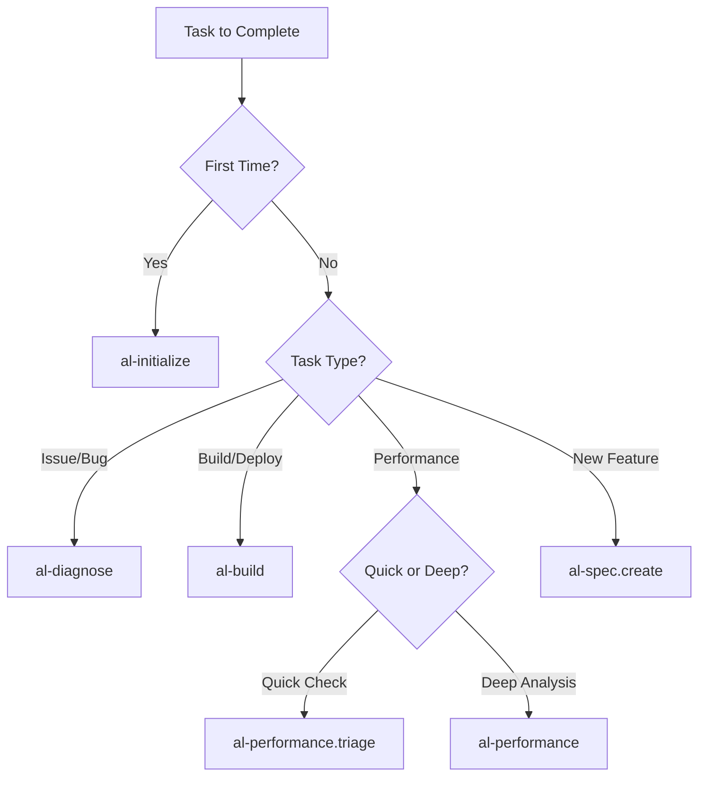

# Agentic Workflows - Layer 2: Agent Primitives

**Complete execution processes** implemented as `.prompt.md` files providing **systematic workflows** for specific AL development tasks in Business Central.

## 📋 What Are Agentic Workflows?

Agentic Workflows (formerly called "prompts") are:
- **Task-specific execution processes** with step-by-step guidance
- **Complete workflows** from planning through validation
- **Tool-integrated** processes that can execute AL commands
- **Reusable templates** for common development scenarios

## 🎯 How to Use Agentic Workflows

Activate workflows explicitly when needed:
```markdown
@workspace use [workflow-name]

Examples:
@workspace use al-initialize
@workspace use al-diagnose
@workspace use al-build
```

## 📦 Available Workflows (13 files)

### Environment & Setup

| File | Purpose | When to Use |
|------|---------|-------------|
| **al-initialize.prompt.md** | Complete environment and workspace initialization | First-time setup, new projects, onboarding |

### Development & Diagnostics

| File | Purpose | When to Use |
|------|---------|-------------|
| **al-diagnose.prompt.md** | Runtime debugging and configuration troubleshooting | Debugging issues, auth problems, symbol errors |
| **al-spec.create.prompt.md** | Create functional specifications | Planning new features |
| **al-pages.prompt.md** | Design and implement page objects | Creating UI components |
| **al-events.prompt.md** | Implement event publishers/subscribers | Extending BC without modifying base |

### Copilot Extensibility

| File | Purpose | When to Use |
|------|---------|-------------|
| **al-copilot-scaffold.prompt.md** | Generate complete Copilot experience structure | Creating new AI-powered features |
| **al-copilot-test.prompt.md** | Create AI Test Toolkit test suites | Testing Copilot features |

### Build & Deployment

| File | Purpose | When to Use |
|------|---------|-------------|
| **al-build.prompt.md** | Build, package, and deploy extensions | Building for release, deployment |
| **al-permissions.prompt.md** | Generate permission sets | Setting up security |
| **al-migrate.prompt.md** | Data migration strategies | Moving data between systems/versions |

### Quality & Performance

| File | Purpose | When to Use |
|------|---------|-------------|
| **al-performance.triage.prompt.md** | Quick performance diagnosis (static analysis) | Rapid performance assessment, code review |
| **al-performance.prompt.md** | Deep performance analysis (runtime profiling) | Slow queries, bottlenecks, optimization |

### Code Review & Documentation

| File | Purpose | When to Use |
|------|---------|-------------|
| **al-pr-prepare.prompt.md** | Prepare pull request documentation | Before code review/merge |

## 🏗️ Workflow Structure

Each workflow follows this pattern:

### 1. Objective
Clear statement of what the workflow accomplishes

### 2. Prerequisites
- Required context (files, settings)
- Required tools
- Required knowledge

### 3. Step-by-Step Process
Detailed instructions with:
- Context gathering
- Analysis phase
- Implementation steps
- Validation gates

### 4. Validation Criteria
How to verify success

### 5. Common Issues & Solutions
Troubleshooting guide

## 💡 Best Practices

### Choosing the Right Workflow



### Workflow Combinations

Common workflow sequences:

1. **New Feature Development**
   ```
   al-spec.create → al-pages → al-events → al-build → al-diagnose
   ```

2. **Performance Issue**
   ```
   al-performance.triage → al-performance → al-build
   ```

3. **Security Setup**
   ```
   al-permissions → al-build → al-diagnose
   ```

4. **Integration Work**
   ```
   al-events → al-migrate → al-build → al-diagnose
   ```

5. **First-Time Setup**
   ```
   al-initialize → al-spec.create → al-build
   ```

### Integration with Other Primitives

Workflows complement:
- **Instructions** - Automatically loaded context during workflow execution
- **Chat Modes** - Strategic consultation before/after workflow execution
  - Use `al-orchestrator` to choose right workflow
  - Use `al-architect` to design before implementing workflow
  - Use `al-debugger` when workflow execution reveals issues

## 🔄 Workflow Optimization (v2.3)

This collection has been optimized to reduce redundancy and improve clarity:

### What Changed

**Consolidated Workflows:**
- `al-setup` + `al-workspace` → **al-initialize** (single initialization workflow)
- `al-debug` + `al-troubleshoot` → **al-diagnose** (unified diagnostics)

**Simplified Workflows:**
- **al-pr-prepare** - Reduced from 509 to ~240 lines (template streamlined)

**Removed Workflows:**
- `al-workflow` - Redundant with specialized prompts and orchestrator mode

**Result:**
- 14 workflows → 11 workflows (-21%), then +2 Copilot workflows = 13 total
- Clearer purpose for each workflow
- Less confusion about which workflow to use
- Reduced context consumption
- **New**: Copilot Extensibility support (v2.3.1)

## 🔗 Related Resources

- **Collection Manifest**: `collections/al-development.collection.yml`
- **Framework Reference**: `references/A-INSTRUCTIONS-ARCHITECTURE.md`
- **User Guide**: `al-development.md`
- **Contributing**: `CONTRIBUTING.md`

## 📊 Validation

Run `npm run validate` to verify:
- All workflow files exist
- Frontmatter is properly formatted
- File naming conventions are followed
- Required fields are present

## 🎯 Quick Reference

| Need to... | Use Workflow |
|-----------|--------------|
| Set up new project/environment | `al-initialize` |
| Debug or troubleshoot issues | `al-diagnose` |
| Build & deploy | `al-build` |
| Fix performance issues | `al-performance.triage` → `al-performance` |
| Create new feature | `al-spec.create` → `al-pages` |
| Add events | `al-events` |
| **Build Copilot feature** | **`al-copilot-scaffold`** |
| **Test Copilot feature** | **`al-copilot-test`** |
| Set up security | `al-permissions` |
| Migrate data | `al-migrate` |
| Prepare for review | `al-pr-prepare` |

---

**Framework Compliance**: These workflows implement **AI-Native Instructions Architecture** - Layer 2 (Agent Primitives) providing systematic execution processes that coordinate Instructions and Chat Modes for complete task fulfillment.

**Version**: 2.3.1 (Optimized + Copilot Extensibility)
**Total Workflows**: 13
**Copilot Workflows**: 2 (new)
**Last Updated**: 2025-10-27
